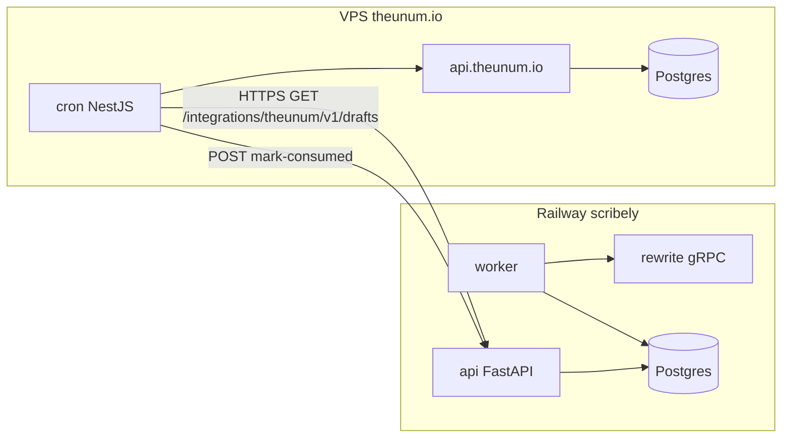

# UNUM Rewriter Tool

Внутренний инструмент редакции UNUM (theunum.io): собирает инфоповоды,
делает AI-рерайт (EN+RU) через OpenRouter, прогоняет через
compliance-проверки и отдаёт редакции на ревью и публикацию.

Постановка задачи, архитектура и весь процесс принятия решений — в
[CLAUDE.md](CLAUDE.md) и [docs/](docs/). Этот файл — только про то, как
поднять репозиторий локально.

**Статус:** Фазы 0–7 (полный пайплайн + Review UI + Publish) задеплоены на
Railway; следующая — Фаза 8 (отчётность). Подробности — в
[CLAUDE.md](CLAUDE.md) и [docs/План_Реализации_MVP.md](docs/План_Реализации_MVP.md).

## Архитектура (кратко)

Три независимых Railway-сервиса на Python + один Postgres:

| Сервис | Роль | Протокол |
|---|---|---|
| `api` | Backend API + WebSocket + Review UI, Auth | HTTP |
| `worker` | Scheduler, Ingestion, Dedup, Filter, Compliance | HTTP (health) |
| `rewrite` | `scribely-rewrite`: Enrichment/Rewrite/SEO/Tags/Keywords/Style | только gRPC |

`api`/`worker` — gRPC-клиенты к `rewrite`; общий код — только в `libs/`
(модели БД, gRPC-стабы, инфраструктурные утилиты), без общего импорта
бизнес-логики между сервисами.

## Требования

- Python 3.12 (проект пиннится на 3.12, не на системный Python — см. ниже)
- [`uv`](https://docs.astral.sh/uv/)
- Docker (для локального Postgres) или доступ к внешнему Postgres
- `protoc`-тулинг ставится через `uv` вместе с зависимостями, отдельно
  устанавливать не нужно

Зависимости ставятся **без `.venv` в репозитории** — в отдельный
Python 3.12, управляемый `uv`, а не в системный Python окружения (он
может быть новее/другой версии и помечен как externally-managed).

## Установка

```bash
# 1. Python 3.12 через uv (не системный python3)
uv python install 3.12
PYBIN=$(uv python find 3.12)

# 2. Зависимости всех сервисов + dev-тулинг, editable-инсталл workspace
uv pip install --python "$PYBIN" --break-system-packages \
  -e libs -e services/api -e services/worker -e services/rewrite \
  ruff pytest pytest-asyncio httpx pre-commit grpcio-tools alembic

# 3. gRPC-стабы из proto/ (не коммитятся, регенерируются)
PYTHON_BIN="$PYBIN" bash scripts/gen_proto.sh

# 4. pre-commit hooks (ruff + базовые проверки)
"$(dirname "$PYBIN")/pre-commit" install

# 5. .env из шаблона
cp .env.example .env
```

Дальше используйте `"$PYBIN"` (или добавьте его `bin/`-каталог в PATH)
для запуска `python`/`pytest`/`ruff`/`alembic`/`uvicorn`.

## База данных и миграции

```bash
# Локальный Postgres в Docker (пример)
docker run -d --name unum_dev_pg -e POSTGRES_PASSWORD=postgres \
  -e POSTGRES_DB=unum_news -p 5432:5432 postgres:16-alpine

# Применить миграции (DATABASE_URL берётся из .env, либо переопределите)
"$PYBIN" -m alembic upgrade head
```

## Запуск сервисов локально

В трёх отдельных терминалах (переменные — из `.env`, `rewrite` наружу не
торчит — только по gRPC):

```bash
# rewrite (gRPC, :50051)
"$PYBIN" -m rewrite_app.server

# api (HTTP, :8000) — реально ходит в rewrite по gRPC
"$(dirname "$PYBIN")/uvicorn" api_app.main:app --reload --port 8000

# worker (HTTP health, :8001)
"$(dirname "$PYBIN")/uvicorn" worker_app.main:app --reload --port 8001
```

Проверка: `curl localhost:8000/health` и `curl localhost:8000/health/rewrite`
(второй — живой gRPC-запрос к `rewrite`, подтверждает, что сервисы видят
друг друга).

## Интеграция scribely → theunum.io (Export API)

**Направление данных:** cron на VPS (`api.theunum.io`) **забирает** готовые
AI-черновики из scribely (Railway). Scribely **не пушит** на theunum —
только отдаёт по HTTP по запросу. Между зонами **нет gRPC**; gRPC только
внутри Railway (`api`/`worker` → `rewrite`).



### Как это работает

1. **Worker** на Railway создаёт `Draft` со статусом `ready_for_review`
   (EN + RU в одной записи).
2. **Cron / кнопка Sync** на theunum вызывает
   `GET /integrations/theunum/v1/drafts?consumed=false` с service token.
3. Scribely отдаёт только черновики **без** записи в `draft_export_log`.
4. theunum сохраняет их в локальный QA (dedupe по `scribely_draft_id`).
5. **mark-consumed не на sync.** Редактор жмёт Одобрить / Отклонить /
   Удалить из очереди — тогда
   `POST /integrations/theunum/v1/drafts/mark-consumed`.
6. Scribely пишет `DraftExportLog` — повторный GET `consumed=false`
   **не вернёт** эти черновики. Статус `Draft` в scribely **не меняется**.

Пустая очередь — **не ошибка**: HTTP 200, `items: []`, в `meta.reason_code`
обычно `queue_empty`. Если очередь пуста из‑за проблем пайплайна
(OpenRouter, rewrite недоступен и т.д.) — другой `reason_code`; cron
должен алертить (см. таблицу в
[docs/Интеграция_theunum_Export_API.md](docs/Интеграция_theunum_Export_API.md)).

### Переменные окружения

| Где | Переменная | Назначение |
|---|---|---|
| Railway `api` | `THEUNUM_INTEGRATION_TOKEN` | Секрет для Export API (обязательно) |
| Railway `api` | `CORS_ALLOWED_ORIGINS` | Опционально, только для вызовов из браузера |
| VPS | `SCRIBELY_BASE_URL` | URL scribely API, напр. `https://api-scribely-production.up.railway.app` |
| VPS | `SCRIBELY_INTEGRATION_TOKEN` | **Тот же** секрет, что `THEUNUM_INTEGRATION_TOKEN` |

Сгенерировать секрет:

```bash
python -c "import secrets; print(secrets.token_urlsafe(48))"
```

Auth: `Authorization: Bearer <token>` или заголовок
`X-Theunum-Service-Token`. Без токена на scribely → 503; неверный → 401.

### Endpoints (prefix `/integrations/theunum/v1`)

| Method | Path | Назначение |
|---|---|---|
| GET | `/drafts` | Список unconsumed черновиков (пагинация `cursor`, фильтр `since`) |
| GET | `/drafts/{id}` | Полный черновик EN+RU |
| POST | `/drafts/mark-consumed` | Batch-пометка «уже забрали» |
| POST | `/drafts/{id}/mark-consumed` | Одна пометка |
| GET | `/status` | Диагностика пайплайна и OpenRouter |

Подробный контракт, `meta.reason_code` и псевдокод cron — в
[docs/Интеграция_theunum_Export_API.md](docs/Интеграция_theunum_Export_API.md).

### Проверка локально

После запуска `api` (и миграций):

```bash
export TOKEN=dev-insecure-theunum-integration-token   # из .env
curl -s -H "Authorization: Bearer $TOKEN" \
  http://localhost:8000/integrations/theunum/v1/drafts | jq .

curl -s -H "Authorization: Bearer $TOKEN" \
  http://localhost:8000/integrations/theunum/v1/status | jq .
```

Без токена — 401:

```bash
curl -s -o /dev/null -w "%{http_code}\n" \
  http://localhost:8000/integrations/theunum/v1/drafts
```

Код cron на стороне VPS (`api.theunum.io`) — **отдельный репозиторий**;
здесь только Export API scribely.

## Тесты и линт

```bash
"$PYBIN" -m pytest services -q    # все сервисы; integration-тесты в services/api/tests/
"$(dirname "$PYBIN")/ruff" check .
"$(dirname "$PYBIN")/ruff" format .
```

Тесты `services/api` и `services/rewrite` (auth-флоу, миграции) требуют
доступный Postgres — по умолчанию тест-конфиг ждёт его на
`localhost:55432`; либо поднимите Postgres на этот порт, либо
переопределите `DATABASE_URL` перед запуском (см.
`services/api/tests/conftest.py`).

## Деплой (Railway)

Каждый сервис — отдельный Railway-сервис с:
- **Root Directory** = корень репозитория (нужен для доступа к `libs/`,
  `proto/` в момент сборки Docker-образа);
- **Dockerfile Path** = `services/<api|worker|rewrite>/Dockerfile`;
- **Config File Path** = `services/<name>/railway.toml` (build/healthcheck).

`rewrite` — без публичного порта/TCP-прокси, доступен только по
приватной сети Railway. Секреты — через Railway Variables (см.
`.env.example` для полного списка переменных).

## Структура репозитория

```
proto/        # gRPC-контракт api/worker <-> rewrite (ТЗ §6.6)
libs/         # общий код: db (модели), common (infra), grpc_gen (генерируется)
migrations/   # Alembic
services/
  api/        # FastAPI: HTTP + WebSocket + Review UI
  worker/     # Scheduler + Ingestion + Dedup + Filter + Compliance
  rewrite/    # scribely-rewrite: только gRPC
scripts/      # gen_proto.sh и т.п.
docs/         # постановка задачи, ТЗ, стайл-гайд, реестр источников,
              # Интеграция_theunum_Export_API.md
```
