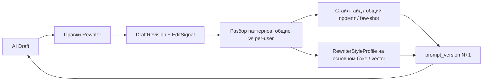

# Заметки и предложения: обогащение данных, правки рерайтера, эволюция промпта

**Автор заметок:** заказчик (пользователь)  
**Дата:** 2026-08-01  
**Статус:** рабочие заметки / предложения пост-MVP и усиления MVP  
**Связанные документы:** [ТЗ_Rewriter_Tool_Черновик.md](ТЗ_Rewriter_Tool_Черновик.md), [План_Реализации_MVP.md](План_Реализации_MVP.md), [Правила_Рерайта_и_Стиля_Черновик.md](Правила_Рерайта_и_Стиля_Черновик.md)

> Цель этого файла — зафиксировать вопросы и предложения по девяти темам:
> (1) обогащение данных, из которых собираются черновики;
> (2) сохранение того, что реально правил рерайтер;
> (3) корректировка промпта со временем, чтобы максимально автоматизировать
> работу рерайтера и сделать тексты точнее;
> (4) вынос этого модуля **сразу** отдельным **Python**-микросервисом + **gRPC**
> (решено, не монолит);
> (5) **прослеживание стиля каждого рерайтера** — профиль **на основном бэке
> в векторах**; сборщик читает/обновляет (без дубля-истины);
> (5b) при нескольких рерайтерах — **не апрувить одну статью вдвоём**: presence /
> soft-lock по **WebSocket в realtime**, когда кто-то открыл просмотр/редактирование;
> (6) черновики сразу с **преднастроенным SEO** + **предложение картинки**
> под пост на основе текста;
> (7) донастройка текста и SEO по **частым поисковым запросам** через
> keyword-сервисы (**Яндекс.Вордстат** для RU, DataForSEO/Semrush/Ahrefs для EN,
> также Serpstat / Keys.so);
> (8) **тегирование статей** — автопредложение на сборщике; **теги и категории
> живут на основном проекте (theunum.io)**, системы обмениваются информацией;
> (9) доп. идеи из практики разработки воронок черновиков — см. §11.

---

## 1. Короткий ответ «как сейчас в ТЗ/плане»

| Вопрос | Есть ли в MVP? | Что именно |
|---|---|---|
| Обогащение данных перед черновиком | Частично, не как отдельный слой | Кластеризация источников, фильтр тем, скоринг приоритета; опционально — догрузка полного текста страницы (заметка в реестре, не жёсткая задача фазы) |
| Сохранение правок рерайтера | Частично | `PATCH` черновика + `AuditLog` (кто/когда/действие); **нет** версий текста, diff «AI → человек», обучения на правках |
| Автоулучшение промпта по правкам | Нет | Промпт статичный: собирается из стайл-гайда; Admin может править вручную |
| Отдельный микросервис + gRPC | **Решено заказчиком** | Сразу отдельный **Python**-микросервис (`scribely-rewrite`) + gRPC с Фазы 0; не монолит «вынесем потом» |
| Профиль стиля по рерайтеру | Нет | Нужен учёт per-user; **хранение стиля — на основном бэке в векторном виде**, сборщик читает/обновляет, без локального дубля-истины |
| Concurrent edit / двойной approve | Нет | Очередь общая; **нет** soft-lock, presence, WebSocket realtime «кто смотрит/редактирует» |
| SEO в черновике | Нет / вручную позже | В редполитике SEO настраивается при размещении на сайте (§6.4 п.4); в Draft модели — категория/теги, **не** meta title/description/slug/OG |
| Предложение обложки/картинки | Нет (TBD) | ТЗ §8 открытый вопрос: источник обложек TBD; в MVP картинки не генерируются и не предлагаются |
| Keyword research → донастройка текста/SEO | Частично решено | Провайдеры: Wordstat (RU) + Google-API (EN); **гео: мир / global** |
| Тегирование статей | Частично / сыро | Нужен обмен с theunum.io как единственным master; **запрет дублей справочника** на сборщике (только id/slug + кэш + ProposeTag с dedupe) |

Код ещё не пишется — всё ниже про проектирование и backlog.

---

## 2. Обогащение данных, из которых собираем черновики

### 2.1. Что уже заложено (не «enrichment», но рядом)

Сейчас воронка такая:

```
Источник → RawItem → NewsCluster → Topic Filter → Rewrite → Draft
```

По сути «обогащение» в MVP сводится к:

1. **Кластеризация** — несколько источников об одном событии → один кластер (перекрёстная верификация фактов по редполитике §2.1).
2. **Фильтр тем + приоритет** — релевантность и очерёдность рерайта.
3. **Догрузка полного текста** (идея в реестре §8) — RSS часто даёт только summary; для проверки фактов можно тянуть страницу по `<link>`. В план фаз как обязательная задача **не** вынесено.

Отдельного модуля «Enrichment» (сущности, цены, контекст рынка, связанные события, глоссарий UNUM и т.п.) **нет**.

### 2.2. Предложение: явный слой Enrichment перед рерайтом

Имеет смысл добавить (хотя бы пост-MVP или как лёгкий MVP+) сущность/шаг **`EnrichedCluster` / `ClusterContext`**, который перед вызовом LLM собирает структурированный контекст:

| Что обогащать | Зачем | Откуда брать |
|---|---|---|
| Полный текст / ключевые факты из 2–3 источников кластера | Меньше галлюцинаций и дыр в фактах | fallback fetch по link + summary из RawItem |
| Тикер / актив / протокол (если есть) | Точность терминов, меньше правок рерайтера | NER / словари / CoinGecko и др. (Уровень 2 реестра — как контекст, не как «новость») |
| Актуальные цифры (цена, %, TVL) на момент события | Цифры с контекстом (стайл-гайд) | market API; помечать «на момент публикации источника» |
| Уровень источника (Tier) + тип (новость / PR / регулятор) | Compliance и тон рерайта | уже есть в `Source` |
| Язык оригиналов и «канонический» набор фактов | Один согласованный набор фактов → EN-рерайт | сравнение фактов внутри кластера |
| Связанные прошлые публикации UNUM (если есть) | Не дублировать, дать continuity | Content DB / PublishRecord (позже) |

**Предлагаемый контракт входа в Rewrite Orchestrator:**

```text
не «сырой RSS-текст», а:
  - список источников (title, url, tier, language, excerpt/full)
  - извлечённые факты (who / what / when / numbers / quotes)
  - флаги (press-release?, regulated?, market-sensitive?)
  - приоритет и тема
```

Чем богаче и чище этот вход — тем меньше рерайтер правит руками.

### 2.3. Приоритет внедрения обогащения

1. **Сначала (дешёво, высокий эффект):** обязательная догрузка полного текста хотя бы для Tier 1, если RSS = summary.
2. **Потом:** извлечение фактов (даты, суммы, имена, тикеры) в структурированный JSON перед промптом.
3. **Потом:** market-контекст (цена/изменение) только когда в тексте есть актив.
4. **Позже:** связь с уже опубликованными материалами UNUM.

---

## 3. Сохранение того, что редактировал рерайтер

### 3.1. Что уже в ТЗ

- Рерайтер правит EN/RU, заголовок, теги, флаги (`PATCH /drafts/{id}`).
- Reject — с причиной; NeedsFix — на доработку.
- `AuditLog` — кто создал / отредактировал / опубликовал / отклонил.
- У Draft — «автор правки», timestamps, какая LLM/ключ использовались.

Этого **достаточно для ответственности**, но **недостаточно для обучения системы**.

### 3.2. Чего не хватает (предложение)

Нужен явный контур **«что AI сгенерил → что человек оставил»**:

| Хранить | Зачем |
|---|---|
| Снимок `body_en` / `body_ru` / title **до** правок (версия `ai_generated`) | База для diff |
| Снимок **после** Publish (версия `human_final`) | Эталон «хорошего» текста |
| Diff или список правок (хотя бы text-diff) | Аналитика: что чаще всего меняют |
| Причина Reject / NeedsFix (обязательное поле + теги причин) | Систематизация ошибок модели |
| Тип правки (факт / стиль / заголовок / атрибуция / длина / тон / перевод RU) | Классификация — куда крутить промпт |
| Метрики: % символов изменён / время на ревью / число правок до Publish | KPI автоматизации |

**Минимальная модель данных (предложение):**

- `DraftRevision` — `draft_id`, `kind` (`ai` | `human` | `regen`), `title_en`, `body_en`, `title_ru`, `body_ru`, `author_id`, `created_at`, `prompt_version_id`
- `EditSignal` (можно считать из diff позже) — `draft_id`, `author_id`, `category`, `note`, `created_at`

При Publish всегда сохранять пару: последняя AI-версия + финальная human-версия.  
`author_id` обязателен — без него нельзя строить стиль по человеку (см. §5).

Без этого «улучшать промпт со временем» будет гаданием, а не работой по данным.

---

## 4. Корректировка промпта → максимальная автоматизация рерайтера

### 4.1. Как сейчас

Промпт = стайл-гайд + правила редполитики. Статичный. Admin может править вручную.  
Цикла «правки людей → лучше следующий черновик» **нет**.

### 4.2. Целевая идея

> Чем больше рерайтер правит один и тот же класс ошибок — тем быстрее эти ошибки должны уходить в правила/промпт/few-shot, чтобы следующий черновик требовал меньше рук.

Не обязательно fine-tune модели на старте. Достаточно **управляемого улучшения промпта и примеров**.

Важно: при **нескольких** рерайтерах общий «средний» промпт часто вреден — правки разных людей конфликтуют. Поэтому feedback loop должен уметь разделять **дом (UNUM)** и **профиль человека** (см. §5).

### 4.3. Предлагаемый контур улучшения (feedback loop)



**Шаги:**

1. **Версионировать промпт** — `prompt_version` (id, текст, дата, кто утвердил). У каждого Draft — какая версия его породила.
2. **Собирать пары** `ai_generated` ↔ `human_final` только с Publish (и отдельно — Reject с причиной), **с привязкой к `author_id`**.
3. **Раз в неделю (или по N публикаций)** — отчёт: топ причин правок **в целом** и **по каждому рерайтеру**.
4. **Править не «на глаз»**, а точечно:
   - общее → в стайл-гайд / базовый system prompt;
   - личное → в `RewriterStyleProfile` / персональные few-shot;
   - 1–3 few-shot примера из реальных «до/после».
5. **A/B или canary** (позже): новая `prompt_version` на 10–20% черновиков → сравнить % правок / время ревью.
6. **Цель автоматизации:** доля черновиков, ушедших в Publish с минимальными правками (например, <10% изменённого текста) растёт со временем — и в среднем по редакции, и per rewriter.

### 4.4. Что можно автоматизировать без ML

| Паттерн правок | Действие в промпте/пайплайне |
|---|---|
| Часто чинят заголовки | Ужесточить правила заголовка + 2 few-shot «плохо/хорошо» |
| Часто добавляют атрибуцию | Пост-проверка compliance уже есть — усилить до блокировки ReadyForReview |
| Часто правят RU сильнее EN | Отдельный промпт перевода + примеры хорошего RU UNUM |
| Часто укорачивают/удлиняют | Жёстче лимит символов/абзацев в промпте + валидатор длины |
| Часто правят факты/цифры | Enrichment фактов + запрет «додумывать» числа вне контекста |
| Частый Reject «не по теме» | Ужесточить Topic Filter, не жечь LLM |
| Один рерайтер всегда короче, другой — развёрнутее | Не усреднять: персональный профиль длины/тона (§5) |

### 4.5. Граница ответственности

- **Автоматически предлагать** правки к промпту / few-shot — можно (отчёт + draft diff).
- **Автоматически выкатывать** новую версию промпта в прод без человека — **нельзя** на старте. Утверждает Admin / редакция.
- Fine-tuning / обучение модели на текстах UNUM — отдельное решение пост-MVP (лицензии источников, объём данных, стоимость). Сначала — промпт + примеры + обогащение входа.
- Персональные профили стиля — **не смешивать слепо** в общий промпт редакции без ревью (риск размыть единый голос UNUM).

---

## 5. Профиль стиля рерайтера (несколько человек)

### 5.1. Зачем

Если рерайтер один — достаточно общего стайл-гайда и одного feedback loop.  
Если рерайтеров **несколько** — у каждого свой почерк: длина, заголовки, жёсткость к канцеляриту, предпочтения EN vs RU, типичные правки фактов vs стиля. Без раздельного учёта:

- в общий промпт попадают **противоречивые** сигналы («всегда короче» vs «добавь контекст»);
- непонятно, кого система «угодила», а кого нет;
- нельзя заранее подстроить черновик под того, кто его завтра откроет в очереди.

**Предложение заказчика:** прослеживать стиль каждого рерайтера — при нескольких людях это сильно поможет автоматизации и точности.  
**Где хранить:** стиль рерайтера — на **основном бэке (theunum.io) в векторном представлении**; сборщик черновиков обменивается с ним (читает для overlay, пишет обновления после правок). Не плодить второй master-профиль только в scribely — та же логика антидублей, что у тегов (§6.7).

### 5.2. Что хранить на человека

| Поле / сигнал | Откуда | Зачем |
|---|---|---|
| `user_id` рерайтера | Auth / Draft.author (id пользователя основного / SSO) | ключ профиля |
| **Вектор стиля** (`style_embedding`) | эмбеддинг по корпусу `human_final` / diff ai→final | поиск похожих правок, nearest-neighbor few-shot, сравнение стилей |
| Типовая длина текста (символы, абзацы) | median по `human_final` | таргет объёма в промпте |
| Паттерны заголовков | diff title | few-shot заголовков «в его вкусе» |
| Частые категории правок | `EditSignal` | что подкручивать персонально |
| Предпочтения EN/RU (где правит больше) | diff по языкам | вес внимания в генерации |
| Любимые / запретные обороты | повторные правки одних и тех же фраз | блоклист / allowlist в личном слое промпта |
| Примеры few-shot (3–10 пар ai→final) | Publish этого автора | персональная калибровка; опционально тоже как векторы чанков |
| Метрики: edit-distance, time-to-publish | ревизии + timestamps | KPI «насколько AI попал в его стиль» |

**Модель на основном бэке (предложение):** `RewriterStyleProfile`

- `user_id` (пользователь theunum.io / редакции)
- `style_embedding` — вектор(а) в vector store / pgvector / аналог на основном бэке
- `summary` (короткое текстовое описание стиля, можно полуавтоматом)
- `preferences_json` (длина, тон, язык, блоклист фраз…)
- `few_shot_ref` / ids опубликованных эталонов (или эмбеддинги чанков правок)
- `embedding_model` / `embedding_version` — какая модель считала вектор (для инвалидации)
- `updated_at`, `sample_count`

На сборщике — **клиент к основному API** + краткий кэш профиля/вектора по `user_id`, не независимая таблица-истина.

### 5.3. Вектор на основном бэке: зачем и как обновлять

```text
[Сборщик] Publish / правки рерайтера
    → SubmitEditFeedback (ai vs human_final, author_id)
    → основной бэк: пересчёт / upsert style_embedding (+ preferences)
[Сборщик] RewriteCluster(assignee_user_id)
    ← GetRewriterStyle / similarity search ближайших эталонов с основного
    → overlay в промпте
```

| Зачем вектор | Как использовать |
|---|---|
| Компактный «отпечаток» стиля | Не тащить весь корпус текстов в каждый промпт |
| Similarity | Подобрать 1–3 ближайших его прошлых финала как few-shot |
| Сравнение рерайтеров | Кластеры стилей редакции; не усреднять противоположных |
| Единое место | Основной бэк = master; SSO/юзеры и стили рядом |

Пересчёт: инкрементально после N публикаций или по расписанию; при смене `embedding_model` — batch re-embed.

**Антидубли:** вектор и профиль не копируются как вторая правда на сборщик; локально только cache + `user_id`.

### 5.4. Как использовать в пайплайне

Два слоя промпта при `RewriteCluster`:

1. **House style (UNUM)** — стайл-гайд, редполитика, общий `prompt_version` — одинаково для всех.
2. **Rewriter overlay** — опционально, если известен assignee:
   - запросить с основного бэка профиль + вектор / nearest few-shot;
   - подмешать 1–3 примера;
   - учесть таргет длины/тона из `preferences_json`.

Если assignee ещё не назначен — только house style; после claim/assign — `Regenerate` под стиль с основного или подсказка «ожидаемые правки».

На scribely-rewrite (gRPC): `GetRewriterStyle` / `UpdateRewriterStyleFromFeedback` — **фасад**, внутри ходят на основной бэк (vector upsert/read). `RewriteCluster` принимает `assignee_user_id`.

### 5.5. Аналитика для редакции

- Сравнение: кто сколько правит AI (не для «наказать», а чтобы видеть, кому промпт уже подходит).
- Общие правки всех → в дом; уникальные одному человеку → в его вектор/профиль на основном.
- Если два рерайтера стабильно правят в противоположные стороны — вынести на редсовет; по векторам это будет видно как далёкие кластеры.

### 5.6. MVP vs позже

| В MVP (минимум) | Позже |
|---|---|
| Всегда писать `author_id` на ревизиях и Publish | Векторный `style_embedding` на **основном бэке** |
| Отчёты правок **с группировкой по рерайтеру** | Автопересчёт вектора после Publish + overlay в промпте |
| Контракт API основного: get/upsert style (даже без vector сначала) | pgvector / dedicated vector DB; similarity few-shot |
| Не усреднять противоречивые сигналы вслепую | Assign → rewrite под стиль assignee с основного |
| | UI на основном / в сборщике: «мой стиль» |

Даже без персональной генерации в MVP: **хранить и резать аналитику по людям** — иначе через месяц с 2–3 рерайтерами общий feedback loop станет шумным.

### 5.7. Несколько рерайтеров: без двойного approve + WebSocket realtime

**Предложение заказчика:** когда рерайтеров несколько, нельзя чтобы двое апрувили / правили **одну и ту же** статью. Как только рерайтер зашёл на **просмотр / редактирование** черновика — остальные должны узнать об этом **в realtime по сокетам**.

В текущем ТЗ очередь общая, soft-lock / presence / WebSocket **не описаны** — при 2+ людях почти гарантированы гонки: два Publish, перетирание PATCH, пустая работа.

#### Цель

| Риск | Как закрываем |
|---|---|
| Два Publish одной статьи | Soft-lock / claim: Publish/Reject только у держателя lock (или confirm «перехватить») |
| Два редактируют параллельно | Presence: «сейчас смотрит/редактирует X»; второй — read-only или предупреждение |
| Устаревшая очередь на экране | WebSocket push: locked / unlocked / published / taken — без F5 |
| Lock «залип» после закрытия вкладки | heartbeat + TTL; unlock on close / disconnect |

#### Модель (предложение)

- `DraftLock` / presence: `draft_id`, `user_id`, `mode` (`viewing` | `editing`), `locked_at`, `heartbeat_at`, `expires_at`
- Открытие экрана ревью → `claim` / `presence.enter` → broadcast всем в комнате очереди
- Закрытие / уход / TTL → `release` → broadcast
- Publish / Reject / NeedsFix — только если `lock.user_id == current` **или** явный force с AuditLog
- Optimistic concurrency: `version` / `updated_at` на Draft — второй PATCH получает 409 Conflict

#### WebSocket (realtime)

Канал на стороне **Review UI / Backend API** сборщика (не обязательно gRPC rewrite-сервис):

| Событие | Когда | Кому |
|---|---|---|
| `draft.presence` | кто-то открыл просмотр/редактирование | все на `/drafts` и на том же draft |
| `draft.locked` / `draft.unlocked` | claim / release / TTL | очередь + карточка |
| `draft.updated` | PATCH текста/SEO/тегов | другие зрители (refresh или read-only sync) |
| `draft.published` / `rejected` / `needs_fix` | финальные действия | убрать из очереди у всех сразу |
| `draft.lock_expired` | нет heartbeat | освободить + уведомить |

Транспорт: WebSocket (или SSE как упрощение только для push очереди; для двустороннего presence удобнее WS).  
Стек рядом с FastAPI: например Starlette/FastAPI WebSocket + Redis pub/sub, если несколько инстансов `api`.

```text
Rewriter A открыл Draft #42 (editing)
    → API: SET lock + WS broadcast draft.presence {user: A, mode: editing}
Rewriter B на очереди
    ← видит «🔒 A редактирует» — Publish недоступен / открытие в read-only
Rewriter A Publish
    → lock release + draft.published → у B строка исчезает в realtime
```

#### UI

- В очереди: аватар/имя «сейчас у …», бейдж Viewing / Editing.
- На карточке чужого lock: read-only + кнопка «Запросить перехват» (опционально) или ждать.
- Свой lock: обычный edit + Publish.
- Индикатор соединения WS; при обрыве — безопасный режим (не давать Publish вслепую без re-claim).

#### MVP vs позже

| В MVP (важно при 2+ рерайтерах) | Позже |
|---|---|
| Soft-lock при открытии editing + TTL/heartbeat | Раздельный viewing vs editing presence |
| WebSocket: presence + published/removed из очереди | Live sync текста (collaborative) — **не** нужно, лучше один editor |
| 409 на конфликт version | Перехват lock с уведомлением владельцу |
| Блокировка Publish не владельцем | Админ force-unlock |

Без этого при нескольких рерайтерах остальной realtime-контур (стиль, теги) не спасёт от дублей публикаций.

---

## 6. SEO, картинка и тегирование уже в черновике

### 6.1. Предложение заказчика

Черновик к моменту ревью должен приходить **не только с текстом EN/RU**, а уже с:

1. **Преднастроенным SEO** (готовые поля под публикацию, рерайтер правит, а не собирает с нуля).
2. **Предложением, какая картинка зайдёт** для этого поста — на основе текста (описание/бриф обложки, не обязательно сразу готовый файл).
3. По возможности — SEO и лёгкая донастройка формулировок **с опорой на частые поисковые запросы** (keyword research), а не только на «внутреннюю» догадку LLM.
4. **Тегами статьи** — предложенными автоматически; сами **теги и категории**
   хранятся и ведутся на **основном проекте (theunum.io)**, сборщик черновиков
   с ним **обменивается** (читает справочник, пишет назначения / кандидатов).

Сейчас в редполитике SEO — шаг при размещении на сайте; источник обложек в ТЗ — открытый вопрос (TBD); теги в ТЗ упомянуты как поле Draft, но без таксономии и автотегирования. Это как раз то, что стоит закрыть в продукте, а не оставлять на ручную рутину после Publish.

### 6.2. SEO-пакет на Draft (предложение полей)

Генерировать вместе с рерайтом (или сразу после), **для EN и RU отдельно** (оба языка публикуются):

| Поле | Назначение |
|---|---|
| `seo_title` | Meta title (часто ≠ заголовку статьи; лимит символов под выдачу) |
| `seo_description` | Meta description / сниппет |
| `slug` | URL-slug (латиница для EN; правила для RU — уточнить под theunum.io) |
| `og_title` / `og_description` | Превью соцсетей (можно = seo_* с правкой) |
| `keywords` / `tags` | SEO keywords ≠ редакционные теги (см. §6.7) — не смешивать в одно поле |
| `canonical_hint` | Если кластер из нескольких URL — какой канонический смысл |
| `focus_keyphrase` | 1 главная фраза, вокруг которой собран сниппет |

Правила генерации — в том же Rewrite/Enrich сервисе: без кликбейта, без вранья в description, цифры только из текста, атрибуция не в meta spam.

Рерайтер в UI видит блок **SEO** рядом с текстом, может править до Publish. Правки SEO тоже желательно логировать (как текст) — иначе SEO-промпт не улучшится.

### 6.3. Предложение картинки по тексту

Не обязательно сразу генерировать изображение. Минимум — **визуальный бриф**:

| Что отдать рерайтеру | Пример |
|---|---|
| `image_brief` | 2–4 предложения: что должно быть на обложке, настроение, объекты, чего избегать |
| `image_mood` | нейтральный / срочный / аналитический / регуляторный / рыночный |
| `image_subjects` | список: «логотип SEC», «график роста BTC», «здание биржи» — без чужих чужих лиц без лицензии |
| `image_style` | фото / иллюстрация / простая схема / скрин графика |
| `image_do_not` | кликбейт-шок, мем-лица, чужие скриншоты UI без прав |
| `image_alt` | готовый alt-текст для a11y/SEO |
| `image_caption` | подпись + напоминание про источник/лицензию (§5.3 политики) |
| `image_source_suggestion` | откуда брать: сток / собственная генерация / график из данных / (осторожно) кадр источника с атрибуцией |

**Уровни реализации:**

1. **MVP+:** только текстовый бриф + alt + caption (без файла) — уже экономит время рерайтера.
2. **Дальше:** подбор из внутреннего банка / стока по тегам брифа.
3. **Дальше:** генерация обложки (отдельный провайдер) по `image_brief` — с жёстким compliance по §5.3.
4. Источник обложек из ТЗ (TBD) закрывается одним из пунктов 2–3.

### 6.4. Keyword research: донастройка текста и SEO по частым запросам

**Идея заказчика:** есть (или можно подключить) внешние сервисы, которые «пробивают» тему по ключевым словам / частоте запросов — и по ним донастраивать и текст, и SEO-пакет.

Это не замена фактам из источников, а слой **search demand**: как люди реально ищут эту тему в Google / Яндексе, какие формулировки чаще, какой intent.

#### Кандидаты API (ориентиры, выбор — отдельно)

Исследование 2026-08-01: для **RU** логичен Яндекс.Вордстат (официальный API); для **EN** — Google-ориентированные API. В коде — один интерфейс `KeywordResearchProvider`, несколько бэкендов.

| Сервис | Рынок | Что даёт по API | Заметки |
|---|---|---|---|
| **Яндекс.Вордстат API** | RU / СНГ (Яндекс) | Частотность, топ/похожие запросы, динамика, регионы | С июня 2025 — публичный API; актуальный путь 2026 — **Yandex Cloud Search API** (`/v2/wordstat/topRequests`, `dynamics`, `regions`, `getRegionsTree`), Api-Key + `folderId`, биллинг в Yandex Cloud. Старый OAuth/`api.wordstat.yandex.net` для новых интеграций не опираться. Docs: [структура API](https://yandex.com/support2/wordstat/en/content/api-structure), новость [01-09-06-2025](https://yandex.ru/company/news/01-09-06-2025) |
| **DataForSEO** | Google multi-geo | volume, related, difficulty, intent; pay-as-you-go | Удобен как единый EN (+ опционально RU Google) без тяжёлой подписки |
| **Semrush API** | Google multi-geo | metrics, related, questions, difficulty | Сильная база; обычно дороже |
| **Ahrefs API** | Google multi-geo | volume, suggestions, intent, traffic potential | Enterprise-ориентир |
| **Serpstat API** | Google в т.ч. `g_ru` / др. | volume, related, suggestions, SERP | Есть RU Google-база; JSON-RPC v4 |
| **Keys.so API** | RU (Яндекс/конкурентка) | семантика, видимость, конкурентный разбор | Сильнее для RU SEO-разведки, не только «частота фразы» |
| Google Ads Keyword Planner | Google | volume/ideas | ToS и доступ — проверить до продакшена |
| Suggest / People Also Ask (эвристики) | Google/Yandex UX | идеи без точного volume | Fallback / mock в MVP |

**Рекомендуемая схема для UNUM (двуязычный сайт, ориентация на мир):**

```text
Гео-фокус редакции: мир (global) — как в редполитике (международная аудитория)

EN-черновик  → DataForSEO / Semrush / Ahrefs
               locale: worldwide / multi-geo (не только US)
RU-черновик  → Яндекс.Вордстат (формулировки RU-аудитории Яндекса)
               ± Serpstat Google RU при необходимости
```

События и темы — **по всему миру**; keyword-метрики подбираем под язык версии (EN→Google world, RU→Wordstat), не сужаем редакционный охват до одной страны.

Точный набор **не фиксируем** жёстко — адаптер `KeywordResearchProvider` с `provider=wordstat|dataforseo|…` и кэшем по нормализованной фразе+locale.

#### Что забирать в пайплайн

Из seed-фраз (заголовок кластера, тикеры, тема §1.4, сущности из Enrichment):

- top related / associations / broad-match (у Wordstat — `topRequests` + похожие);
- search volume / count + тренд (`dynamics` у Wordstat — смотреть **share**, не только абсолют);
- срезы по регионам при необходимости (для Wordstat — без жёсткой привязки «только РФ»; уточнять регионы под задачу, default — широкий/без узкого регионального фильтра, если API позволяет);
- keyword difficulty / competition (где есть — Semrush/DataForSEO; у Wordstat difficulty как у Google-SEO нет — другая метрика);
- search intent (informational / news / commercial…) — где отдаёт провайдер;
- «вопросы» (PAA / phrase questions) — осторожно, без превращения новости в гайд.

#### Как применять (осторожно)

| Можно | Нельзя |
|---|---|
| Выбрать `focus_keyphrase` и 2–5 supporting из **реальных** частых запросов | Впихивать ключи в текст во вред читаемости и точности |
| Подкрутить `seo_title` / `seo_description` / slug под живой запрос | Менять факты, цифры, смысл ради SEO |
| Для RU опираться на **формулировки Яндекса**, для EN — на Google | Мешать volume Яндекса и Google в одну цифру без пометки источника |
| Предложить рерайтеру «в тексте ещё нет формулировки X (volume N)» | Автоматически раздувать объём под long-tail |
| Для evergreen/аналитики — сильнее; для breaking news — слабее (свежесть > volume) | Игнорировать редполитику и стайл-гайд ради позиций |

Новости UNUM — в первую очередь **точность и атрибуция**. Keyword-слой — помощник для сниппета и лёгкой естественной формулировки, не «SEO-комбайн».

В UI рерайтера показывать **источник метрики** (`wordstat` / `dataforseo` / …) и locale — чтобы не путать «частоту Яндекса» с «частотой Google».

#### Контур в пайплайне

```text
EnrichCluster → seed keywords (entities + topic)
    → KeywordResearch (volume / related / intent)   ← внешний API
    → RewriteCluster (текст; опционально мягкие подсказки по формулировкам)
    → GenerateSeoPack (уже с focus_keyphrase из research)
    → SuggestImageBrief
    → Draft: текст + SEO + бриф + keyword insights для рерайтера
```

В UI рерайтера — блок **«Запросы»**: выбранный focus, related с volume, пометки «уже в тексте / нет». Рерайтер принимает или отклоняет; отклонения — сигнал в feedback.

На gRPC: `ResearchKeywords` + поля `keyword_insights` в ответе SEO/Rewrite; ключи Wordstat (Yandex Cloud) / Semrush / Ahrefs / DataForSEO — только в rewrite-сервисе (Railway Variables).

#### MVP vs позже

| Раньше / дёшево | Позже |
|---|---|
| SEO без внешнего API (LLM-only) — уже шаг вперёд | Подключить один `KeywordResearchProvider` |
| Показать рерайтеру «идеи ключей» без volume | Volume + related + автовыбор focus |
| Кэш research по нормализованной теме (не бить API на каждый черновик) | Разные локали EN/RU, мониторинг позиций |
| Feature-flag: news vs analytical тон применения | A/B: с research vs без — CTR сниппета (когда будет CMS) |

---

### 6.5. Где в пайплайне (сводка)

```text
EnrichCluster
    → KeywordResearch (опционально, по флагу/типу материала)
    → RewriteCluster (текст EN+RU, мягкие формулировки)
    → SuggestTags (category + editorial tags из справочника)
    → GenerateSeoPack (seo_* на оба языка + focus из research)
    → SuggestImageBrief (по тексту)
    → Draft готов к ревью: текст + теги + SEO + бриф + keyword insights
```

На gRPC: `ResearchKeywords`, `SuggestTags`, `GenerateSeoPack`, `SuggestImageBrief` (или поля внутри ответа `RewriteCluster`, чтобы не плодить круглые трипы на каждый черновик).

### 6.6. MVP vs позже

| В MVP имеет смысл | Позже |
|---|---|
| Поля SEO на Draft + генерация вместе с рерайтом | Автопубликация SEO в CMS theunum.io |
| UI: блок SEO editable | A/B сниппетов |
| Текстовый `image_brief` + alt + caption | Реальный файл обложки / генерация |
| Правила «не копировать чужие обложки вслепую» | Интеграция стока / бренд-шаблоны UNUM |
| Интерфейс `KeywordResearchProvider` + кэш (даже mock) | Реальный **Wordstat (RU)** + DataForSEO/Semrush (EN) |
| | Донастройка текста по related queries с ручным approve |
| Справочник Tag на основном проекте + автопредложение на сборщике + sync | Синонимы, иерархия, полный двусторонний обмен |
| Обязательная primary category на Draft (id с основного проекта) | Обучение автотегера на правках рерайтеров |

### 6.7. Тегирование статей + обмен с основным проектом

**Предложение заказчика:**

- На **основном проекте (theunum.io)** — живут **теги и категории** (справочник / таксономия сайта).
- На **сборщике черновиков (Rewriter Tool / scribely)** — идёт **создание** черновиков: автопредложение category/tags, правка рерайтером, при необходимости **создание кандидатов** новых тегов.
- Две системы **обмениваются информацией**: сборщик не ведёт отдельный «свой» прод-справочник в отрыве от сайта.
- **Без дублей и там и там:** один и тот же Tag/Category не создаётся параллельно в двух базах как две «правды». Истина одна — на основном проекте; на сборщике только ссылки (id/slug) + кэш для чтения.

В ТЗ у Draft уже есть «категория, теги» и правка в UI, но без этой схемы обмена появятся локальные дубли (`BTC` / `Bitcoin` / `биткоин`) и рассинхрон с CMS.

#### Антидубли: жёсткие правила

| Правило | Зачем |
|---|---|
| **Один master** — Category/Tag только на theunum.io | Иначе через месяц два справочника разъедутся |
| На сборщике **запрещён** независимый CRUD «боевых» тегов вне Publish | Новые теги создаются **на основном в момент Approve** (после dedupe), затем приходят id |
| На Draft до Publish: существующие id с основного **или** локальные кандидаты (slug/name) без «боевого» id | После Approve кандидаты → Create → реальные id |
| Кэш на сборщике = **read-only replica** известных Tag/Category, с TTL/invalidation | Ускорение UI, не вторая редакция |
| Перед create нового тега — **поиск по aliases / slug / name_en / name_ru** на основном | Не плодить `BTC` и `Bitcoin` |
| Нормализация при create: lower(slug), схлопывание синонимов из `aliases[]` | Дубли не проходят даже из LLM |
| Рерайтер выбирает из autocomplete; free-text без match → кандидат на Draft, **create при Approve** | Нет orphan master-тегов «только в сборщике» |
| При sync-конфликте (тег удалён/переименован на основном) — Draft обновляет ссылку или помечает stale | Не оставлять мёртвые локальные копии |

Итог: **дублей справочника нет**; дублируются только *назначения* (какой draft на какие tag_ids ссылается) — это нормально.

#### Кто чем владеет

| Где | Роль |
|---|---|
| **theunum.io (основной проект)** | Source of truth: Category, Tag. CreateTag / ensure category при Approve со сборщика |
| **Сборщик черновиков** | SuggestTags, правка рерайтером; на Approve — оркестрация create→ids→post |
| **Обмен** | Основной → сборщик: ListTags/ListCategories (sync). Сборщик → основной: **CreateTag при Approve** + Publish статьи с `category_id` + `tag_ids` |

#### Флоу Publish / Approve (решено заказчиком)

```text
Рерайтер нажал Approve / Publish
    │
    ├─1─ Для каждого нового тега/категории-кандидата:
    │       dedupe на theunum.io → CreateTag / EnsureCategory
    │       ← получить category_id, tag_id
    │
    ├─2─ На Draft записать финальные id с основного
    │
    └─3─ Post статьи на theunum.io уже с category_id + tag_ids
         (пока Adapter no-op — всё равно пройти шаги 1–2, чтобы id были настоящие)
```

**Правило:** статью **не** постим, пока не получены нужные `category_id` / `tag_id`. Нет отдельной долгой очереди Propose→ручной approve тега перед публикацией материала — create тега **сразу в том же Approve**, затем пост.

```text
[theunum.io]
  Category + Tag (source of truth)
       │ sync List* / CreateTag / Publish article
       ▼
[Сборщик]
  SuggestTags → Draft (id известных + кандидаты новых)
  Approve ──► Create missing tags ──► ids ──► Post article
```

#### Развести три слоя (не путать)

| Слой | Где master | Пример |
|---|---|---|
| **Category (рубрика)** | theunum.io | `news` / `regulation` / `defi` |
| **Editorial tags** | theunum.io | `bitcoin`, `sec`, `ethereum`, `mica` |
| **SEO keywords** | сборщик (SEO-пакет Draft) | `sec bitcoin etf decision` — **не** обязательно = тег навигации сайта |

#### Откуда брать автотеги (на сборщике)

1. **Enrichment** — тикеры, протоколы, регуляторы, юрисдикции.
2. **Topic Filter** — тема кластера → candidate category (маппинг на id с основного).
3. **Текст рерайта** — LLM предлагает 3–8 тегов **только из синхронизированного справочника** (или кандидат «новый» → на основной проект).
4. **Keyword research** — подсказка для SEO, не бесконтрольные теги сайта.
5. **RSS category_hint** — слабый сигнал.

#### Модель на сборщике (ссылки, не вторая правда)

- Локально на Draft: `category_id` / `tag_ids` для уже известных с основного; плюс `pending_tags[]` (slug/name) для новых до Approve.
- Кэш справочника на сборщике (autocomplete) + sync после Create на Approve.
- SEO keywords — отдельные поля Draft, не пишутся в Tag table сайта.

Лимит: например 1 category + 3–7 tags.

#### UI рерайтера

- Чипы из справочника **основного проекта** + возможность добавить новый (кандидат до Approve).
- На Approve видно: «будут созданы теги: …» → create → ids → post.
- Правки тегов логировать для обучения автотегера.

#### Обмен: контракт (черновик)

| Направление | Что |
|---|---|
| theunum.io → сборщик | `ListCategories`, `ListTags` (+ aliases); webhook create/update/delete |
| сборщик → theunum.io | На **Approve**: `CreateTag` / `EnsureCategory` (после dedupe) → получить id → **затем** `PublishArticle` с `category_id` + `tag_ids` |
| Транспорт | API основного; на сборщике — клиент + read-only кэш |

#### MVP vs позже (теги + обмен)

| В MVP | Позже |
|---|---|
| List* sync + **Approve = CreateTag → ids → Post** | Webhooks, batch create |
| Dedupe по slug/aliases перед create | Богатый UI кандидатов |
| Не плодить локальный master-справочник | Обучение автотегера на human правках |

---

## 7. Архитектура: отдельный микросервис + gRPC

### 7.1. Решение заказчика

Вынести **этот модуль** (обогащение + AI-рерайт/перевод + SEO/image-brief + **тегирование с sync к основному проекту** + **keyword research** + версионирование промпта / приём сигналов правок; **стиль рерайтера — vector на основном бэке**, сборщик — клиент) в **отдельный микросервис на Python**, с которым остальные части системы общаются по **gRPC**.

**Решено (открытый вопрос §10 п.6):** сразу отдельный сервис с Фазы 0 — **не** начинать с монолита и не откладывать вынос. Стек сервиса — **Python** (как и остальной пайплайн в ТЗ).

В исходном ТЗ всё описано внутри одного проекта (FastAPI HTTP + worker); это уточнение архитектуры поверх ТЗ.

### 7.2. Зачем отдельный сервис

| Плюс | Смысл |
|---|---|
| Чёткий контракт | Enrich / Rewrite / SEO / Tags / Keywords / ImageBrief / SubmitEditFeedback — типизированные protobuf; Style — через API основного бэка |
| Независимое масштабирование | LLM/эмбеддинги/догрузка страниц/keyword API жрут CPU/IO отдельно от UI ревью |
| Переиспользование | Тот же сервис могут звать Review UI, будущий Publish Adapter, другие пайплайны UNUM |
| Изоляция секретов и лимитов | OpenRouter + Wordstat/DataForSEO/Semrush/Ahrefs ключи живут только в rewrite-сервисе |
| Эволюция промпта без трогания UI | Новые `prompt_version` на сборщике; **векторы стиля — на основном бэке** |

### 7.3. Граница сервиса (предложение)

**Микросервис `scribely-rewrite` (рабочее имя)** — «мозг» пайплайна:

- `EnrichCluster` — полный текст / факты / контекст → `ClusterContext`
- `ResearchKeywords` — seed → volume / related / intent (через `KeywordResearchProvider`)
- `RewriteCluster` — EN-рерайт + RU-перевод → черновик + `prompt_version` (+ `assignee_user_id` → style с основного)
- `SuggestTags` — primary category + editorial tags по **синхронизированному** справочнику theunum.io
- `GenerateSeoPack` — meta title/description/slug/OG/keywords для EN+RU (с опорой на research, если есть)
- `SuggestImageBrief` — бриф обложки, mood, alt, caption, do_not (по тексту поста)
- `RegenerateDraft` — NeedsFix / повторная генерация
- `SubmitEditFeedback` — ai/human + `author_id` → также триггер upsert `style_embedding` на основном бэке
- `GetRewriterStyle` / `UpsertRewriterStyle` — **фасад** к vector/profile API theunum.io (не локальный master)
- `GetPromptVersion` / служебные health/metrics

**Остаётся снаружи (отдельные сервисы / тот же Railway-проект, но не в gRPC-ядре):**

- Ingestion / Scheduler (RSS-опрос)
- Review & Publish UI + HTTP API для человека + **WebSocket presence/lock** (realtime очередь)
- Auth, AuditLog UI, отчётность
- **theunum.io** — master Category/Tag; **vector store стилей рерайтеров**; Publish Adapter
- Сток/генератор картинок; SaaS keyword — внешние

```text
[RSS Worker / Ingestion]
        │
        ▼
[scribely-rewrite : gRPC]  ← Enrich + Keywords + Rewrite + SuggestTags + SEO + Image + Feedback
        │                      ↳ Tag/Category sync ◄── theunum.io
        │                      ↳ style_embedding get/upsert ◄── theunum.io (vector)
        ▼
[Backend HTTP API + Review UI + WebSocket]
        ← текст + теги + SEO + бриф; presence/lock realtime между рерайтерами
        │
        ├── SubmitEditFeedback ──► scribely-rewrite ──► upsert style на основном
        └── Approve: CreateTag → ids → Publish article ──► theunum.io
```

### 7.4. Почему gRPC, а не только REST

- Строгий контракт (`.proto`) между сервисами — меньше сюрпризов при эволюции Enrichment/Rewrite.
- Удобно для внутренних вызовов (worker → rewrite, API → rewrite), стриминг статуса длинного рерайта при необходимости.
- HTTP/REST наружу для UI и внешних интеграций можно оставить как facade; **межсервисный** канал — gRPC.

Рекомендация: завести `proto/` (или отдельный repo контрактов) с версионированием API (`scribely.rewrite.v1`).

### 7.5. Схема деплоя (решено)

| Подход | Статус |
|---|---|
| **A. Монолит с границей модуля** | Отклонён — потом больнее вырезать |
| **B. Сразу отдельный Python gRPC-микросервис** | **Выбран** — с Фазы 0 скелет `scribely-rewrite` на Railway |
| **C. «Как будто gRPC» внутри одного процесса** | Не используем как целевой путь |

На Railway с дня 1 минимум три процесса (можно один git-repo, разные entrypoints):

- `api` — HTTP + WebSocket (Review UI backend)
- `worker` — ingestion / scheduler
- `rewrite` — **отдельный Python-микросервис**, только gRPC (Enrich/Rewrite/SEO/Tags/Keywords/…)

UI/API и worker говорят с `rewrite` **только** через gRPC-клиент, без общего импорта бизнес-логики LLM. Ingestion может писать кластеры в БД и/или звать `RewriteCluster` по gRPC.

### 7.6. Стек (черновик)

- **Python** (тот же язык, что ТЗ §6.3): `grpcio` + `protobuf` (codegen из `.proto`)
- Опционально FastAPI только для `/health` внутри контейнера `rewrite` — не для бизнес-API
- Сервис `rewrite` на Railway рядом с `api` и `worker`
- Локально — mock/dry-run (план Фазы 4), без расхода OpenRouter
- Auth между сервисами: mTLS или внутренний token/service identity (уточнить при деплое)
- Каталог `proto/scribely/rewrite/v1/*.proto` — контракт с первого коммита Фазы 0

---

## 8. Как это стыкуется с текущим планом фаз

| Идея | Куда логично вписать |
|---|---|
| Версии Draft (ai / human) при Publish | Фаза 6–7 (Review UI + Audit) — небольшое расширение модели |
| Обязательные причины Reject / NeedsFix + теги | Фаза 6 |
| Догрузка полного текста Tier 1 | Фаза 1 (ingestion) или сразу после — до Фазы 4 |
| Структурированные факты в промпт | Фаза 4 (вход Orchestrator) или пост-MVP Enrichment |
| `prompt_version` + привязка к Draft | Фаза 4 + Фаза 7 |
| Еженедельный отчёт по паттернам правок | Фаза 8 (отчётность) или пост-MVP |
| Few-shot из реальных правок | пост-MVP (нужна накопленная выборка) |
| A/B промптов | пост-MVP |
| Отдельный Python-микросервис `rewrite` + `.proto` / gRPC | **Фаза 0** — скелет сервиса обязательно; Фаза 4 — реальная логика. Монолитный путь закрыт |
| SubmitEditFeedback по gRPC из Review API | Фаза 6–7 |
| `author_id` на всех ревизиях + отчёты **по рерайтеру** | Фаза 6–8 (минимум в MVP) |
| `RewriterStyleProfile` + `style_embedding` на **основном бэке** + overlay | Контракт get/upsert style с Фазы 6–7; vector store — когда накопятся правки |
| Soft-lock + WebSocket presence (не двойной approve) | Фаза 6 (Review UI) — критично при 2+ рерайтерах; Redis pub/sub если несколько инстансов api |
| SEO-поля на Draft + генерация SEO-пакета | Фаза 4 (генерация) + Фаза 6 (UI правки); закрывает часть рутины §6.4 политики |
| `image_brief` / alt / caption по тексту | Фаза 4–6; файл обложки — отдельно, закрывает TBD ТЗ §8 |
| `KeywordResearchProvider` + донастройка SEO/текста по volume | пост-MVP (бюджет API); в MVP — интерфейс + mock/кэш |
| Справочник `Tag`/`Category` на **theunum.io** + `SuggestTags` на сборщике + обмен | Контракт sync с Фазы 0/6; live Publish ids — с Adapter; не плодить вторую истину |

**Предложение по скоупу:**  
в MVP заложить **хранение** (ревизии + причины + prompt_version + **author_id** + **SEO-поля** + **image_brief** + слот под **keyword_insights** + **category/tag ids основного проекта** + клиент sync + контракт **style profile/vector на основном бэке** + **DraftLock / WebSocket presence**), даже если полный двусторонний обмен, CreateTag и vector store включаем по мере готовности основного проекта.  
Параллельно — **с Фазы 0 отдельный Python-микросервис `rewrite` + gRPC-контракт** (решено, §7.5); Enrichment/Rewrite не живут внутри UI-монолита. Soft-lock + WS — в Фазе 6, иначе при 2+ рерайтерах будут двойные approve.

---

## 9. Резюме предложений (чеклист)

- [ ] Явно описать слой **Enrichment / ClusterContext** (хотя бы полный текст + факты).
- [ ] При Publish сохранять **AI-снимок и human-финал** (`DraftRevision`).
- [ ] Обязательные **причины/теги** Reject и NeedsFix.
- [ ] Версионировать **промпт** (`prompt_version` на каждом Draft).
- [ ] В отчётности — % правок, время ревью, топ причин правок (**и в разрезе рерайтера**).
- [ ] Процесс: разбор паттернов → правка стайл-гайда/промпта/few-shot → утверждение Admin.
- [ ] Цель: со временем черновики точнее, руки рерайтера — меньше; без слепого автодеплоя промпта.
- [ ] **Сразу** отдельный **Python**-микросервис `rewrite` + gRPC (`.proto` с Фазы 0); HTTP только для UI/facade. Не монолит.
- [ ] На Railway: `rewrite` / `api` / `worker` — три сервиса с первого дня.
- [ ] Прослеживать **стиль каждого рерайтера**: `style_embedding` + профиль на **основном бэке** (vector); сборщик — фасад/кэш, без дубля-истины; overlay под assignee.
- [ ] При 2+ рерайтерах: **soft-lock / presence** при открытии просмотра/редактирования + **WebSocket realtime** (очередь видит «кто на статье»); Publish только у держателя lock; без двойного approve.
- [ ] Черновик сразу с **преднастроенным SEO** (title, description, slug, OG) для EN+RU.
- [ ] **Тегирование:** Category/Tag master на основном; на Approve — **сразу CreateTag** (dedupe) → получить `category_id`/`tag_id` → **потом** post статьи; без дубля справочника на сборщике.
- [ ] По тексту — **предложение картинки** (`image_brief`, mood, alt, caption, ограничения); файл обложки — следующим шагом.
- [ ] Опционально: **keyword research** — гео **мир**; RU: **Яндекс.Вордстат**; EN: DataForSEO/Semrush/Ahrefs worldwide → focus/related → SEO; факты не жертвовать ради ключей.
- [ ] Адаптер `KeywordResearchProvider` + кэш; ключи (в т.ч. Yandex Cloud Wordstat) только в rewrite-сервисе.
- [ ] Из §11 (приоритет): similarity-to-source gate; конфликт фактов в кластере; TTL устаревших черновиков; дедуп с уже опубликованным на theunum.io; 2–3 варианта заголовка; ручной inject URL; glossary терминов; trace_id по пайплайну.

---

## 10. Открытые вопросы к обсуждению

1. Enrichment полного текста — делаем уже в MVP (Фаза 1/4) или оставляем пост-MVP?
2. Diff/ревизии — минимум «два снимка при Publish» или полноценная история каждого PATCH?
3. Кто утверждает новую версию промпта: Admin инструмента или редакция UNUM отдельно?
4. Можно ли использовать финальные тексты рерайтера как few-shot (внутренние данные редакции) — да/нет по политике?
5. Какой KPI автоматизации считаем успехом через 1 месяц: например, median edit-distance < X% или median time-to-publish < Y минут?
6. ~~gRPC с Фазы 0 или монолит?~~ → **Решено:** сразу отдельный **Python**-микросервис `rewrite` + gRPC с Фазы 0.
7. Ingestion тоже за gRPC (событие «кластер готов») или пока общая Postgres + poll/триггер для rewrite-сервиса?
8. Нужен ли публичный gRPC наружу (другие продукты UNUM) или только внутренняя сеть Railway?
9. Персональный overlay стиля — только после assign или средний черновик на всех?
10. Vector store на основном: pgvector в Postgres theunum.io или отдельный сервис? Какая embedding-модель (локальная vs API)?
11. Presence: lock уже на **viewing** или только на **editing**? Можно ли перехватывать чужой lock?
12. WebSocket обязателен в MVP или достаточно short polling + 409 Conflict до второго рерайтера?
13. Насколько жёстко держим единый голос UNUM vs допуск личных предпочтений рерайтеров в генерации?
14. SEO: какие поля обязательны под реальную схему theunum.io (slug, hreflang EN/RU, OG)?
15. Картинка в первой итерации — только бриф или сразу генерация/сток? Кто утверждает лицензию обложки перед Publish?
16. Keyword-провайдеры: для RU стартуем с **Яндекс.Вордстат** (Yandex Cloud Search API)? Для EN — DataForSEO vs Semrush vs Ahrefs? Бюджет на ~100 черновиков/сутки (2 локали)? Serpstat/Keys.so — нужны сразу или позже?
17. ~~Рынки запросов / гео?~~ → **Решено:** смотрим **на мир** (global), в духе редполитики. EN keywords — worldwide/multi-geo, не US-only; RU — Wordstat для RU-версии. Breaking news — research слабо / только сниппет (уточнить отдельно при необходимости).
18. ~~Обмен тегами / create?~~ → **Решено:** на **Approve** сразу `CreateTag` / ensure category (после dedupe) → получить `category_id` + `tag_id` → **затем** постим статью. Без отдельной ручной очереди Propose тега.
19. ~~Master-копия на сборщике?~~ → **Решено:** нет; только кэш + кандидаты до Approve; боевые id только с основного.
20. Из §11: что берём в ближайший MVP+ (топ-5)? Similarity-to-source и TTL черновиков — обязательны или можно позже?

---

## 11. Доп. предложения из практики разработки (создание черновиков)

> Ниже — не требования заказчика из диалога, а **рекомендации** по опыту
> похожих пайплайнов (новостной ingest → LLM → human review → publish).
> Можно принять / отложить / вычеркнуть. Уже обсуждённое выше (SEO, теги,
> стиль-вектор, WS-lock, keywords, gRPC) не дублирую.

### 11.1. Качество и безопасность текста (высокий ROI)

| Идея | Зачем | Когда |
|---|---|---|
| **Similarity-to-source gate** | Замер близости рерайта к оригиналу (emb / shingles). Слишком близко → NeedsFix / блок ReadyForReview (П10: не построчный парафраз) | Фаза 4–5 |
| **Конфликт фактов в кластере** | Источники в одном NewsCluster расходятся в цифре/дате/имени → флаг «сверить факты» до Publish | Enrichment |
| **Чеклист утверждений** | Структурированный список claims (who/what/when/numbers) рядом с текстом; рерайтер галочками подтверждает | UI Фаза 6 |
| **Glossary / term bank UNUM** | Единые написания (MiCA, названия бирж, тикеры) с основного бэка — как теги, без дубля | Sync с theunum.io |
| **2–3 варианта заголовка** | Рерайтер выбирает, не сочиняет с нуля; выбор логировать → обучение | Фаза 4+6 |
| **SERP / social preview** | Превью Google-сниппета и OG-карточки в UI до Publish | UI SEO-блок |
| **JSON-LD NewsArticle** | Черновик schema.org вместе с SEO-пакетом — меньше ручной работы на сайте | с Publish Adapter |
| **Sensitive hold** | Темы sanctions / crime / death / хаки — авто-hold сильнее обычного compliance | Фаза 5 |
| **Readability / length gate** | Автопроверка «~2000 символов / 3 абзаца», слишком канцелярит → мягкий warn | Фаза 4 |

### 11.2. Свежесть, дедуп с сайтом, объём 90–110

| Идея | Зачем | Когда |
|---|---|---|
| **TTL / aging черновиков** | Breaking старше N часов → auto-archive или понизить приоритет (не публиковать вчерашнее как срочное) | Фаза 3–6 |
| **Дедуп с уже опубликованным на theunum.io** | Векторный/slug поиск: «мы уже писали об этом» → merge / update / skip | когда есть API сайта |
| **Update-цепочка** | Новый инфоповод по тому же событию → черновик «обновление» со ссылкой на предыдущий материал, не второй дубль | пост-MVP |
| **Fairness по источникам** | Один шумный RSS не должен забивать 80% очереди; квоты / diversity | Ingestion |
| **SLA очереди** | Метрика time-to-first-view / time-to-publish; алерт если ReadyForReview копится | Фаза 8 |
| **Буфер «почти 100»** | Если за день мало кластеров — подсветить; если много — отрезать низкий приоритет, не жечь LLM впустую | Фаза 3–4 |

### 11.3. UX рерайтера под высокий поток

| Идея | Зачем | Когда |
|---|---|---|
| **Клавиатура / hotkeys** | Publish / Reject / Next / NeedsFix без мыши — при 100/сутки критично | UI |
| **Очередь по риску** | Сортировка: compliance-флаги и низкий confidence сверху, «зелёные» — быстрее | UI + scoring |
| **Confidence score черновика** | Модель/эвристика «насколько черновик готов»; низкий → больше внимания | Фаза 4–8 |
| **Ручной inject URL** | Рерайтер вставил ссылку → форс в пайплайн (минуя только RSS) — для эксклюзивов | Фаза 1+6 |
| **Причины Reject — обязательный enum** | Уже в заметках; без этого нельзя улучшать промпт | Фаза 6 |
| **Черновик «на паузе» / snooze** | Не Reject, а «вернуться через час» без потери lock-логики | UI |
| **Handoff-заметка** | Короткий комментарий смене: «цифру 2.1 млрд сверить с SEC» | Draft note |
| **Превью двух языков sync-scroll** | EN/RU side-by-side с синхронной прокруткой абзацев | UI |

### 11.4. Надёжность пайплайна (чтобы черновики вообще появлялись)

| Идея | Зачем | Когда |
|---|---|---|
| **Idempotent jobs + replay** | Один cluster_id → один успешный Draft; ретрай LLM без дублей | worker |
| **Dead-letter quarantine** | Сломанный JSON от модели / вечный fail → карантин, не блокирует очередь | Фаза 4 |
| **trace_id на весь путь** | RawItem → Cluster → Draft → Publish в одном id в логах и UI | с Фазы 0–1 |
| **Shadow / dry-run промпта** | Новая prompt_version гоняет 5% кластеров без показа в очереди — сравнение | пост-MVP |
| **Circuit breaker на источник** | Источник врёт/отдаёт мусор N раз → pause + алерт | Ingestion |
| **Контракт ответа LLM (JSON schema)** | Жёсткий parse EN/RU/SEO/tags; иначе regenerate, не «почти текст» | Фаза 4 |
| **Стоимость/лимиты free-моделей** | Дашборд: ключ, модель, fail rate, очередь retry — уже близко к ТЗ ротации | Фаза 8 |

### 11.5. Связь с основным проектом (кроме тегов/стиля)

| Идея | Зачем | Когда |
|---|---|---|
| **Related / «читайте также»** | По вектору стиля события или тегам — 2–3 ссылки на материалы theunum.io | с API сайта |
| **Автор byline / desk** | Кто опубликовал — с основного user id (SSO); прозрачность §13.2 | Auth |
| **Webhook наружу** | `draft.ready` / `draft.published` в Slack/Telegram редакции для hot news | опционально |
| **Preview на staging theunum.io** | «Как будет на сайте» до боевого Publish | с Adapter |
| **Обратный sync правок с сайта** | Если поправили уже на CMS — не затереть при re-publish | пост-MVP |

### 11.6. Что я бы взял в первую очередь (после уже записанного вами)

Порядок по отдаче при ~100 материалов/сутки и нескольких рерайтерах:

1. **Soft-lock + WS** (уже §5.7) — иначе двойные publish.
2. **Similarity-to-source + конфликты фактов** — меньше позора и правок.
3. **TTL устаревших + дедуп с сайтом** — меньше мусора в очереди.
4. **2–3 заголовка + SERP preview** — быстрый win для SEO/кликабельности без кликбейта.
5. **Ручной inject URL + glossary** — редакция не заперта только в RSS.
6. **trace_id + dead-letter + JSON schema ответа** — операционная устойчивость.
7. **Confidence + очередь по риску + hotkeys** — скорость рук рерайтера.

Остальное из таблиц — backlog по мере боли.

### 11.7. Чего сознательно не предлагаю сейчас

- Полный collaborative editing (Google Docs) — конфликтует с soft-lock «один editor».
- Автопубликацию без человека — против скоупа UNUM.
- Fine-tune своей модели до накопления корпуса human_final.
- Тяжёлый anti-plagiarism SaaS на каждый черновик — сначала простой similarity gate.
