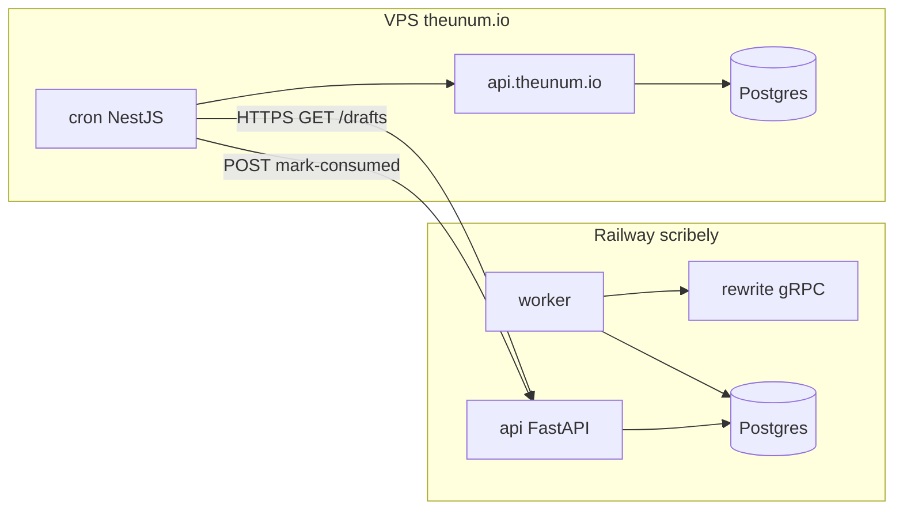
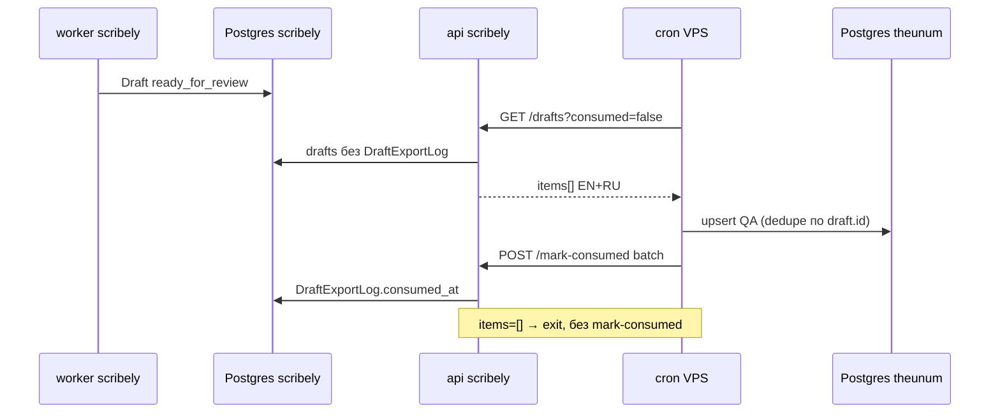

# Интеграция api-scribely → api.theunum.io (Export API)

Cron на VPS **забирает** AI-черновики из scribely (Railway) для QA и дальнейшей работы на theunum.io.
Scribely **не пушит** данные на VPS — только отдаёт по HTTP по запросу.

**Prefix API:** `/integrations/theunum/v1`  
**Реализация:** `services/api/app/routers/integration_theunum.py`  
**Код cron на VPS:** отдельный репозиторий `api.theunum.io` (здесь только контракт scribely).

---

## Направление данных



- **scribely** генерирует черновики: `RawItem → cluster → AI → Draft (ready_for_review)`.
- **theunum backend** на VPS периодически **тянет** unconsumed черновики.
- После сохранения на VPS cron вызывает **mark-consumed** — повторный GET не отдаёт те же `draft_id`.
- **gRPC между зонами не используется** — только внутри Railway (`api`/`worker` → `rewrite`).
- UI `/drafts` (JWT rewriter/admin) и Export API — **разные контракты**, не смешивать.



---

## CORS: когда нужен

| Кто вызывает scribely | CORS | Защита |
|---|---|---|
| NestJS cron на VPS (`fetch` server-side) | **Не нужен** | Service token |
| Браузер admin.theunum.io → scribely напрямую | **Нужен** | Token + `CORS_ALLOWED_ORIGINS` |

Для cron достаточно service token. CORS включается опционально через env (см. ниже).

---

## Безопасность

Отдельный machine-to-machine секрет — **не** JWT и **не** `INTERNAL_SERVICE_TOKEN`:

| Переменная | Назначение |
|---|---|
| `INTERNAL_SERVICE_TOKEN` | только api/worker → rewrite (gRPC внутри Railway) |
| `JWT_SECRET` | логин rewriter/admin в UI scribely |
| **`THEUNUM_INTEGRATION_TOKEN`** | theunum backend → scribely Export API |

**Правила:**

- Генерация: `python -c "import secrets; print(secrets.token_urlsafe(48))"`.
- Один секрет в Railway (`api`) и на VPS (`SCRIBELY_INTEGRATION_TOKEN`).
- Передача: `Authorization: Bearer <token>` (предпочтительно) или `X-Theunum-Service-Token: <token>`.
- Проверка: `secrets.compare_digest` — constant-time.
- Токен **не** в query string и **не** в URL.
- Prod: только HTTPS (`https://api-scribely-production.up.railway.app`).
- Токен **не** класть во frontend — только server-side cron/API route.

**HTTP-коды auth:**

| Ситуация | Код |
|---|---|
| `THEUNUM_INTEGRATION_TOKEN` не задан на `api` | **503** |
| Токен отсутствует или неверный | **401** |

---

## Переменные окружения

### api-scribely (Railway)

| Сервис | Переменная | Обязательно | Описание |
|---|---|---|---|
| `api` | `THEUNUM_INTEGRATION_TOKEN` | **Да** | Без него Export API → 503 |
| `api` | `CORS_ALLOWED_ORIGINS` | Нет | Через запятую; cron не нуждается |
| `api` | `DATABASE_URL`, `JWT_SECRET`, `INTERNAL_SERVICE_TOKEN`, `REWRITE_GRPC_ADDRESS` | Да | Без изменений |
| `rewrite` | `OPENROUTER_KEY_1..3` | Для AI | **Только** на rewrite, не на api |
| `worker` | shared DB + gRPC | Да | Пишет pipeline telemetry в AppSetting |

### api.theunum.io (VPS)

| Переменная | Обязательно | Описание |
|---|---|---|
| `SCRIBELY_BASE_URL` | **Да** | Prod: `https://api-scribely-production.up.railway.app` |
| `SCRIBELY_INTEGRATION_TOKEN` | **Да** | **Тот же** секрет, что `THEUNUM_INTEGRATION_TOKEN` |

---

## Деплой и миграция

После merge в GitHub Railway (если подключён к repo) деплоит **три** сервиса:

| Сервис | Зачем redeploy |
|---|---|
| `api` | Export API, `/status`, CORS |
| `worker` | запись `pipeline.last_error_*` в AppSetting |
| `rewrite` | классификация OpenRouter, `[reason=code]` в gRPC |

**Миграция `draft_export_log`:** на Railway сервис `api` при старте выполняет `alembic upgrade head` (см. `services/api/Dockerfile`). Локально:

```bash
alembic upgrade head
```

После первого деплоя добавить `THEUNUM_INTEGRATION_TOKEN` на `api` и **redeploy `api`**.

---

## HTTP API

**Auth (все endpoints):**

```http
Authorization: Bearer <THEUNUM_INTEGRATION_TOKEN>
```

или

```http
X-Theunum-Service-Token: <THEUNUM_INTEGRATION_TOKEN>
```

| Method | Path | Назначение |
|---|---|---|
| GET | `/drafts` | Список черновиков для выгрузки |
| GET | `/drafts/{id}` | Полный черновик |
| POST | `/drafts/mark-consumed` | Batch: пометить «уже забрали» |
| POST | `/drafts/{id}/mark-consumed` | Один черновик |
| GET | `/status` | Диагностика пайплайна и OpenRouter |

---

## GET `/drafts`

```http
GET /integrations/theunum/v1/drafts?status=ready_for_review&since=2026-09-01T12:00:00Z&limit=50&cursor=<draft_uuid>
Authorization: Bearer <token>
```

### Query-параметры

| Параметр | По умолчанию | Описание |
|---|---|---|
| `consumed` | `false` | **`false`** — только ещё не забранные theunum (главный фильтр cron). `true` — только для отладки/аудита |
| `status` | `ready_for_review`, `needs_fix` | Можно повторить параметр или передать один статус |
| `since` | — | ISO8601, фильтр по `Draft.updated_at` (инкрементальный cron) |
| `limit` | `50` | Max 100 |
| `cursor` | — | Пагинация: `draft_id` последнего item с предыдущей страницы |

Сортировка: `created_at ASC`, `id ASC`.

### Ответ

```json
{
  "items": [],
  "next_cursor": null,
  "has_more": false,
  "meta": {
    "pipeline_status": "ok",
    "reason_code": "queue_empty",
    "reason_message": "Нет новых unconsumed черновиков — это норма.",
    "checked_at": "2026-09-01T12:00:00+00:00",
    "undrafted_in_topic_clusters": 12,
    "last_draft_created_at": "2026-09-01T11:45:00+00:00"
  }
}
```

**Правила:**

- HTTP **200** даже при пустой очереди или `pipeline_degraded` — cron получает данные **и** диагностику.
- `items` **всегда массив**, никогда `null`.
- Если `items` не пуст — `meta.reason_code` = `ok` (есть что забирать).
- При пустом `items` — **не вызывать** mark-consumed.
- Cron: `if (meta.reason_code !== 'queue_empty')` → alert/log.

---

## GET `/drafts/{id}`

Полный черновик. Payload = `DraftDetail` из UI API + поле `consumed_at`.

**Один черновик = EN + RU в одном JSON** (обе версии публикуются вместе):

| Блок | Поля |
|---|---|
| Идентификация | `id`, `trace_id` (в summary через cluster), `status`, `version`, `consumed_at` |
| Текст EN | `title_en`, `body_en`, `title_en_variants[]` |
| Текст RU | `title_ru`, `body_ru`, `title_ru_variants[]` |
| SEO EN | `seo_title_en`, `seo_description_en`, `slug_en`, `keywords_en`, `og_*`, `focus_keyphrase_en` |
| SEO RU | `seo_title_ru`, `seo_description_ru`, `slug_ru`, `keywords_ru`, … |
| Качество | `compliance_notes`, `sensitive_hold`, `fact_conflict`, `similarity_score`, флаги sponsor/press_release/disclaimer |
| Теги/категория | `pending_tags`, `pending_category_slug`, `tag_ids`, `category_id` |
| Image brief | `image_brief`, `image_alt`, `image_mood`, … |
| Источники | `sources[]`: `{ title, url, language, source_name }` |
| Прочее | `attribution_urls`, `handoff_note`, `rewrite_llm_model`, `created_at` |

Отдельных запросов «только EN» / «только RU» нет.

---

## POST mark-consumed

### Один черновик

```http
POST /integrations/theunum/v1/drafts/{draft_id}/mark-consumed
Content-Type: application/json

{ "theunum_reference_id": "optional-id-on-vps" }
```

### Batch (рекомендуется для cron)

```http
POST /integrations/theunum/v1/drafts/mark-consumed
Content-Type: application/json

{
  "items": [
    { "draft_id": "uuid", "theunum_reference_id": "optional" }
  ]
}
```

**Ответ:**

```json
{ "marked": 1, "draft_ids": ["uuid"] }
```

**Поведение:**

- Upsert в `draft_export_log`: `draft_id`, `consumed_at`, `theunum_reference_id`, `trace_id`.
- **Идемпотентно** — повторный POST с тем же `draft_id` → 200 OK.
- `items: []` в batch → 200 OK, `marked: 0` (no-op).
- После пометки черновик **исчезает** из `GET ...?consumed=false`.
- `AuditLog`: `action=theunum_consumed`, `source=integration_api`.
- **`Draft.status` не меняется** — export/consumed ≠ publish в scribely UI.

---

## GET `/status`

Отдельный endpoint для мониторинга (можно вызывать раз в N минут вместо чтения `meta` из GET drafts).

```http
GET /integrations/theunum/v1/status
Authorization: Bearer <token>
```

**Пример ответа:**

```json
{
  "pipeline_status": "degraded",
  "reason_code": "openrouter_payment_required",
  "reason_message": "OpenRouter: закончились credits — пополните баланс или проверьте ключи. (all OpenRouter keys exhausted: …)",
  "checked_at": "2026-09-01T12:00:00+00:00",
  "stages": {
    "poll_enabled": true,
    "dispatch_enabled": true,
    "rewrite_reachable": true
  },
  "queue": {
    "unconsumed_drafts": 0,
    "undrafted_in_topic_clusters": 47,
    "last_draft_created_at": "2026-09-01T11:45:00+00:00",
    "last_dispatch_at": "2026-09-01T11:30:00+00:00",
    "last_dispatch_dispatched": 0,
    "last_dispatch_failed": 3
  },
  "openrouter": {
    "keys_configured": 3,
    "last_error_code": "openrouter_payment_required",
    "last_error_message": "[reason=openrouter_payment_required] all OpenRouter keys exhausted: …",
    "last_error_at": "2026-09-01T11:30:05+00:00",
    "key_usage": [
      { "key_alias": "key_1", "model": "openai/gpt-oss-20b:free", "usage_count": 120, "error_count": 5 }
    ]
  }
}
```

---

## meta.reason_code — полный справочник

| `reason_code` | Когда | Действие cron на VPS |
|---|---|---|
| `ok` | Есть items или пайплайн штатен | Забирать / продолжать |
| `queue_empty` | Нечего забирать, очередь пуста | **Exit quietly**, без alert |
| `pipeline_degraded` | Сырьё есть, черновики не создаются, код ошибки не детализирован | **Alert** |
| `openrouter_payment_required` | HTTP 402, insufficient credits | **Alert**, пополнить ключи |
| `openrouter_rate_limited` | HTTP 429, rate limit | **Alert**, подождать/ключи |
| `openrouter_keys_exhausted` | Все 3 ключа отвалились | **Alert** |
| `openrouter_auth_failed` | HTTP 401/403, invalid API key | **Alert**, проверить `OPENROUTER_KEY_*` |
| `openrouter_no_keys_configured` | Ключи пустые в env rewrite | **Alert** |
| `dispatch_disabled` | `pipeline.dispatch_enabled=false` | Info/alert |
| `rewrite_unavailable` | gRPC rewrite не отвечает | **Alert**, Railway |
| `ingestion_disabled` | `pipeline.poll_enabled=false`, нет новых кластеров | Info |

---

## Pipeline telemetry (OpenRouter → worker → AppSetting)

Ошибки OpenRouter сохраняются в Postgres (`app_settings`) и отдаются через `/status` и `meta`.

### Цепочка классификации

```
OpenRouter HTTP 402/429/401…
  → OpenRouterError(code=openrouter_*)
  → rotation → AllKeysExhaustedError(code=…)
  → rewrite gRPC: [reason=openrouter_payment_required] all OpenRouter keys exhausted: …
  → worker run_dispatch_cycle() → record_dispatch_cycle_result()
  → AppSetting pipeline.last_error_*
  → api build_pipeline_status() → /status и meta
```

**Маппинг OpenRouter → код:**

| Сигнал | `pipeline.last_error_code` |
|---|---|
| HTTP 402, insufficient credits, billing | `openrouter_payment_required` |
| HTTP 429, rate limit | `openrouter_rate_limited` |
| HTTP 401/403, invalid api key | `openrouter_auth_failed` |
| Все ключи исчерпаны | `openrouter_keys_exhausted` |
| timeout / 5xx / connect | `openrouter_keys_exhausted` |

### Ключи AppSetting

| Key | Пример | Кто пишет |
|---|---|---|
| `pipeline.last_error_code` | `openrouter_payment_required` | worker |
| `pipeline.last_error_message` | текст gRPC/OpenRouter | worker |
| `pipeline.last_error_at` | ISO8601 | worker |
| `pipeline.last_dispatch_at` | ISO8601 | worker |
| `pipeline.last_dispatch_dispatched` | `0` | worker |
| `pipeline.last_dispatch_failed` | `3` | worker |
| `openrouter.keys_configured` | `3` | rewrite при старте |

При **успешном** dispatch (`dispatched > 0`) worker сбрасывает `pipeline.last_error_code` → `ok`.

**Проверка в БД:**

```sql
SELECT key, value FROM app_settings
WHERE key LIKE 'pipeline.%' OR key = 'openrouter.keys_configured';
```

---

## Cron на VPS (полный псевдокод)

```typescript
const headers = {
  Authorization: `Bearer ${SCRIBELY_INTEGRATION_TOKEN}`,
  "Content-Type": "application/json",
};

async function syncDraftsFromScribely() {
  let cursor: string | null = null;

  do {
    const url = new URL(`${SCRIBELY_BASE_URL}/integrations/theunum/v1/drafts`);
    url.searchParams.set("limit", "50");
    if (cursor) url.searchParams.set("cursor", cursor);

    const resp = await fetch(url, { headers });
    if (resp.status === 401) {
      await alertOps({ code: "auth_failed", message: "Invalid SCRIBELY_INTEGRATION_TOKEN" });
      return;
    }
    if (!resp.ok) {
      await alertOps({ code: "scribely_http_error", message: `${resp.status}` });
      return;
    }

    const { items, meta, next_cursor, has_more } = await resp.json();

    if (!items?.length) {
      if (meta.reason_code !== "queue_empty") {
        await alertOps({
          code: meta.reason_code,
          message: meta.reason_message,
          undrafted: meta.undrafted_in_topic_clusters,
        });
      }
      return;
    }

    const toMark: { draft_id: string; theunum_reference_id: string }[] = [];

    for (const draft of items) {
      const localId = await upsertQaDraft(draft); // unique index по scribely_draft_id
      toMark.push({ draft_id: draft.id, theunum_reference_id: localId });
    }

    if (toMark.length) {
      await fetch(`${SCRIBELY_BASE_URL}/integrations/theunum/v1/drafts/mark-consumed`, {
        method: "POST",
        headers,
        body: JSON.stringify({ items: toMark }),
      });
    }

    cursor = has_more ? next_cursor : null;
  } while (cursor);
}

// Опционально: отдельный мониторинг раз в N минут
async function checkScribelyPipeline() {
  const resp = await fetch(`${SCRIBELY_BASE_URL}/integrations/theunum/v1/status`, { headers });
  const status = await resp.json();
  if (status.pipeline_status === "degraded") {
    await alertOps({ code: status.reason_code, message: status.reason_message });
  }
}
```

### Idempotency (два уровня)

| Уровень | Механизм |
|---|---|
| scribely | `draft_export_log` + `consumed=false` в GET |
| VPS | unique index по `scribely_draft_id` — если mark-consumed не дошёл, дубликаты локально не плодятся |

### Retry

- 5xx / timeout на GET — exponential backoff.
- 401 — alert, не ретраить бесконечно.
- mark-consumed **идемпотентен** — безопасно ретраить.

---

## Гарантии

- **Пустая очередь — не ошибка:** `items: []`, HTTP 200; cron выходит без mark-consumed.
- **At-least-once delivery:** если cron упал до mark-consumed, повторный GET может отдать тот же draft; VPS dedupe по `scribely_draft_id`.
- **Export ≠ publish:** mark-consumed не меняет `Draft.status` в scribely.
- **since + cursor** — для больших очередей и инкрементального cron.

---

## Что НЕ делать

- Не открывать gRPC rewrite наружу.
- Не использовать JWT rewriter/admin для cron.
- Не класть integration token во frontend theunum.
- Не менять `Draft.status` на `published` при export.
- Не передавать token в query string.

---

## Проверка (curl)

```bash
export TOKEN="<THEUNUM_INTEGRATION_TOKEN>"
export BASE="https://api-scribely-production.up.railway.app"

# 401 без токена
curl -s -o /dev/null -w "%{http_code}\n" "$BASE/integrations/theunum/v1/drafts"

# Список (503 если TOKEN не задан на api)
curl -s -H "Authorization: Bearer $TOKEN" \
  "$BASE/integrations/theunum/v1/drafts" | jq .

# Статус пайплайна
curl -s -H "Authorization: Bearer $TOKEN" \
  "$BASE/integrations/theunum/v1/status" | jq .

# mark-consumed (пример)
curl -s -X POST -H "Authorization: Bearer $TOKEN" -H "Content-Type: application/json" \
  -d '{"items":[{"draft_id":"<uuid>","theunum_reference_id":"qa-1"}]}' \
  "$BASE/integrations/theunum/v1/drafts/mark-consumed" | jq .
```

**Локально:** `http://localhost:8000` (или другой порт), token из `.env` → `THEUNUM_INTEGRATION_TOKEN`.

---

## Тест-план (scribely)

| # | Проверка |
|---|---|
| 1 | curl без токена → 401 |
| 2 | curl с токеном → 200, список drafts |
| 3 | Пустая очередь → `items: []`, HTTP 200 |
| 4 | mark-consumed → draft не в `consumed=false` |
| 5 | Bulk mark-consumed → все исчезают из списка |
| 6 | `items=[]` + `reason_code=queue_empty` → cron exit без alert |
| 7 | `items=[]` + `openrouter_payment_required` → alert |
| 8 | GET `/status` → те же коды, `openrouter.key_usage` |
| 9 | Cron с VPS → черновик в QA-таблице theunum |
| 10 | CORS (если включён): OPTIONS из admin.theunum.io → 200 |

Автотесты: `services/api/tests/test_integration_theunum.py`, `test_integration_reasons.py`, `services/worker/tests/test_pipeline_telemetry.py`.

---

## Сторона VPS (api.theunum.io) — вне этого репо

1. Env: `SCRIBELY_BASE_URL`, `SCRIBELY_INTEGRATION_TOKEN`.
2. NestJS `@Cron` или system cron → код выше.
3. Таблица QA с unique index по `scribely_draft_id`.
4. Alerting при `meta.reason_code !== 'queue_empty'`.

Publish на theunum.io и CreateTag/EnsureCategory — **отдельный flow**, не часть Export API scribely.
