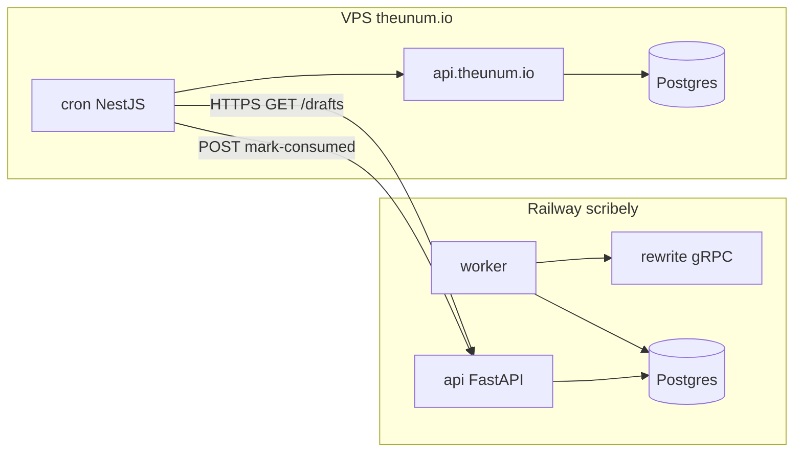
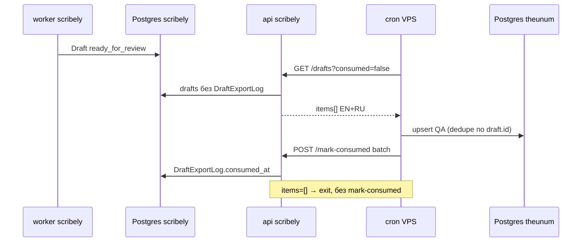

# Интеграция api-scribely → api.theunum.io (Export API)

Cron на VPS **забирает** AI-черновики из scribely (Railway) для QA и дальнейшей работы на theunum.io.
Scribely **не пушит** данные на VPS — только отдаёт по HTTP по запросу.

**Prefix API:** `/integrations/theunum/v1`  
**Реализация:** `services/api/app/routers/integration_theunum.py`  
**Код cron на VPS:** отдельный репозиторий `api.theunum.io` (здесь только контракт scribely).

---

## Модель безопасности (два слоя)

Запрос из **продукта theunum** к scribely Export API защищён **двумя независимыми проверками на scribely**:

| Слой | Где настраивается | Что проверяет |
|---|---|---|
| **1. Origin (CORS)** | scribely `api` → `CORS_ALLOWED_ORIGINS` | Запрос пришёл **с разрешённого URL** продукта (`https://admin.theunum.io`, `https://theunum.io`, …). Чужой сайт в браузере получит блок CORS **до** API. |
| **2. Service token** | **Оба** бэкенда — **один и тот же секрет** | scribely: `THEUNUM_INTEGRATION_TOKEN` · theunum: `SCRIBELY_INTEGRATION_TOKEN`. Без правильного header → **401**. |

**Оба слоя обязательны**, если theunum **из браузера** (admin / site) ходит в scribely **напрямую**:
- Origin должен быть в `CORS_ALLOWED_ORIGINS`
- В каждом запросе header `X-Theunum-Service-Token: <секрет>` (или `Authorization: Bearer <секрет>`)

**Только token** (без CORS) — когда зовёт **сервер** theunum (NestJS cron / route на VPS): браузер не участвует, CORS не применяется, но **тот же секрет в header обязателен**.

Токен **не** в URL, **не** в frontend-коде публично, **не** JWT rewriter scribely, **не** `INTERNAL_SERVICE_TOKEN`.

### Что прописать на scribely (Railway, сервис `api`)

```env
THEUNUM_INTEGRATION_TOKEN=<один-секрет>
CORS_ALLOWED_ORIGINS=https://admin.theunum.io,https://theunum.io
```

После смены — **redeploy `api`**.

### Что прописать на theunum (VPS, `api.theunum.io`)

```env
SCRIBELY_BASE_URL=https://api-scribely-production.up.railway.app
SCRIBELY_INTEGRATION_TOKEN=<тот-же-секрет>
```

### Заголовок на каждый запрос (theunum → scribely)

```http
X-Theunum-Service-Token: <SCRIBELY_INTEGRATION_TOKEN>
Content-Type: application/json
```

### Если что-то не так

| Симптом | Причина |
|---|---|
| CORS error в браузере | Origin theunum **не** в `CORS_ALLOWED_ORIGINS` scribely |
| **401** | Нет header или секрет **не совпадает** между бэкендами |
| **503** | На scribely не задан `THEUNUM_INTEGRATION_TOKEN` |
| Preflight OPTIONS падает | Origin не в allowlist или header не в `allow_headers` (у нас: `X-Theunum-Service-Token`, `Authorization`, `Content-Type`) |

---

## Шпаргалка: вызов из другого проекта (prod)

Скопируй этот блок в `api.theunum.io` / заметки — не нужно каждый раз объяснять scribely заново.

### Prod URL (scribely)

```
https://api-scribely-production.up.railway.app
```

Все integration-запросы:

```
https://api-scribely-production.up.railway.app/integrations/theunum/v1/drafts
https://api-scribely-production.up.railway.app/integrations/theunum/v1/drafts/{uuid}
https://api-scribely-production.up.railway.app/integrations/theunum/v1/drafts/mark-consumed
https://api-scribely-production.up.railway.app/integrations/theunum/v1/status
```

### Секрет (один на обе стороны)

| Где | Env | Значение |
|---|---|---|
| Railway scribely **`api`** | `THEUNUM_INTEGRATION_TOKEN` | `<секрет>` |
| VPS **`api.theunum.io`** | `SCRIBELY_INTEGRATION_TOKEN` | **тот же** `<секрет>` |

Генерация: `python -c "import secrets; print(secrets.token_urlsafe(48))"`

### Auth — два равнозначных заголовка (не JWT!)

**Вариант A (рекомендуется для server-side / NestJS cron):**

```http
X-Theunum-Service-Token: <SCRIBELY_INTEGRATION_TOKEN>
```

**Вариант B:**

```http
Authorization: Bearer <SCRIBELY_INTEGRATION_TOKEN>
```

Токен **только в header**, **не** в query/URL.  
**Не** `INTERNAL_SERVICE_TOKEN`, **не** JWT rewriter/admin.

| Ответ | Причина |
|---|---|
| **503** | На scribely `api` не задан `THEUNUM_INTEGRATION_TOKEN` |
| **401** | Header отсутствует или секрет не совпадает |

### Сценарий 1: сервер theunum (cron / NestJS route) → scribely

CORS не участвует (не браузер). **Token обязателен.**

```typescript
const headers = {
  "X-Theunum-Service-Token": process.env.SCRIBELY_INTEGRATION_TOKEN!,
  "Content-Type": "application/json",
};

await fetch(`${process.env.SCRIBELY_BASE_URL}/integrations/theunum/v1/drafts?limit=50`, {
  headers,
});
```

### Сценарий 2: браузер theunum → scribely напрямую

**Origin из allowlist + token в header — оба обязательны.**

На scribely уже должно быть:

```env
CORS_ALLOWED_ORIGINS=https://admin.theunum.io,https://theunum.io
THEUNUM_INTEGRATION_TOKEN=<секрет>
```

Запрос **только** со страницы, чей origin в списке (например открыт `https://admin.theunum.io`):

```javascript
fetch("https://api-scribely-production.up.railway.app/integrations/theunum/v1/drafts?limit=50", {
  method: "GET",
  headers: {
    "X-Theunum-Service-Token": "<секрет — лучше прокси через api.theunum.io, не светить в FE>",
    "Content-Type": "application/json",
  },
});
```

Если origin не в allowlist — браузер заблокирует ответ (CORS), даже с правильным token.

**Безопаснее:** браузер → `api.theunum.io` (свой JWT/session) → сервер theunum добавляет `X-Theunum-Service-Token` → scribely. Тогда CORS scribely не нужен для FE, token остаётся только на VPS.

### Минимальный flow cron (без cursor, если ≤50 drafts)

```
1. GET  /integrations/theunum/v1/drafts?limit=50
       Header: X-Theunum-Service-Token: <token>
2. if items.length === 0 && meta.reason_code !== 'queue_empty' → alert
3. save each item to VPS DB (dedupe по draft.id)
4. POST /integrations/theunum/v1/drafts/mark-consumed
       Body: { "items": [{ "draft_id": "...", "theunum_reference_id": "..." }] }
       Header: X-Theunum-Service-Token: <token>
```

`cursor` — **не обязателен** на первом запросе; нужен только если `has_more: true`.

---

## Направление данных



- **scribely** генерирует черновики: `RawItem → cluster → AI → Draft (ready_for_review)`.
- **theunum backend** на VPS периодически **тянет** unconsumed черновики.
- После сохранения на VPS cron вызывает **mark-consumed** — повторный GET не отдаёт те же `draft_id`.
- **gRPC между зонами не используется** — только внутри Railway (`api`/`worker` → `rewrite`).
- UI `/drafts` (JWT rewriter/admin) и Export API — **разные контракты**, не смешивать.



---

## CORS: когда нужен

| Кто вызывает scribely | CORS | Защита |
|---|---|---|
| NestJS cron на VPS (`fetch` server-side) | **Не нужен** | Service token |
| Браузер admin.theunum.io → scribely напрямую | **Нужен** | Token + `CORS_ALLOWED_ORIGINS` |

Для cron достаточно service token. CORS включается опционально через env (см. ниже).

---

## Безопасность

Отдельный machine-to-machine секрет — **не** JWT и **не** `INTERNAL_SERVICE_TOKEN`:

| Переменная | Назначение |
|---|---|
| `INTERNAL_SERVICE_TOKEN` | только api/worker → rewrite (gRPC внутри Railway) |
| `JWT_SECRET` | логин rewriter/admin в UI scribely |
| **`THEUNUM_INTEGRATION_TOKEN`** | theunum backend → scribely Export API |

**Правила:**

- Генерация: `python -c "import secrets; print(secrets.token_urlsafe(48))"`.
- Один секрет в Railway (`api`) и на VPS (`SCRIBELY_INTEGRATION_TOKEN`).
- Передача: `Authorization: Bearer <token>` (предпочтительно) или `X-Theunum-Service-Token: <token>`.
- Проверка: `secrets.compare_digest` — constant-time.
- Токен **не** в query string и **не** в URL.
- Prod: только HTTPS (`https://api-scribely-production.up.railway.app`).
- Токен **не** класть во frontend — только server-side cron/API route.

**HTTP-коды auth:**

| Ситуация | Код |
|---|---|
| `THEUNUM_INTEGRATION_TOKEN` не задан на `api` | **503** |
| Токен отсутствует или неверный | **401** |

---

## Переменные окружения

### api-scribely (Railway)

| Сервис | Переменная | Обязательно | Описание |
|---|---|---|---|
| `api` | `THEUNUM_INTEGRATION_TOKEN` | **Да** | Без него Export API → 503 |
| `api` | `CORS_ALLOWED_ORIGINS` | Нет | Через запятую; cron не нуждается |
| `api` | `DATABASE_URL`, `JWT_SECRET`, `INTERNAL_SERVICE_TOKEN`, `REWRITE_GRPC_ADDRESS` | Да | Без изменений |
| `rewrite` | `OPENROUTER_KEY_1..3` | Для AI | **Только** на rewrite, не на api |
| `worker` | shared DB + gRPC | Да | Пишет pipeline telemetry в AppSetting |

### api.theunum.io (VPS)

| Переменная | Обязательно | Описание |
|---|---|---|
| `SCRIBELY_BASE_URL` | **Да** | Prod: `https://api-scribely-production.up.railway.app` |
| `SCRIBELY_INTEGRATION_TOKEN` | **Да** | **Тот же** секрет, что `THEUNUM_INTEGRATION_TOKEN` |

---

## Деплой и миграция

После merge в GitHub Railway (если подключён к repo) деплоит **три** сервиса:

| Сервис | Зачем redeploy |
|---|---|
| `api` | Export API, `/status`, CORS |
| `worker` | запись `pipeline.last_error_*` в AppSetting |
| `rewrite` | классификация OpenRouter, `[reason=code]` в gRPC |

**Миграция `draft_export_log`:** на Railway сервис `api` при старте выполняет `alembic upgrade head` (см. `services/api/Dockerfile`). Локально:

```bash
alembic upgrade head
```

После первого деплоя добавить `THEUNUM_INTEGRATION_TOKEN` на `api` и **redeploy `api`**.

---

## HTTP API

**Auth (все endpoints):**

```http
Authorization: Bearer <THEUNUM_INTEGRATION_TOKEN>
```

или

```http
X-Theunum-Service-Token: <THEUNUM_INTEGRATION_TOKEN>
```

| Method | Path | Назначение |
|---|---|---|
| GET | `/drafts` | Список черновиков для выгрузки |
| GET | `/drafts/today` | То же, но **только AI-текст с UTC-00:00 сегодня** (`freshness=today`) |
| GET | `/drafts/{id}` | Полный черновик |
| POST | `/drafts/mark-consumed` | Batch: пометить «уже забрали» |
| POST | `/drafts/{id}/mark-consumed` | Один черновик |
| GET | `/status` | Диагностика пайплайна и OpenRouter |
| GET | `/export-schema` | **Схема всех фильтров** + текущие admin defaults (для фронта / cron builder) |

**Admin REST (JWT admin, не integration token):**

| Method | Path | Назначение |
|---|---|---|
| GET | `/admin/integration/export-settings` | Defaults + filters + unsupported (то же что export-schema, для админки) |
| PUT | `/admin/integration/export-settings` | Сохранить `default_freshness`, `default_max_age_hours`, `default_limit` |

---

## Справочник фильтров Export API (полный контракт для фронта / VPS)

Этот раздел — **единый источник правды** по всем параметрам списка черновиков, дефолтам админки и тому, **чего API не умеет**. Можно копировать в `api.theunum.io` / admin frontend.

### Base URL и auth

| | |
|---|---|
| **Prefix** | `/integrations/theunum/v1` |
| **Auth** | `Authorization: Bearer <THEUNUM_INTEGRATION_TOKEN>` **или** `X-Theunum-Service-Token: <token>` |
| **Content-Type** | `application/json` (для POST) |
| **401** | Нет header или неверный секрет |
| **503** | На scribely `api` не задан `THEUNUM_INTEGRATION_TOKEN` |

Integration token **не** передаётся в query string. JWT rewriter/admin **не** подходит.

### Какие эндпоинты принимают фильтры

| Method | Path | Query-фильтры | Body |
|---|---|---|---|
| `GET` | `/drafts` | **Все** (см. таблицы ниже) | — |
| `GET` | `/drafts/today` | Подмножество (см. ниже) | — |
| `GET` | `/drafts/{id}` | **Нет** | — |
| `GET` | `/status` | **Нет** | — |
| `POST` | `/drafts/{id}/mark-consumed` | **Нет** | `{ "theunum_reference_id"?: string }` |
| `POST` | `/drafts/mark-consumed` | **Нет** | `{ "items": [{ "draft_id", "theunum_reference_id"? }] }` |

---

## GET `/drafts` — все query-параметры

```http
GET /integrations/theunum/v1/drafts?consumed=false&freshness=today&limit=100
Authorization: Bearer <token>
```

### 1. Export / очередь theunum

| Параметр | Тип | Default | Допустимые значения | SQL / поле | Описание |
|---|---|---|---|---|---|
| `consumed` | `boolean` | `false` | `true`, `false` | `draft_export_log` (LEFT JOIN) | **`false`** — только черновики **без** строки в `draft_export_log` (ещё не забраны theunum). **`true`** — только уже помеченные `mark-consumed` (отладка, аудит повторной выгрузки) |

**Неявное правило:** при `consumed=false` cron видит только то, что ещё не вызывало `POST mark-consumed` для данного `draft_id`.

### 2. Статус черновика в scribely

| Параметр | Тип | Default | Допустимые значения | SQL / поле | Описание |
|---|---|---|---|---|---|
| `status` | `string[]` | см. ниже | enum `DraftStatus` | `draft.status` | Фильтр по статусу. Повтор параметра: `?status=ready_for_review&status=needs_fix`. Один статус: `?status=published` |

**Default без `status` в URL:** `ready_for_review`, `needs_fix` — типичная export-очередь.

**Полный enum `DraftStatus`:**

| Значение | В export по умолчанию | Смысл |
|---|---|---|
| `ready_for_review` | ✅ | Готов к ревью rewriter |
| `needs_fix` | ✅ | Нужны правки, но всё равно отдаётся в export |
| `drafting` | ❌ | LLM ещё пишет |
| `published` | ❌ | Опубликован через UI scribely |
| `rejected` | ❌ | Отклонён rewriter |
| `snoozed` | ❌ | Отложен |
| `archived` | ❌ | Архив |
| `updated` | ❌ | Обновлён после publish |

Export API **не меняет** статус при `mark-consumed`. Статус `published` на scribely ≠ «забрали на VPS».

### 3. Свежесть AI-текста (главное для cron «сегодня за сегодня»)

Все параметры этого блока фильтруют по **`draft.content_generated_at`** — момент **последнего** AI-рерайта (dispatch worker) или regen. **Не** `created_at`, **не** `updated_at` (кроме отдельного `since`).

| Параметр | Тип | Default | Диапазон / формат | SQL | Описание |
|---|---|---|---|---|---|
| `freshness` | enum | — | `today`, `48h` | `content_generated_at >= cutoff` | **`today`** — с **UTC 00:00:00** текущих суток. **`48h`** — не старше 48 часов от «сейчас» (UTC) |
| `max_age_hours` | integer | — | `1` … `168` | то же | Скользящее окно: не старше N часов |
| `generated_since` | datetime ISO8601 | — | `2026-09-01T17:00:00Z` или без TZ (трактуется как UTC) | `content_generated_at >= generated_since` | Явная нижняя граница |

**Комбинация нескольких freshness-параметров:**

Если передано больше одного из `generated_since`, `freshness`, `max_age_hours` — вычисляются все cutoffs, в SQL уходит **самый строгий** (`max` из cutoffs = самая поздняя нижняя граница).

Примеры:

| Query | Эффективный cutoff |
|---|---|
| `freshness=48h` + `max_age_hours=24` | последние **24 ч** |
| `freshness=today` + `generated_since=2026-09-01T06:00:00Z` (если 06:00 UTC позже полуночи) | с 06:00 UTC |
| только `freshness=today` | с UTC 00:00 сегодня |

**Приоритет query vs admin defaults:**

```
Любой из (freshness | max_age_hours | generated_since) в URL  →  source=query, admin игнорируется
Ни одного из трёх в URL                                         →  source=admin_default (если задано в AppSetting)
Admin тоже пусто                                                →  source=none, без фильтра по content_generated_at
```

**422 Unprocessable Entity:**

| Причина | Пример |
|---|---|
| `freshness` не `today`/`48h` | `?freshness=7d` |
| `max_age_hours` вне 1–168 | `?max_age_hours=0` или `200` |
| `max_age_hours` не число | `?max_age_hours=abc` |

### 4. Прочие фильтры по датам

| Параметр | Тип | Default | Формат | SQL / поле | Описание |
|---|---|---|---|---|---|
| `since` | datetime ISO8601 | — | ISO8601 | `draft.updated_at >= since` | Любое изменение черновика: правка rewriter, compliance, regen metadata и т.д. **Ортогонален** `content_generated_at` — можно комбинировать |

### 5. Пагинация

| Параметр | Тип | Default | Диапазон | Описание |
|---|---|---|---|---|
| `limit` | integer | `50` | `1` … `100` | Размер страницы |
| `cursor` | UUID | — | `draft.id` с предыдущей страницы | Курсорная пагинация; значение = `next_cursor` из прошлого ответа |

**Сортировка (фиксированная, не настраивается):** `ORDER BY draft.content_generated_at DESC, draft.id DESC` (свежий AI-рерайт первым).

**Поведение cursor:** выбираются черновики **строго старше** cursor-draft по `(content_generated_at, id)` — следующая страница к более старым.

**Offset-пагинации (`page`, `offset`) нет.**

---

## GET `/drafts/today` — параметры

Шорткат: **внутри всегда** `freshness=today`. Admin defaults для freshness **не применяются**.

| Параметр | Default | Есть в `/drafts/today` |
|---|---|---|
| `consumed` | `false` | ✅ |
| `status` | `ready_for_review`, `needs_fix` | ✅ |
| `limit` | `50` | ✅ |
| `cursor` | — | ✅ |
| `freshness` | жёстко `today` | ❌ не передаётся |
| `max_age_hours` | — | ❌ |
| `generated_since` | — | ❌ |
| `since` | — | ❌ |

Эквивалент:

```http
GET /integrations/theunum/v1/drafts?consumed=false&freshness=today&limit=100
```

---

## Admin Settings — дефолты freshness (без query на VPS)

Настраивается в scribely: **Admin → Настройки пайплайна → «Export API — свежесть для VPS cron»**. Без редеплоя — следующий GET подхватит значение из Postgres.

| AppSetting key | UI-поле | Тип | Допустимые значения | Когда применяется |
|---|---|---|---|---|
| `integration.export.default_freshness` | Пресет | string | `""` (пусто), `today`, `48h` | Только `GET /drafts` **без** `freshness`, `max_age_hours`, `generated_since` |
| `integration.export.default_max_age_hours` | max_age_hours | integer | `1`–`168` или пусто | То же; комбинируется с default_freshness — **строже побеждает** |
| `integration.export.default_limit` | limit | integer | `1`–`100` или пусто | Когда VPS **не передаёт** `limit` (иначе API default 50) |

**REST scribely (JWT admin, не integration token):**

```http
GET  /admin/integration/export-settings
PUT  /admin/integration/export-settings
Content-Type: application/json

{"default_freshness": "today", "default_max_age_hours": 48, "default_limit": 100}
```

**Integration token (для cron builder / theunum backend):**

```http
GET /integrations/theunum/v1/export-schema
```

**HTML form (scribely UI):**

```http
POST /ui/admin/settings/export-freshness
Content-Type: application/x-www-form-urlencoded

default_freshness=today&default_max_age_hours=&default_limit=100
```

---

## `meta` в ответе `GET /drafts` и `/drafts/today`

Помимо pipeline-диагностики, echo применённых freshness-фильтров:

| Поле | Тип | Когда | Значения / смысл |
|---|---|---|---|
| `freshness_source` | string | всегда | `query` — из URL; `admin_default` — из AppSetting; `none` — фильтра по AI-дате нет |
| `limit` | integer | всегда | Итоговый limit страницы |
| `limit_source` | string | всегда | `query` | `admin_default` | `api_default` (50) |
| `freshness` | string | если задан | `today`, `48h` |
| `max_age_hours` | integer | если задан | `1`–`168` |
| `content_generated_since` | string ISO8601 | если cutoff вычислен | Итоговая нижняя граница для `content_generated_at` |
| `pipeline_status` | string | всегда | `ok`, `degraded` |
| `reason_code` | string | всегда | см. [справочник reason_code](#meta-reason_code--полный-справочник) |
| `reason_message` | string | всегда | Локализованное пояснение |
| `checked_at` | string ISO8601 | всегда | Момент сборки meta |
| `undrafted_in_topic_clusters` | integer | всегда | Кластеры in_topic без Draft (сырьё в очереди worker) |
| `last_draft_created_at` | string \| null | всегда | `MAX(draft.created_at)` |

**Правило для cron:** если `items.length > 0`, то `reason_code` принудительно `ok` (есть что забирать), даже если пайплайн degraded.

**Тело ответа:**

```typescript
{
  items: IntegrationDraftExport[];  // всегда массив, never null
  next_cursor: string | null;       // draft UUID для следующей страницы
  has_more: boolean;
  meta: { /* см. выше */ };
}
```

---

## Поля каждого `item` (не query-фильтры, но нужны UI/маппингу)

`IntegrationDraftExport` = `DraftDetail` + export-поля. **Фильтровать по ним через GET нельзя** — только на стороне VPS после получения.

| Блок | Поля |
|---|---|
| Идентификация | `id`, `status`, `version`, `consumed_at`, `created_at`, `updated_at`, **`content_generated_at`** |
| Текст EN | `title_en`, `body_en`, `body_en_html`, `title_en_variants[]` |
| Текст RU | `title_ru`, `body_ru`, `body_ru_html`, `title_ru_variants[]` |
| SEO EN/RU | `seo_title_*`, `seo_description_*`, `slug_*`, `keywords_*`, `og_*`, `focus_keyphrase_*` |
| Качество | `compliance_notes[]`, `sensitive_hold`, `fact_conflict`, `similarity_score`, `sponsor_flag`, `press_release_flag`, `disclaimer_flag`, `needs_attention` (computed) |
| Теги/категория | `pending_tags`, `pending_category_slug`, `tag_ids`, `category_id` |
| Image brief | `image_brief`, `image_alt`, `image_mood`, `image_subjects`, `image_style`, `image_do_not`, `image_caption`, `image_source_suggestion`, `image_license_confirmed` |
| Источники | `sources[]`: `{ title, url, language, source_name }` |
| Прочее | `attribution_urls[]`, `handoff_note`, `rewrite_llm_model`, `topic`, `assignee_user_id` |
| Токены LLM (на статью) | `llm_prompt_tokens`, `llm_completion_tokens`, `llm_total_tokens` — сумма enrich+rewrite последнего цикла |

**Формат текста:**

- `body_en` / `body_ru` — plain text, **3 абзаца**, `\n\n`
- `body_en_html` / `body_ru_html` — `<p>…</p>` × 3
- Отдельных полей «только EN» / «только RU» в API нет — обе локали в одном item

**Даты item:**

| Поле | Смысл | Связь с фильтрами |
|---|---|---|
| `content_generated_at` | Последний AI-рерайт/regen | Ось `freshness` / `max_age_hours` / `generated_since` |
| `created_at` | Создание Draft | Метаданные; сортировка Export — по `content_generated_at` |
| `updated_at` | Любое изменение | Фильтр `since` |
| `consumed_at` | Когда theunum вызвал mark-consumed | `null` = ещё в `consumed=false` |

---

## Неявные фильтры (всегда, без query)

| Правило | Детали |
|---|---|
| Integration auth | Без валидного token — 401/503, список не отдаётся |
| JOIN export log | `consumed=false` → `draft_export_log` отсутствует |
| Default statuses | Без `status` — только `ready_for_review` + `needs_fix` |
| Sort | Только `content_generated_at DESC, id DESC` |
| Limit cap | Max 100 items за запрос |
| Нет soft-delete filter | Архивные/rejected не попадают только если status не передан явно |

---

## Чего **НЕТ** в Export API (явный список)

Использовать **нельзя** — параметров не существует; нужна фильтрация на VPS или доработка scribely.

### Фильтры по контенту и метаданным

| Желаемое | Статус |
|---|---|
| По теме / topic slug / topic_id | ❌ нет (`topic` только в ответе) |
| По категории / `pending_category_slug` / `category_id` | ❌ нет |
| По тегам / `pending_tags` / `tag_ids` | ❌ nет |
| По языку (только EN или только RU) | ❌ нет — всегда пара EN+RU |
| По длине текста (`body_*` min/max символов) | ❌ нет |
| По `similarity_score` | ❌ нет |
| По compliance-флагам (`sensitive_hold`, `fact_conflict`, `sponsor_flag`, …) | ❌ нет |
| По `needs_attention` | ❌ нет |
| По `rewrite_llm_model` | ❌ nет |
| По источнику RSS / `source_name` / домену URL | ❌ нет |
| Full-text search по title/body | ❌ нет |
| По `assignee_user_id` (rewriter) | ❌ нет |
| По `handoff_note` | ❌ нет |
| Только черновики с заполненной категорией | ❌ nет |

### Фильтры по датам (кроме документированных)

| Желаемое | Статус |
|---|---|
| `created_since` / `created_before` | ❌ нет (только cursor по `created_at`) |
| `updated_before` | ❌ nет |
| `content_generated_before` / upper bound | ❌ nет |
| `consumed_since` / фильтр по `consumed_at` | ❌ nет (только boolean `consumed`) |
| Timezone отличный от UTC для `today` | ❌ нет — `today` всегда **UTC midnight** |
| `freshness=24h` / `7d` / произвольный пресет | ❌ nет — только `today`, `48h` или `max_age_hours` |
| `freshness=week` / `month` | ❌ nет |

### Пагинация и сортировка

| Желаемое | Статус |
|---|---|
| `offset`, `page`, `skip` | ❌ nет |
| Сортировка по `updated_at`, `content_generated_at`, title | ❌ нет |
| `order=asc` (старые первыми) | ❌ нет (фиксировано DESC по AI-дате) |
| Произвольный `sort_by` | ❌ nет |

### Прочее

| Желаемое | Статус |
|---|---|
| GraphQL / bulk export by ids | ❌ nет |
| Webhook push от scribely | ❌ нет — только pull cron |
| PATCH/DELETE draft через integration | ❌ нет |
| Publish на theunum через integration | ❌ нет — отдельный flow VPS |
| Фильтр «только с `body_*_html`» | ❌ nет — html всегда генерируется на export |
| Include/exclude fields (sparse response) | ❌ nет — полный DraftDetail |
| `If-Modified-Since` / ETag | ❌ nет |
| Rate limit headers / quota API | ❌ nет (ограничение только `limit` ≤ 100) |

---

## TypeScript-типы (для admin / cron на theunum)

```typescript
type FreshnessPreset = "today" | "48h";

type DraftStatus =
  | "drafting"
  | "ready_for_review"
  | "needs_fix"
  | "published"
  | "rejected"
  | "snoozed"
  | "archived"
  | "updated";

type FreshnessSource = "query" | "admin_default" | "none";

/** GET /integrations/theunum/v1/drafts */
interface ExportDraftsQuery {
  consumed?: boolean;              // default false
  status?: DraftStatus | DraftStatus[];
  since?: string;                  // ISO8601 → draft.updated_at
  generated_since?: string;        // ISO8601 → draft.content_generated_at
  freshness?: FreshnessPreset;
  max_age_hours?: number;          // 1–168
  limit?: number;                  // 1–100, default 50
  cursor?: string;                 // draft UUID
}

/** GET /drafts/today */
interface ExportDraftsTodayQuery {
  consumed?: boolean;
  status?: DraftStatus | DraftStatus[];
  limit?: number;
  cursor?: string;
}

/** Admin defaults (scribely AppSetting) */
interface ExportFreshnessAdminDefaults {
  "integration.export.default_freshness": "" | FreshnessPreset;
  "integration.export.default_max_age_hours": number | null;
}

interface ExportListMeta {
  freshness_source: FreshnessSource;
  freshness?: FreshnessPreset;
  max_age_hours?: number;
  content_generated_since?: string;
  pipeline_status: "ok" | "degraded";
  reason_code: string;
  reason_message: string;
  checked_at: string;
  undrafted_in_topic_clusters: number;
  last_draft_created_at: string | null;
}

interface ExportDraftListResponse {
  items: IntegrationDraftExport[];
  next_cursor: string | null;
  has_more: boolean;
  meta: ExportListMeta;
}
```

---

## Готовые URL для cron (копипаст)

```http
# Сегодня за сегодня (явно, без admin)
GET /integrations/theunum/v1/drafts/today?consumed=false&limit=100

# То же через /drafts
GET /integrations/theunum/v1/drafts?consumed=false&freshness=today&limit=100

# Не старше 2 суток
GET /integrations/theunum/v1/drafts?consumed=false&freshness=48h&limit=100

# Свой порог 24 часа
GET /integrations/theunum/v1/drafts?consumed=false&max_age_hours=24&limit=100

# Явная дата (редко на VPS)
GET /integrations/theunum/v1/drafts?consumed=false&generated_since=2026-09-01T00:00:00Z&limit=100

# Без freshness в URL — дефолт из Admin Settings (рекомендуется для prod)
GET /integrations/theunum/v1/drafts?consumed=false&limit=100

# Только needs_fix (отладка)
GET /integrations/theunum/v1/drafts?consumed=false&status=needs_fix&limit=50

# Инкремент по updated_at (не по AI-дате)
GET /integrations/theunum/v1/drafts?consumed=false&since=2026-09-01T12:00:00Z&limit=50

# Пагинация
GET /integrations/theunum/v1/drafts?consumed=false&limit=100&cursor=<uuid>
```

### Ответ (пример)

```json
{
  "items": [],
  "next_cursor": null,
  "has_more": false,
  "meta": {
    "freshness_source": "admin_default",
    "freshness": "today",
    "content_generated_since": "2026-09-01T00:00:00+00:00",
    "pipeline_status": "ok",
    "reason_code": "queue_empty",
    "reason_message": "Нет новых unconsumed черновиков — это норма.",
    "checked_at": "2026-09-01T12:00:00+00:00",
    "undrafted_in_topic_clusters": 12,
    "last_draft_created_at": "2026-09-01T11:45:00+00:00"
  }
}
```

**Правила cron:**

- HTTP **200** даже при пустой очереди или `pipeline_degraded`.
- `items` **всегда массив**, никогда `null`.
- Если `items` не пуст — `meta.reason_code` = `ok`.
- При пустом `items` — **не вызывать** mark-consumed.
- `if (meta.reason_code !== 'queue_empty')` при пустом списке → alert/log.

---

## GET `/drafts/{id}`

Полный черновик. Payload = `DraftDetail` из UI API + поле `consumed_at`.

**Один черновик = EN + RU в одном JSON** (обе версии публикуются вместе):

| Блок | Поля |
|---|---|
| Идентификация | `id`, `status`, `version`, `consumed_at`, `created_at`, `updated_at`, **`content_generated_at`** |
| Текст EN | `title_en`, `body_en`, `body_en_html`, `title_en_variants[]` |
| Текст RU | `title_ru`, `body_ru`, `body_ru_html`, `title_ru_variants[]` |

**Формат текста:**

- `body_en` / `body_ru` — plain text, **3 абзаца**, разделитель `\n\n` (нормализуется на export).
- `body_en_html` / `body_ru_html` — готовый HTML для CMS: `<p>…</p><p>…</p><p>…</p>` (экранирование включено).
- Markdown, TipTap JSON и inline-HTML в `body_*` **не** используются.
| SEO EN | `seo_title_en`, `seo_description_en`, `slug_en`, `keywords_en`, `og_*`, `focus_keyphrase_en` |
| SEO RU | `seo_title_ru`, `seo_description_ru`, `slug_ru`, `keywords_ru`, … |
| Качество | `compliance_notes`, `sensitive_hold`, `fact_conflict`, `similarity_score`, флаги sponsor/press_release/disclaimer |
| Теги/категория | `pending_tags`, `pending_category_slug`, `tag_ids`, `category_id` |

**Категория сайта (`pending_category_slug`)** — slug из **Postgres** (`tag_category_cache`, sync с theunum.io раз в сутки). Не хардкод в scribely.

| Источник | Как обновляется |
|---|---|
| `tag_category_cache` | Worker: `GET {THEUNUM_API_BASE_URL}/api/v1/categories?locale=en` + `?locale=ru` раз в **24 ч** |
| Admin | `POST /admin/site-categories/sync` — ручной sync |
| Bootstrap | Если таблица пуста — seed из дефолтов до первого sync |

Ожидаемый JSON theunum (на каждый locale): `{"items": [{"id", "slug", "name"}]}` — scribely мержит EN+RU в `name_en`/`name_ru`. Новые категории на сайте → upsert; исчезнувшие → `is_active=false`.

Fallback slug (обычно «мир»): AppSetting `site_category.fallback_slug` (default `world`).

На VPS маппить `pending_category_slug` → id категории в CMS (можно брать `id` из Export, если scribely прокинет `category_id` после sync — пока только slug в `pending_category_slug`).

| Image brief | `image_brief`, `image_alt`, `image_mood`, … |
| Источники | `sources[]`: `{ title, url, language, source_name }` |
| Прочее | `attribution_urls`, `handoff_note`, `rewrite_llm_model` |

**Даты:**

| Поле | Смысл |
|---|---|
| `created_at` | Когда черновик впервые создан в scribely |
| `updated_at` | Любое последнее изменение (regen, правка, compliance) |
| `content_generated_at` | **Когда последний раз LLM переписал текст** (dispatch или regen) — для отсечения «старых» статей на VPS |

Пример cron **«сегодня за сегодня»** (без ручной даты):

```http
GET /integrations/theunum/v1/drafts/today?consumed=false&limit=100
```

Пример **не старше 2 суток**:

```http
GET /integrations/theunum/v1/drafts?consumed=false&freshness=48h&limit=100
```

Явная дата (если нужна):

```http
GET /integrations/theunum/v1/drafts?consumed=false&generated_since=2026-09-01T17:00:00Z
```

Отдельных запросов «только EN» / «только RU» нет.

---

## POST mark-consumed

### Один черновик

```http
POST /integrations/theunum/v1/drafts/{draft_id}/mark-consumed
Content-Type: application/json

{ "theunum_reference_id": "optional-id-on-vps" }
```

### Batch (рекомендуется для cron)

```http
POST /integrations/theunum/v1/drafts/mark-consumed
Content-Type: application/json

{
  "items": [
    { "draft_id": "uuid", "theunum_reference_id": "optional" }
  ]
}
```

**Ответ:**

```json
{ "marked": 1, "draft_ids": ["uuid"] }
```

**Поведение:**

- Upsert в `draft_export_log`: `draft_id`, `consumed_at`, `theunum_reference_id`, `trace_id`.
- **Идемпотентно** — повторный POST с тем же `draft_id` → 200 OK.
- `items: []` в batch → 200 OK, `marked: 0` (no-op).
- После пометки черновик **исчезает** из `GET ...?consumed=false`.
- `AuditLog`: `action=theunum_consumed`, `source=integration_api`.
- **`Draft.status` не меняется** — export/consumed ≠ publish в scribely UI.

---

## GET `/status`

Отдельный endpoint для мониторинга (можно вызывать раз в N минут вместо чтения `meta` из GET drafts).

```http
GET /integrations/theunum/v1/status
Authorization: Bearer <token>
```

**Пример ответа:**

```json
{
  "pipeline_status": "degraded",
  "reason_code": "openrouter_payment_required",
  "reason_message": "OpenRouter: закончились credits — пополните баланс или проверьте ключи. (all OpenRouter keys exhausted: …)",
  "checked_at": "2026-09-01T12:00:00+00:00",
  "stages": {
    "poll_enabled": true,
    "dispatch_enabled": true,
    "rewrite_reachable": true
  },
  "queue": {
    "unconsumed_drafts": 0,
    "undrafted_in_topic_clusters": 47,
    "last_draft_created_at": "2026-09-01T11:45:00+00:00",
    "last_dispatch_at": "2026-09-01T11:30:00+00:00",
    "last_dispatch_dispatched": 0,
    "last_dispatch_failed": 3
  },
  "openrouter": {
    "keys_configured": 3,
    "last_error_code": "openrouter_payment_required",
    "last_error_message": "[reason=openrouter_payment_required] all OpenRouter keys exhausted: …",
    "last_error_at": "2026-09-01T11:30:05+00:00",
    "key_usage": [
      { "key_alias": "key_1", "model": "openai/gpt-oss-20b:free", "usage_count": 120, "error_count": 5 }
    ]
  },
  "llm_tokens": {
    "prompt_tokens": 1250000,
    "completion_tokens": 890000,
    "total_tokens": 2140000,
    "calls": 412
  }
}
```

**Токены:**

| Где | Поля | Смысл |
|---|---|---|
| Каждый draft (Export item) | `llm_prompt_tokens`, `llm_completion_tokens`, `llm_total_tokens` | Сумма enrich+rewrite **последнего** цикла генерации этой статьи |
| `GET /status` и `meta` списка | `llm_tokens.{prompt,completion,total}_tokens`, `calls` | **Накопительный** lifetime-счётчик по всем успешным LLM-вызовам (AppSetting) |

---

## meta.reason_code — полный справочник

| `reason_code` | Когда | Действие cron на VPS |
|---|---|---|
| `ok` | Есть items или пайплайн штатен | Забирать / продолжать |
| `queue_empty` | Нечего забирать, очередь пуста | **Exit quietly**, без alert |
| `pipeline_degraded` | Сырьё есть, черновики не создаются, код ошибки не детализирован | **Alert** |
| `openrouter_payment_required` | HTTP 402, insufficient credits | **Alert**, пополнить ключи |
| `openrouter_rate_limited` | HTTP 429, rate limit | **Alert**, подождать/ключи |
| `openrouter_keys_exhausted` | Все 3 ключа отвалились | **Alert** |
| `openrouter_auth_failed` | HTTP 401/403, invalid API key | **Alert**, проверить `OPENROUTER_KEY_*` |
| `openrouter_no_keys_configured` | Ключи пустые в env rewrite | **Alert** |
| `dispatch_disabled` | `pipeline.dispatch_enabled=false` | Info/alert |
| `rewrite_unavailable` | gRPC rewrite не отвечает | **Alert**, Railway |
| `ingestion_disabled` | `pipeline.poll_enabled=false`, нет новых кластеров | Info |

---

## Pipeline telemetry (OpenRouter → worker → AppSetting)

Ошибки OpenRouter сохраняются в Postgres (`app_settings`) и отдаются через `/status` и `meta`.

### Цепочка классификации

```
OpenRouter HTTP 402/429/401…
  → OpenRouterError(code=openrouter_*)
  → rotation → AllKeysExhaustedError(code=…)
  → rewrite gRPC: [reason=openrouter_payment_required] all OpenRouter keys exhausted: …
  → worker run_dispatch_cycle() → record_dispatch_cycle_result()
  → AppSetting pipeline.last_error_*
  → api build_pipeline_status() → /status и meta
```

**Маппинг OpenRouter → код:**

| Сигнал | `pipeline.last_error_code` |
|---|---|
| HTTP 402, insufficient credits, billing | `openrouter_payment_required` |
| HTTP 429, rate limit | `openrouter_rate_limited` |
| HTTP 401/403, invalid api key | `openrouter_auth_failed` |
| Все ключи исчерпаны | `openrouter_keys_exhausted` |
| timeout / 5xx / connect | `openrouter_keys_exhausted` |

### Ключи AppSetting

| Key | Пример | Кто пишет |
|---|---|---|
| `pipeline.last_error_code` | `openrouter_payment_required` | worker |
| `pipeline.last_error_message` | текст gRPC/OpenRouter | worker |
| `pipeline.last_error_at` | ISO8601 | worker |
| `pipeline.last_dispatch_at` | ISO8601 | worker |
| `pipeline.last_dispatch_dispatched` | `0` | worker |
| `pipeline.last_dispatch_failed` | `3` | worker |
| `openrouter.keys_configured` | `3` | rewrite при старте |

При **успешном** dispatch (`dispatched > 0`) worker сбрасывает `pipeline.last_error_code` → `ok`.

**Проверка в БД:**

```sql
SELECT key, value FROM app_settings
WHERE key LIKE 'pipeline.%' OR key = 'openrouter.keys_configured';
```

---

## Cron на VPS (полный псевдокод)

```typescript
const headers = {
  Authorization: `Bearer ${SCRIBELY_INTEGRATION_TOKEN}`,
  "Content-Type": "application/json",
};

async function syncDraftsFromScribely() {
  let cursor: string | null = null;

  do {
    const url = new URL(`${SCRIBELY_BASE_URL}/integrations/theunum/v1/drafts`);
    url.searchParams.set("limit", "50");
    if (cursor) url.searchParams.set("cursor", cursor);

    const resp = await fetch(url, { headers });
    if (resp.status === 401) {
      await alertOps({ code: "auth_failed", message: "Invalid SCRIBELY_INTEGRATION_TOKEN" });
      return;
    }
    if (!resp.ok) {
      await alertOps({ code: "scribely_http_error", message: `${resp.status}` });
      return;
    }

    const { items, meta, next_cursor, has_more } = await resp.json();

    if (!items?.length) {
      if (meta.reason_code !== "queue_empty") {
        await alertOps({
          code: meta.reason_code,
          message: meta.reason_message,
          undrafted: meta.undrafted_in_topic_clusters,
        });
      }
      return;
    }

    const toMark: { draft_id: string; theunum_reference_id: string }[] = [];

    for (const draft of items) {
      const localId = await upsertQaDraft(draft); // unique index по scribely_draft_id
      toMark.push({ draft_id: draft.id, theunum_reference_id: localId });
    }

    if (toMark.length) {
      await fetch(`${SCRIBELY_BASE_URL}/integrations/theunum/v1/drafts/mark-consumed`, {
        method: "POST",
        headers,
        body: JSON.stringify({ items: toMark }),
      });
    }

    cursor = has_more ? next_cursor : null;
  } while (cursor);
}

// Опционально: отдельный мониторинг раз в N минут
async function checkScribelyPipeline() {
  const resp = await fetch(`${SCRIBELY_BASE_URL}/integrations/theunum/v1/status`, { headers });
  const status = await resp.json();
  if (status.pipeline_status === "degraded") {
    await alertOps({ code: status.reason_code, message: status.reason_message });
  }
}
```

### Idempotency (два уровня)

| Уровень | Механизм |
|---|---|
| scribely | `draft_export_log` + `consumed=false` в GET |
| VPS | unique index по `scribely_draft_id` — если mark-consumed не дошёл, дубликаты локально не плодятся |

### Retry

- 5xx / timeout на GET — exponential backoff.
- 401 — alert, не ретраить бесконечно.
- mark-consumed **идемпотентен** — безопасно ретраить.

---

## Гарантии

- **Пустая очередь — не ошибка:** `items: []`, HTTP 200; cron выходит без mark-consumed.
- **At-least-once delivery:** если cron упал до mark-consumed, повторный GET может отдать тот же draft; VPS dedupe по `scribely_draft_id`.
- **Export ≠ publish:** mark-consumed не меняет `Draft.status` в scribely.
- **since + cursor** — для больших очередей и инкрементального cron.

---

## Что НЕ делать

- Не открывать gRPC rewrite наружу.
- Не использовать JWT rewriter/admin для cron.
- Не класть integration token во frontend theunum.
- Не менять `Draft.status` на `published` при export.
- Не передавать token в query string.

---

## Проверка (curl)

```bash
export TOKEN="<THEUNUM_INTEGRATION_TOKEN>"
export BASE="https://api-scribely-production.up.railway.app"

# 401 без токена
curl -s -o /dev/null -w "%{http_code}\n" "$BASE/integrations/theunum/v1/drafts"

# Список (503 если TOKEN не задан на api)
curl -s -H "Authorization: Bearer $TOKEN" \
  "$BASE/integrations/theunum/v1/drafts" | jq .

# Статус пайплайна
curl -s -H "Authorization: Bearer $TOKEN" \
  "$BASE/integrations/theunum/v1/status" | jq .

# mark-consumed (пример)
curl -s -X POST -H "Authorization: Bearer $TOKEN" -H "Content-Type: application/json" \
  -d '{"items":[{"draft_id":"<uuid>","theunum_reference_id":"qa-1"}]}' \
  "$BASE/integrations/theunum/v1/drafts/mark-consumed" | jq .
```

**Локально:** `http://localhost:8000` (или другой порт), token из `.env` → `THEUNUM_INTEGRATION_TOKEN`.

---

## Тест-план (scribely)

| # | Проверка |
|---|---|
| 1 | curl без токена → 401 |
| 2 | curl с токеном → 200, список drafts |
| 3 | Пустая очередь → `items: []`, HTTP 200 |
| 4 | mark-consumed → draft не в `consumed=false` |
| 5 | Bulk mark-consumed → все исчезают из списка |
| 6 | `items=[]` + `reason_code=queue_empty` → cron exit без alert |
| 7 | `items=[]` + `openrouter_payment_required` → alert |
| 8 | GET `/status` → те же коды, `openrouter.key_usage` |
| 9 | Cron с VPS → черновик в QA-таблице theunum |
| 10 | CORS (если включён): OPTIONS из admin.theunum.io → 200 |

Автотесты: `services/api/tests/test_integration_theunum.py`, `test_integration_reasons.py`, `services/worker/tests/test_pipeline_telemetry.py`.

---

## Сторона VPS (api.theunum.io) — вне этого репо

1. Env: `SCRIBELY_BASE_URL`, `SCRIBELY_INTEGRATION_TOKEN`.
2. NestJS `@Cron` или system cron → код выше.
3. Таблица QA с unique index по `scribely_draft_id`.
4. Alerting при `meta.reason_code !== 'queue_empty'`.

Publish на theunum.io и CreateTag/EnsureCategory — **отдельный flow**, не часть Export API scribely.
