# План реализации MVP — Rewriter Tool

**Статус:** v0.1 — рабочий план по фазам
**Проект:** UNUM_news_100
**Основа:** [ТЗ_Rewriter_Tool_Черновик.md](ТЗ_Rewriter_Tool_Черновик.md) (v0.3, зафиксировано),
[Правила_Рерайта_и_Стиля_Черновик.md](Правила_Рерайта_и_Стиля_Черновик.md),
[Реестр_Источников_Технический_Черновик.md](Реестр_Источников_Технический_Черновик.md)

> Документ отвечает на вопрос «что строим в каком порядке». Каждая фаза
> заканчивается чем-то демонстрируемым (реальные данные, реальный запуск на
> Railway), а не просто «написанным кодом в стол».

---

## 0. Принципы планирования

- **Каждая фаза — демо, а не абстрактный этап.** В конце любой фазы должно
  быть что показать: реальные строки в БД, реальный запрос, реальный экран.
- **Инфраструктура — с первого дня, не в конце.** Деплой на Railway
  настраивается в Фазе 0 на «hello world», а не после того, как весь код
  написан — чтобы не столкнуться с проблемами деплоя в последний момент.
- **Не жечь бесплатные LLM-лимиты на разработке.** Rewrite Orchestrator
  (Фаза 4) с самого начала получает mock/dry-run режим — при разработке
  несвязанных частей (UI, БД) не должно уходить реальных вызовов в
  OpenRouter.
- **Источники — постепенно, не все 67 сразу.** Стартуем с ✅-подмножества
  реестра источников (раздел 7 реестра), остальные добавляются по одному по
  ходу дела — это штатный процесс (П9 редполитики), а не блокер MVP.
- **UI можно частично распараллелить.** Каркас очереди/интерфейса (Фаза 6)
  можно начинать верстать на фикстурах ещё до того, как реальный
  Rewrite Orchestrator (Фаза 4) заработает — если нужно ускориться, это
  безопасная точка распараллеливания.

---

## 1. Обзор фаз и зависимости

```mermaid
%%{init: {
  "theme": "base",
  "themeVariables": {
    "background": "#ffffff",
    "primaryColor": "#ffffff",
    "primaryTextColor": "#000000",
    "primaryBorderColor": "#000000",
    "secondaryColor": "#ffffff",
    "tertiaryColor": "#ffffff",
    "lineColor": "#000000",
    "edgeLabelBackground": "#ffffff",
    "fontFamily": "Arial"
  }
}}%%
flowchart LR
    classDef ph fill:#ffffff,stroke:#000000,stroke-width:1px,color:#000000;

    P0["Фаза 0<br/>Фундамент + Railway"]
    P1["Фаза 1<br/>Ingestion (RSS)"]
    P2["Фаза 2<br/>Дедуп/кластеризация"]
    P3["Фаза 3<br/>Topic Filter"]
    P4["Фаза 4<br/>Rewrite + Rotation"]
    P5["Фаза 5<br/>Compliance"]
    P6["Фаза 6<br/>Review UI + API"]
    P7["Фаза 7<br/>Publish + Audit"]
    P8["Фаза 8<br/>Отчётность"]

    P0 --> P1 --> P2 --> P3 --> P4 --> P5 --> P6 --> P7 --> P8
    P0 -.-> P6

    class P0,P1,P2,P3,P4,P5,P6,P7,P8 ph;
```

Пунктирная стрелка `P0 -.-> P6` — можно начать каркас UI на фикстурах сразу
после Фазы 0, параллельно с Фазами 1–5, если нужно ускорить разработку.

| Фаза | Что делаем | Зависит от | Соответствует критериям приёмки ТЗ §9 |
|---|---|---|---|
| 0 | Фундамент: репозиторий, Railway, схема БД, базовый auth | — | — (инфраструктурная) |
| 1 | Ingestion: RSS-коннектор + сид источников | 0 | «система непрерывно опрашивает…» |
| 2 | Кросс-языковая дедупликация/кластеризация | 1 | «дедупликация группирует… включая разноязычные» |
| 3 | Фильтр тем и приоритизация | 2 | (часть воронки, неявный критерий) |
| 4 | LLM Rotation Manager + Rewrite Orchestrator | 3 | «AI-рерайт на английском… плюс русский перевод», «демонстрируется работа ротации» |
| 5 | Policy/Compliance Checker | 4 | «compliance-проверка помечает…» |
| 6 | Review & Publish UI + Backend API | 5 (каркас — от 0) | «Rewriter видит очередь черновиков…» |
| 7 | Publish (no-op) + Audit Log | 6 | «нажатие Publish переводит… audit log» |
| 8 | Отчётность/мониторинг | 7 | «счётчик… относительно целевого диапазона 90–110» |

---

## 2. Фаза 0 — Фундамент и инфраструктура

**Цель:** пустой, но настоящий работающий скелет на Railway — прежде чем
писать бизнес-логику.

Задачи:
- `git init`, структура репозитория (`app/ingestion`, `app/dedup`,
  `app/rewrite`, `app/compliance`, `app/api`, `app/ui`, `app/common`,
  `migrations/`, `tests/`).
- Python-тулинг: менеджер зависимостей (uv/poetry), `ruff` (линт), `pytest`,
  pre-commit хуки.
- Railway: создать проект, добавить managed PostgreSQL, создать 2 сервиса —
  `api` (FastAPI, отвечает на HTTP) и `worker` (планировщик/пайплайн,
  долгоживущий процесс на APScheduler или Railway Cron).
- Секреты — через Railway Variables: `DATABASE_URL` (авто от Postgres-аддона),
  `OPENROUTER_KEY_1/2/3`, ключи источников по мере надобности (реестр §2).
- Alembic (миграции) + первая миграция: таблицы `Source`, `RawItem`,
  `NewsCluster`, `Draft`, `PublishRecord`, `LLMRotationState`, `AuditLog`,
  `User` (модель данных — ТЗ §6.4).
- Базовый auth: таблица `User`, логин по паролю (хеш), сессия/JWT — минимум
  один настоящий аккаунт для реального тестового Rewriter-а из редакции
  UNUM (не хардкод-заглушка, см. ТЗ §3).
- `GET /health` задеплоен на Railway и отвечает 200 — подтверждаем, что
  пайплайн деплоя реально работает.

**Демо в конце фазы:** `https://<app>.up.railway.app/health` возвращает 200;
можно залогиниться тестовым аккаунтом; таблицы существуют в Postgres.

---

## 3. Фаза 1 — Ingestion (RSS)

**Цель:** реальные инфоповоды реально текут в БД по расписанию.

Задачи:
- `RssConnector` (`feedparser` + `httpx`) — универсальный, конфигурируемый
  (см. Реестр_Источников §0 — архитектурное решение «1 коннектор, не 67»).
- Засеять таблицу `Source` из реестра — **только записи ✅** для старта
  (часть Уровня 1 + Bloomberg Crypto + SEC — этого достаточно, чтобы
  проверить весь путь на реальных данных); остальные источники добавляются
  позже без изменения кода.
- `worker`-сервис: цикл опроса по `poll_interval` каждого источника →
  запись в `RawItem`.
- Дедуп на уровне одного источника (по `guid`/`link`) — не путать с
  кросс-источниковой кластеризацией (Фаза 2).
- Обработка ошибок источника (retry, пометка «недоступен») — без остановки
  всего пайплайна (ТЗ §5).

**Демо в конце фазы:** запрос к `RawItem` в Railway Postgres показывает
свежие реальные статьи, обновляющиеся по расписанию.

---

## 4. Фаза 2 — Кросс-языковая дедупликация и кластеризация

**Цель:** один инфоповод из разных источников (в т.ч. разных языков) — один
кластер, не два независимых черновика (подтверждено как обязательное для
MVP, ТЗ §4.2/§8.1).

Задачи:
- Кластеризация через многоязычные текстовые эмбеддинги (например,
  `sentence-transformers` с multilingual-моделью) — **считать локально, не
  через OpenRouter**: это внутренняя техническая операция, незачем тратить
  на неё лимит free-моделей, зарезервированный для рерайта.
- Таблица `NewsCluster` + джоб группировки свежих `RawItem` по порогу
  схожести.
- В сид источников (Фаза 1) стоит намеренно включить хотя бы один
  русскоязычный источник (например, НацБанк РБ или ru-локаль BeInCrypto) —
  иначе кросс-языковую дедупликацию не на чем будет продемонстрировать.

**Демо в конце фазы:** минимум один реальный пример, где EN- и RU-источник
об одном событии объединились в один `NewsCluster`.

---

## 5. Фаза 3 — Фильтр тем и приоритизация

**Цель:** в дальнейшую обработку идут только релевантные кластеры, причём
важные — в первую очередь.

Задачи:
- Правило-ориентированный фильтр по темам §1.4 редполитики (крипто, DeFi,
  блокчейн/Web3, финтех, регулирование и т.д.) — сопоставление по
  категориям/ключевым словам источника и текста.
- Скоринг приоритета (например: количество источников в кластере + уровень
  источника (Tier) + свежесть).

**Демо в конце фазы:** у кластеров видны флаг «в теме/не в теме» и числовой
приоритет.

---

## 6. Фаза 4 — LLM Rotation Manager + Rewrite Orchestrator

**Цель:** реальный AI-рерайт на английском + перевод на русский из реальных
кластеров, с рабочей ротацией ключей/моделей.

Задачи:
- HTTP-клиент к OpenRouter с параметром `models` (список free-моделей —
  **здесь фиксируется точный список**, закрывая давний открытый вопрос
  ТЗ §8.2) + собственная ротация 3 ключей (Railway Variables) поверх этого
  (ТЗ §4.5).
- Промпт строится напрямую из
  [Правила_Рерайта_и_Стиля_Черновик.md](Правила_Рерайта_и_Стиля_Черновик.md)
  (заголовок, орфография RU, атрибуция, структура абзацев).
- Рекомендация: один запрос, возвращающий сразу EN-рерайт и RU-перевод
  (структурированный формат ответа) — экономит вызовы при ограниченных
  free-лимитах, вместо двух отдельных запросов.
- **Mock/dry-run режим** для локальной разработки — не расходует реальные
  free-лимиты, пока разрабатываются несвязанные части системы.

**Демо в конце фазы:** реальный кластер из Фазы 2–3 превращается в реальную
запись `Draft` (`title_en/body_en/title_ru/body_ru`, атрибуция источников),
в логах видно фактическое переключение ключей/моделей.

---

## 7. Фаза 5 — Policy/Compliance Checker

**Цель:** черновик не попадает на ревью, минуя обязательные проверки
политики.

Задачи:
- Пометка пресс-релиз/спонсорский контент (по `Source.tier`, П7 реестра).
- Триггер дисклеймера при признаках инвестиционной рекомендации (§2.5,
  §11.4 редполитики).
- Проверка на запрещённый контент (§11.4) — блокирует автопродвижение в
  очередь до ручного решения.
- Проверка наличия обязательной атрибуции/ссылки — без неё черновик не
  может стать «готов к ревью».

**Демо в конце фазы:** черновик из пресс-релизного источника получает
метку; черновик без атрибуции не проходит в очередь.

---

## 8. Фаза 6 — Review & Publish UI + Backend API

**Цель:** реальный сотрудник редакции UNUM может залогиниться и поработать
с реальными черновиками.

Задачи:
- FastAPI: `GET /drafts` (очередь), `GET /drafts/{id}` (детали EN+RU+
  источники+compliance-пометки), `PATCH /drafts/{id}` (правка),
  `POST /drafts/{id}/publish|reject|needs-fix`.
- UI (Jinja2 + HTMX по умолчанию, ТЗ §6.3): очередь, экран
  ревью/редактирования (EN/RU рядом, оригиналы источников), счётчик
  публикаций за сутки относительно диапазона 90–110.
- Подключение реального логина тестового Rewriter-а из редакции UNUM.

**Демо в конце фазы:** реальный человек из редакции логинится, видит
реальные черновики (из Фазы 4–5), редактирует, видит compliance-пометки.

---

## 9. Фаза 7 — Публикация (no-op) и аудит

**Цель:** замыкается весь цикл от инфоповода до «опубликовано», с полным
журналом действий.

Задачи:
- `Publish` → статус `published` (обе языковые версии сразу, ТЗ §4.8),
  запись в `PublishRecord` (внешний id/url — пусто, поле на будущее).
- `AuditLog` — фиксация всех значимых действий (создание, правка,
  публикация, отклонение) по всем предыдущим фазам.

**Демо в конце фазы:** полный сквозной прогон — реальная RSS-статья →
кластер → черновик → ревью → нажатие Publish → запись в audit log,
показывающая всю цепочку.

---

## 10. Фаза 8 — Отчётность и мониторинг

**Цель:** видно, что происходит с воронкой и с целевым показателем.

Задачи:
- Метрики по этапам воронки (собрано → кластеризовано → отфильтровано →
  отрерайчено → на ревью → опубликовано/отклонено).
- Состояние ротации LLM (какой ключ/модель активны, частота переключений).
- Счётчик публикаций за сутки относительно диапазона 90–110.
- Алерты о «мёртвых» источниках (недоступность RSS).

**Демо в конце фазы:** простая страница/дашборд с этими цифрами на реальных
данных.

---

## 11. Что осознанно остаётся за пределами MVP (backlog)

- Реальная интеграция Publish Adapter с theunum.io (сейчас — no-op).
- SSO с системой аккаунтов редакции UNUM (сейчас — локальные учётки).
- Источник обложек/изображений (всё ещё TBD).
- Добавление источников со статусом 🔴 из реестра — по одному, по мере
  того, как для них находится реальный способ забора.
- Проверка ToS отдельных источников (например, DL News явно пишет про
  «non-commercial» использование RSS) — решить до включения таких
  источников в продакшен-реестр.
- Двухэтапное одобрение (Rewriter → Editor-in-Chief) — не реализуется,
  но статусная модель это не блокирует (ТЗ §4.9/§8.1).
