# План реализации MVP — Rewriter Tool

**Статус:** v0.3 — рабочий план по фазам, дополнен Admin Settings
(runtime-конфигурация без редеплоя, ТЗ §4.21, прямой запрос заказчика
2026-08-03)
**Проект:** UNUM_news_100
**Основа:** [ТЗ_Rewriter_Tool_Черновик.md](ТЗ_Rewriter_Tool_Черновик.md) (v0.5, зафиксировано),
[Правила_Рерайта_и_Стиля_Черновик.md](Правила_Рерайта_и_Стиля_Черновик.md),
[Реестр_Источников_Технический_Черновик.md](Реестр_Источников_Технический_Черновик.md),
[Заметки_Обогащение_Правки_Промпт.md](Заметки_Обогащение_Правки_Промпт.md)

> Документ отвечает на вопрос «что строим в каком порядке». Каждая фаза
> заканчивается чем-то демонстрируемым (реальные данные, реальный запуск на
> Railway), а не просто «написанным кодом в стол».

## Изменения v0.2 → v0.3 (по заметкам заказчика от 2026-08-03)

Фазы 0–8 остаются теми же девятью фазами. Заказчик прямо запросил
runtime-редактируемость (источники/темы/промпты/список моделей ротации
+ предложение исполнителя, что ещё вынести в настройки) без правки кода
и без передеплоя (ТЗ §4.21). Задача встроена в ближайшую на тот момент
нереализованную фазу и в следующую за ней (т.к. до Фазы 6 в инструменте
физически нет HTML-интерфейса):

- **Фаза 5** — новые таблицы `Topic`/`LlmRotationModel`/`AppSetting`,
  миграция захардкоженных констант (темы, список free-моделей, лимиты
  очереди/дедупа/диспетчера/circuit breaker) на чтение из БД заново на
  каждом использовании, kill-switch-флаги на каждый этап шедулер-тика,
  Admin REST API с записью в `AuditLog`.
- **Фаза 6** — тонкий HTML/HTMX Admin Settings UI поверх того же API,
  видимый только роли Admin.

## Изменения v0.1 → v0.2 (по заметкам заказчика от 2026-08-01)

Фазы 0–8 остаются теми же девятью фазами — новые задачи встроены внутрь
существующих фаз, ни одна фаза не переименована и не удалена. Ключевые
дополнения (решения — ТЗ §8.1):

- **Фаза 0** — третий Railway-сервис `rewrite` (`scribely-rewrite`, только
  gRPC) поднимается уже здесь, скелетом, вместе с `proto/` и `trace_id`.
- **Фаза 1** — fallback-догрузка полного текста Tier 1, ручной inject URL,
  circuit breaker на источник.
- **Фаза 3** — fairness-квоты по источнику, TTL-возраст в скоринге.
- **Фаза 4** — `EnrichCluster`, структурированный JSON-контракт ответа LLM
  (+ dead-letter), `PromptVersion`, `SuggestTags`/`GenerateSeoPack`/
  `SuggestImageBrief`, `ResearchKeywords` (mock), фасад к стилю рерайтера.
- **Фаза 5** — similarity-to-source gate, флаг `fact_conflict`,
  усиленный sensitive-hold.
- **Фаза 6** — `DraftLock` + WebSocket presence, SEO/теги/image-brief
  блоки в UI, 2–3 варианта заголовка, hotkeys, ручной inject URL в UI.
- **Фаза 7** — CreateTag/EnsureCategory на Approve (реальный вызов
  theunum.io), снимок `DraftRevision` (human_final), `SubmitEditFeedback`.
- **Фаза 8** — еженедельная сводка правок по рерайтеру, дашборд
  `prompt_version`, `trace_id`-поиск, TTL-алерты.
- **Backlog (§11)** — существенно расширен: реальный vector store стиля,
  реальные keyword-провайдеры, реальная обложка, обучение автотегера,
  A/B промптов, полный collaborative editing (сознательно не делается).

---

## 0. Принципы планирования

- **Каждая фаза — демо, а не абстрактный этап.** В конце любой фазы должно
  быть что показать: реальные строки в БД, реальный запрос, реальный экран.
- **Инфраструктура — с первого дня, не в конце.** Деплой на Railway
  настраивается в Фазе 0 на «hello world», а не после того, как весь код
  написан — чтобы не столкнуться с проблемами деплоя в последний момент.
- **Не жечь бесплатные LLM-лимиты на разработке.** Rewrite Orchestrator
  (Фаза 4) с самого начала получает mock/dry-run режим — при разработке
  несвязанных частей (UI, БД) не должно уходить реальных вызовов в
  OpenRouter.
- **Источники — постепенно, не все 67 сразу.** Стартуем с ✅-подмножества
  реестра источников (раздел 7 реестра), остальные добавляются по одному по
  ходу дела — это штатный процесс (П9 редполитики), а не блокер MVP.
- **UI можно частично распараллелить.** Каркас очереди/интерфейса (Фаза 6)
  можно начинать верстать на фикстурах ещё до того, как реальный
  Rewrite Orchestrator (Фаза 4) заработает — если нужно ускориться, это
  безопасная точка распараллеливания.
- **Третий сервис `rewrite` — с Фазы 0, не потом.** Скелет gRPC-сервиса
  `scribely-rewrite` (health + пустые методы) поднимается сразу как
  отдельный Railway-процесс, до того как в нём появляется реальная
  бизнес-логика (Фаза 4) — иначе интерфейс между `api`/`worker` и
  `rewrite` будет спроектирован постфактум, а не проверен вживую
  (ТЗ §6.6, решение заказчика — план «сначала монолит» отклонён).
- **Внешние интеграции — по контракту, с mock по умолчанию.** Keyword
  research (Wordstat/DataForSEO) и профиль стиля рерайтера (theunum.io
  vector store) реализуются в MVP только как интерфейс + mock/кэш —
  реальное подключение зависит от внешних команд/бюджета и не должно
  блокировать остальной пайплайн (ТЗ §4.14, §4.18). Исключение — Tag/
  Category: этот вызов к theunum.io реальный уже в MVP (ТЗ §4.19).

---

## 1. Обзор фаз и зависимости

```mermaid
%%{init: {
  "theme": "base",
  "themeVariables": {
    "background": "#ffffff",
    "primaryColor": "#ffffff",
    "primaryTextColor": "#000000",
    "primaryBorderColor": "#000000",
    "secondaryColor": "#ffffff",
    "tertiaryColor": "#ffffff",
    "lineColor": "#000000",
    "edgeLabelBackground": "#ffffff",
    "fontFamily": "Arial"
  }
}}%%
flowchart LR
    classDef ph fill:#ffffff,stroke:#000000,stroke-width:1px,color:#000000;

    P0["Фаза 0<br/>Фундамент + Railway<br/>(3 сервиса)"]
    P1["Фаза 1<br/>Ingestion (RSS)"]
    P2["Фаза 2<br/>Дедуп/кластеризация"]
    P3["Фаза 3<br/>Topic Filter"]
    P4["Фаза 4<br/>Rewrite + Rotation<br/>+ Enrich/SEO/Tags/Image"]
    P5["Фаза 5<br/>Compliance<br/>+ similarity/fact-conflict"]
    P6["Фаза 6<br/>Review UI + API<br/>+ soft-lock/WebSocket"]
    P7["Фаза 7<br/>Publish + Audit<br/>+ CreateTag на Approve"]
    P8["Фаза 8<br/>Отчётность<br/>+ сводка правок"]

    P0 --> P1 --> P2 --> P3 --> P4 --> P5 --> P6 --> P7 --> P8
    P0 -.-> P6

    class P0,P1,P2,P3,P4,P5,P6,P7,P8 ph;
```



Пунктирная стрелка `P0 -.-> P6` — можно начать каркас UI на фикстурах сразу
после Фазы 0, параллельно с Фазами 1–5, если нужно ускорить разработку.

**Дополнение (2026-08-01, ТЗ §6.6):** скелет третьего сервиса `rewrite`
(`scribely-rewrite` — proto + пустые gRPC-методы + health) поднимается уже
в Фазе 0, третьим параллельным треком рядом с `P0 -.-> P6`, до того как в
нём появляется реальная бизнес-логика в Фазе 4 — на диаграмме это не
отдельная фаза (нумерация 0–8 не меняется), а часть задач самой Фазы 0.

| Фаза | Что делаем                                                                                                                                         | Зависит от        | Соответствует критериям приёмки ТЗ §9                                                                                                                                    |
| -------- | ----------------------------------------------------------------------------------------------------------------------------------------------------------- | -------------------------- | -------------------------------------------------------------------------------------------------------------------------------------------------------------------------------------------------------- |
| 0        | Фундамент: репозиторий, Railway (3 сервиса —`api`/`worker`/`rewrite`), схема БД, базовый auth, `trace_id` | —                         | — (инфраструктурная)                                                                                                                                                                    |
| 1        | Ingestion: RSS-коннектор + сид источников + fallback полного текста + ручной inject URL                            | 0                          | «система непрерывно опрашивает…»                                                                                                                                           |
| 2        | Кросс-языковая дедупликация/кластеризация                                                                             | 1                          | «дедупликация группирует… включая разноязычные»                                                                                                              |
| 3        | Фильтр тем, приоритизация, fairness-квоты, TTL-возраст                                                                    | 2                          | (часть воронки, неявный критерий)                                                                                                                                             |
| 4        | Enrichment + LLM Rotation Manager + Rewrite Orchestrator + SEO/Tags/Image/Keywords + PromptVersion                                                          | 3                          | «AI-рерайт на английском… плюс русский перевод», «демонстрируется работа ротации», SEO-пакет и бриф в черновике |
| 5        | Policy/Compliance Checker + similarity-to-source gate + fact-conflict                                                                                       | 4                          | «compliance-проверка помечает…», similarity-gate блокирует парафраз                                                                                                  |
| 6        | Review & Publish UI + Backend API + DraftLock/WebSocket presence                                                                                            | 5 (каркас — от 0) | «Rewriter видит очередь черновиков…», soft-lock демонстрируется                                                                                                  |
| 7        | Publish (no-op статьи) + CreateTag на Approve + Audit Log                                                                                           | 6                          | «нажатие Publish переводит… audit log», реальные tag_id на Draft                                                                                                            |
| 8        | Отчётность/мониторинг + сводка правок по рерайтеру + prompt_version dashboard                                    | 7                          | «счётчик… относительно целевого диапазона 90–110»                                                                                                                |

---

## 2. Фаза 0 — Фундамент и инфраструктура

**Цель:** пустой, но настоящий работающий скелет на Railway — прежде чем
писать бизнес-логику.

### Структура репозитория (утверждена 2026-08-02)

```
UNUM_news_100/
├── docs/                              # уже есть
│
├── proto/                             # ТЗ §6.6 — контракт с первого коммита
│   └── scribely/rewrite/v1/
│       └── rewrite.proto              # EnrichCluster, RewriteCluster, SuggestTags,
│                                       # GenerateSeoPack, SuggestImageBrief, ResearchKeywords,
│                                       # RegenerateDraft, SubmitEditFeedback,
│                                       # GetRewriterStyle/UpsertRewriterStyle, GetPromptVersion
│
├── services/                          # 3 независимо деплоящихся Railway-сервиса
│   ├── api/                           # Backend API + WebSocket + Review UI
│   │   ├── app/
│   │   │   ├── routers/               # GET/PATCH /drafts, /publish|reject|needs-fix, /auth
│   │   │   ├── websocket/             # DraftLock + presence (§4.15)
│   │   │   ├── ui/                    # Jinja2/HTMX — очередь, SEO/теги/бриф, hotkeys
│   │   │   ├── auth/                  # Auth & Roles
│   │   │   ├── publish/               # Publish Adapter (no-op)
│   │   │   ├── tagsync/               # CreateTag/EnsureCategory на Approve (§4.19) — реально
│   │   │   └── grpc_client/           # клиент к rewrite (из proto/)
│   │   ├── tests/
│   │   └── Dockerfile
│   ├── worker/                        # Scheduler + Ingestion + Dedup + Filter + Compliance
│   │   ├── app/
│   │   │   ├── ingestion/             # RssConnector + ApiConnector'ы + inject-url
│   │   │   ├── dedup/                 # кросс-языковая кластеризация
│   │   │   ├── filter/                # темы + приоритет + fairness + TTL-скоринг (§4.3)
│   │   │   ├── compliance/            # правило-ориент. проверки + similarity-gate (§4.6/§4.20)
│   │   │   ├── tagsync/               # периодический ListTags/ListCategories → TagCache (§4.19)
│   │   │   └── grpc_client/           # вызывает RewriteCluster и т.д.
│   │   ├── tests/
│   │   └── Dockerfile
│   └── rewrite/                       # scribely-rewrite — только gRPC (ТЗ §6.6)
│       ├── app/
│       │   ├── server.py              # grpc-сервер + health/metrics
│       │   ├── enrich/                # EnrichCluster → ClusterContext
│       │   ├── rewrite/               # RewriteCluster + LLM Rotation Manager
│       │   ├── seo/                   # GenerateSeoPack
│       │   ├── tags/                  # SuggestTags (только из синхронизированного TagCache)
│       │   ├── image/                 # SuggestImageBrief
│       │   ├── keywords/              # ResearchKeywords + KeywordResearchProvider (mock/…)
│       │   ├── feedback/              # SubmitEditFeedback + GetRewriterStyle facade
│       │   ├── prompt/                # PromptVersion, промпт из стайл-гайда + глоссарий
│       │   └── generated/             # protoc-вывод из proto/
│       ├── tests/
│       └── Dockerfile
│
├── libs/                              # общий код — НЕ бизнес-логика
│   ├── db/                            # SQLAlchemy-модели Content DB (ТЗ §6.4) + session
│   ├── grpc_gen/                      # единый protoc-вывод, используют все 3 сервиса
│   └── common/                        # trace_id middleware, логирование, конфиг
│
├── migrations/                        # Alembic, versions/
├── scripts/                           # сид Source из реестра, локальный dry-run rewrite
├── tests/e2e/                         # сквозной прогон RawItem → ... → PublishRecord
├── .env.example
└── pyproject.toml                     # workspace-уровень: ruff, pytest, uv
```

`rewrite` не импортирует бизнес-логику `api`/`worker` и наоборот (ТЗ
§6.6) — общее ограничено `libs/` (модели БД, сгенерированные gRPC-стабы,
инфраструктурные утилиты). Каждый Railway-сервис указывает на свою
поддиректорию `services/<name>` (root directory в настройках сервиса) со
своим `Dockerfile`; `libs/`, `proto/`, `migrations/` копируются в образ на
билде.

Задачи:

- Репозиторий уже инициализирован как git и подключён к GitHub — здесь
  создаётся структура выше (`services/api`, `services/worker`,
  `services/rewrite`, `libs/`, `proto/`, `migrations/`, `scripts/`,
  `tests/e2e/`).
- Python-тулинг: менеджер зависимостей (uv workspace — один lock-файл на
  все сервисы + `libs/`), `ruff` (линт), `pytest`, pre-commit хуки.
  **Без отдельного `.venv` на проект/сервис** — используется системный
  Python (уточнено 2026-08-02); зависимости ставятся в него напрямую
  (`uv pip install --system` или аналог), не в изолированное окружение.
- Railway: создать проект, добавить managed PostgreSQL, создать **3
  сервиса** — `api` (FastAPI, отвечает на HTTP + WebSocket, root dir
  `services/api`), `worker` (планировщик/пайплайн, root dir
  `services/worker`) и **`rewrite`** (`scribely-rewrite`, root dir
  `services/rewrite`, только gRPC, ТЗ §6.6).
- **Скелет `rewrite`**: `proto/scribely/rewrite/v1/rewrite.proto` с
  первого коммита (`EnrichCluster`, `ResearchKeywords`, `RewriteCluster`,
  `SuggestTags`, `GenerateSeoPack`, `SuggestImageBrief`, `RegenerateDraft`,
  `SubmitEditFeedback`, `GetRewriterStyle`/`UpsertRewriterStyle`,
  `GetPromptVersion`) → `libs/grpc_gen` (protoc-вывод, общий для всех
  сервисов) → пустой gRPC-сервер в `services/rewrite/app/server.py` с
  `health`/`metrics`. `api`/`worker` получают gRPC-клиент к `rewrite`
  (`grpc_client/`, даже если методы пока заглушки) — интерфейс
  проверяется вживую с этой фазы, а не проектируется на бумаге.
- Внутренний service-token между `api`/`worker` и `rewrite` (Railway
  private networking) — без mTLS в MVP (ТЗ §5, §6.6).
- Базовое сквозное логирование с `trace_id` (`libs/common`, генерируется
  на входе в пайплайн, прокидывается дальше) — с этой фазы, не
  добавляется задним числом (ТЗ §4.20).
- Секреты — через Railway Variables: `DATABASE_URL` (авто от Postgres-аддона),
  `OPENROUTER_KEY_1/2/3`, ключи источников по мере надобности (реестр §2).
- Alembic (`migrations/`, модели в `libs/db`) + первая миграция: таблицы
  `Source`, `RawItem`, `NewsCluster`, `Draft`, `PublishRecord`,
  `LLMRotationState`, `AuditLog`, `User` (модель данных — ТЗ §6.4), плюс
  сразу заведённые (даже если пока не заполняются) `ClusterContext`,
  `DraftRevision`, `PromptVersion`, `DraftLock`, `TagCache`/
  `CategoryCache`, `RewriterStyleCache`, `KeywordResearchCache` —
  дешевле завести сейчас, чем мигрировать поверх боевых данных в Фазах
  4–8 (ТЗ §6.4).
- Базовый auth: таблица `User`, логин по паролю (хеш), сессия/JWT —
  минимум один настоящий аккаунт для реального тестового Rewriter-а из
  редакции UNUM (не хардкод-заглушка, см. ТЗ §3).
- `GET /health` на `api`/`worker` и gRPC `health` на `rewrite` задеплоены
  на Railway и отвечают — подтверждаем, что пайплайн деплоя реально
  работает для всех трёх сервисов.

**Демо в конце фазы:** `https://<app>.up.railway.app/health` возвращает
200; gRPC `health` на `rewrite` отвечает, и `api` реально достаёт до него
по приватной сети (пусть и заглушку); можно залогиниться тестовым
аккаунтом; таблицы существуют в Postgres.

### Статус: ✅ готово, задеплоено на Railway и верифицировано (2026-08-03)

Структура репозитория, `proto/scribely/rewrite/v1/rewrite.proto` (все 11
методов ТЗ §6.6), `libs/db/models.py` (все 17 таблиц ТЗ §6.4 + первая
Alembic-миграция, автоприменяется на каждом деплое `api` перед стартом),
`libs/common` (trace_id, internal service-token, логирование),
`services/rewrite` (gRPC health + все методы на проводе, осознанно
возвращают `UNIMPLEMENTED` — логика в Фазе 4), `services/api` (health,
`/health/rewrite`, `/auth/login`+`/auth/me` на JWT/argon2),
`services/worker` (health + gRPC-клиент).

Railway: workspace **Unum**, project `api-scribely`
(id `00d2f337-c04d-41f4-8232-b9c72e2662da`), 3 сервиса (`api-scribely`,
`worker`, `rewrite` — первый исторически не переименован в `api`, токен
проекта не даёт прав на rename) + managed Postgres. Публичные домены:
`api-scribely-production.up.railway.app`,
`worker-production-2bbc.up.railway.app` (у `rewrite` домена нет и не
должно быть — только приватная сеть). Все `/health` и `/health/rewrite`
отвечают 200 на реальных URL.

**Пять реальных багов, пойманы только на живом деплое** (не проявлялись
локально/в тестах — см. commit-историю 2026-08-03 за деталями):

1. `libs/common/grpc_client.py` использовал `grpc_health`, а зависимость
   `grpcio-health-checking` была объявлена только у `rewrite`, не у
   `libs` — поймано локальной сборкой Docker-образа `rewrite`.
2. `libs/common/tracing.py` тянул `starlette` ради `TraceIdMiddleware`,
   хотя `rewrite` — чисто gRPC-сервис без HTTP-зависимостей вообще (ТЗ
   §6.6). Разнесено на `tracing.py` (протокол-агностичное ядро) и
   `common/http_middleware.py` (Starlette-часть, только для api/worker).
3. Managed Postgres от Railway отдаёт `DATABASE_URL` без указания
   драйвера (`postgresql://...`), SQLAlchemy берёт `psycopg2` по
   умолчанию — которого нигде не установлено (everywhere `psycopg` v3).
   Нормализация — в `CommonSettings` (валидатор pydantic).
4. `RewriteSettings.port` — Railway на каждый сервис сам подставляет
   `PORT` (под публичный HTTP-прокси), pydantic-settings матчит env-
   переменные по имени поля регистронезависимо: поле тихо получало
   значение Railway `PORT` вместо нашего 50051. Переименовано в
   `grpc_port`; заодно убрано мёртвое одноимённое поле у `api`/`worker`.
5. gRPC-сервер `rewrite` слушал `0.0.0.0` (только IPv4) — приватная сеть
   Railway (`*.railway.internal`) IPv6-only. Переключено на `[::]`.

Осознанные отклонения от дерева каталогов в §2 выше: один общий
`libs/grpc_gen/` вместо дублирующего `services/rewrite/app/generated/`
(этот же документ в прозе так и описывает — общее ограничено `libs/`);
устанавливаемое имя Python-пакета `app/` у каждого сервиса переименовано
на `api_app`/`worker_app`/`rewrite_app` (каталоги на диске не менялись)
— иначе три сервиса с одинаковым именем пакета `app` перекрывали бы друг
друга на общем dev-интерпретере и при общем `pytest` с корня репозитория.

---

## 3. Фаза 1 — Ingestion (RSS)

**Цель:** реальные инфоповоды реально текут в БД по расписанию.

Задачи:

- `RssConnector` (`feedparser` + `httpx`) — универсальный, конфигурируемый
  (см. Реестр_Источников §0 — архитектурное решение «1 коннектор, не 67»).
- Засеять таблицу `Source` из реестра — **только записи ✅** для старта
  (часть Уровня 1 + Bloomberg Crypto + SEC — этого достаточно, чтобы
  проверить весь путь на реальных данных); остальные источники добавляются
  позже без изменения кода.
- `worker`-сервис: цикл опроса по `poll_interval` каждого источника →
  запись в `RawItem`.
- Дедуп на уровне одного источника (по `guid`/`link`) — не путать с
  кросс-источниковой кластеризацией (Фаза 2).
- Обработка ошибок источника (retry, пометка «недоступен») — без остановки
  всего пайплайна (ТЗ §5).
- **Circuit breaker на источник**: N подряд неудач/мусора → пауза
  источника с алертом в мониторинг, вместо бесконечного retry каждый
  цикл опроса (ТЗ §4.20).
- **Fallback-догрузка полного текста** для источников Tier 1, если RSS
  отдаёт только summary (простая httpx-загрузка страницы + экстрактор
  текста) — задел под Enrichment Фазы 4 (ТЗ §4.12).
- **Ручной inject URL**: минимальный API-эндпоинт «добавить статью по
  ссылке вручную», создающий `RawItem` напрямую, минуя RSS-опрос (для
  эксклюзивов редакции) — UI поверх него в Фазе 6.
- Идемпотентность опроса (по `guid`/`link`) явно распространяется и на
  ручной inject — повторная отправка той же ссылки не создаёт дубль
  (ТЗ §4.20).

**Демо в конце фазы:** запрос к `RawItem` в Railway Postgres показывает
свежие реальные статьи, обновляющиеся по расписанию, включая один пример,
добавленный вручную по URL; намеренно сломанный источник (тестовый) после
N неудач подряд встаёт на паузу с алертом (circuit breaker); у Tier 1
источника с summary-only RSS в `RawItem` виден полный текст, догруженный
по fallback.

### Статус: ✅ готово, верифицировано на реальных данных (2026-08-03)

`RssConnector` (`services/worker/app/ingestion/rss_connector.py`,
`feedparser`+`httpx`, конфигурируемый — не адаптер на источник), circuit
breaker (5 подряд неудач → пауза на час), fallback полного текста для
Tier 1 через `libs/common/fulltext.py` (`httpx`+`trafilatura` —
используется и RSS-фоллбэком, и ручным inject, как общая инфраструктура,
не бизнес-логика конкретного коннектора), поллинг на `APScheduler` (тик
60с, каждый `Source` — по своему `poll_interval_seconds`).

`scripts/seed_sources.py` — 9 источников из реестра, живо перепроверенных
`curl` 2026-08-03 (не просто скопированных как ✅): CoinDesk /
Cointelegraph / Decrypt / CryptoSlate / Bitcoin Magazine / BeInCrypto /
NewsBTC (все Tier 1, EN) + **BeInCrypto RU**
(`ru.beincrypto.com/feed` — найден и подтверждён в процессе, реестр не
содержал точного URL; закрывает требование Фазы 2 ниже про RU-источник
для демо кросс-языковой дедупликации) + SEC (Tier 3, регулятор).
Bloomberg Crypto (пример выше) при живой проверке оказался мёртв (404) —
понижен до 🔴 в [реестре](Реестр_Источников_Технический_Черновик.md),
заменён на этот набор.

Локальная демонстрация (не на Railway, реальный интернет): 210 `RawItem`
за первый цикл поллинга, оба языка (EN+RU, кириллица цела),
fallback-догрузка полного текста отработала избирательно — именно там,
где лента даёт только summary (в среднем 3.2k символов на
fallback-статью против 12k у источников с `content:encoded`). Circuit
breaker и идемпотентность — покрыты тестами
(`services/worker/tests/test_poller.py`, `test_circuit_breaker.py`), не
отдельным ручным прогоном — 5 подряд реальных фейлов означало бы держать
источник намеренно сломанным лишний час без дополнительной пользы поверх
теста. Docker-сборки `worker`/`api` с новыми зависимостями проверены
отдельно; задеплоено и на Railway.

Ручной inject URL (ТЗ §4.1) — **`POST /ingestion/inject` в `api`**, не в
`services/worker/app/ingestion/` как буквально написано в дереве §2
Плана. Причина: auth/roles живут в `api` (ТЗ §6.3), а `api`/`worker` —
два независимых устанавливаемых пакета без общей бизнес-логики между
собой (только через `libs/`); эндпоинт, требующий роль Rewriter/Admin,
не мог бы переиспользовать код из `worker_app` без нарушения этой
границы. Идемпотентен по самому URL (как источник истины вместо guid),
всегда тянет полный текст (нет RSS-summary, из которого можно было бы не
дотягивать).

---

## 4. Фаза 2 — Кросс-языковая дедупликация и кластеризация

**Цель:** один инфоповод из разных источников (в т.ч. разных языков) — один
кластер, не два независимых черновика (подтверждено как обязательное для
MVP, ТЗ §4.2/§8.1).

Задачи:

- Кластеризация через многоязычные текстовые эмбеддинги (например,
  `sentence-transformers` с multilingual-моделью) — **считать локально, не
  через OpenRouter**: это внутренняя техническая операция, незачем тратить
  на неё лимит free-моделей, зарезервированный для рерайта.
- Таблица `NewsCluster` + джоб группировки свежих `RawItem` по порогу
  схожести.
- В сид источников (Фаза 1) стоит намеренно включить хотя бы один
  русскоязычный источник (например, НацБанк РБ или ru-локаль BeInCrypto) —
  иначе кросс-языковую дедупликацию не на чем будет продемонстрировать.

> Примечание на будущее: модель эмбеддингов, выбранная здесь для
> кросс-языковой кластеризации, — логичный кандидат переиспользовать
> позже для `style_embedding` на theunum.io (ТЗ §4.14, §8.1, решение 22) —
> не тратить на две разные модели без причины. Не блокирует эту фазу.

**Демо в конце фазы:** минимум один реальный пример, где EN- и RU-источник
об одном событии объединились в один `NewsCluster`.

### Статус: ✅ готово, верифицировано на реальных данных (2026-08-03)

Модель — `sentence-transformers/paraphrase-multilingual-MiniLM-L12-v2`
(50+ языков, `services/worker/app/dedup/embeddings.py`), считается
локально на CPU, не через OpenRouter. Калибровка порога на синтетической
паре: одно и то же событие на EN/RU — схожесть **0.767**, разные темы —
**0.30–0.35**; порог схожести взят **0.6** (комфортный запас с обеих
сторон, см. `SIMILARITY_THRESHOLD`). Эмбеддинг — заголовок + первые 500
символов тела; хранится как `ARRAY(Float)` прямо в Postgres, без
pgvector (объём ~100-300/сутки не требует векторного индекса, сравнение
в Python по последним 72 часам кластеров — вполне достаточно).

`services/worker/app/dedup/clustering.py`: каждый непроклассифицированный
`RawItem` сравнивается с эмбеддингами кластеров за последние 72 часа;
выше порога — присоединяется, иначе — новый кластер. Встроено в тот же
тик планировщика, что и поллинг (сразу после ingestion, не отдельным
джобом на отдельном интервале).

**Реальная демонстрация (локально, не синтетика):** после ~4 минут
поллинга 9 сидированных источников (Фаза 1) — 230 `RawItem`, 130
`NewsCluster` (среднее ~1.8 материала на кластер — реальная группировка,
не 1:1 и не всё в одну кучу). **10 кластеров реально объединили EN и
RU** без какой-либо ручной подсказки, например: «COLDCARD SECURITY RISK:
IMMEDIATE ACTION REQUIRED» (EN) + «Coldcard атаковали 4-й раз: под
угрозой ещё 462 кошелька» (RU) — один кластер; кластер из 4 материалов
про IPO Bithumb в 2028 году — RU-статья BeInCrypto плюс три независимых
EN-источника про тот же анонс (заодно демонстрирует и обычную
мульти-источниковую кросс-верификацию, П1/§2.1 политики, не только
кросс-языковую).

Docker-образ `worker` собирается с `UV_TORCH_BACKEND=cpu` (иначе PyPI по
умолчанию тянет полный CUDA-стек ради контейнера без GPU — лишние
гигабайты и время сборки впустую) и печёт модель эмбеддингов в образ на
этапе сборки (`RUN python -c "...; _model()"`) — контейнер не зависит от
доступности HuggingFace Hub в рантайме и не тратит время на скачивание
модели при каждом холодном старте.

---

## 5. Фаза 3 — Фильтр тем и приоритизация

**Цель:** в дальнейшую обработку идут только релевантные кластеры, причём
важные — в первую очередь.

Задачи:

- Правило-ориентированный фильтр по темам §1.4 редполитики (крипто, DeFi,
  блокчейн/Web3, финтех, регулирование и т.д.) — сопоставление по
  категориям/ключевым словам источника и текста.
- Скоринг приоритета (например: количество источников в кластере + уровень
  источника (Tier) + свежесть).
- **Fairness-квоты по источнику**: один шумный RSS не должен занимать всю
  очередь — простое ограничение доли одного источника в топ-N приоритета
  (ТЗ §4.3).
- **Буфер вокруг 90–110**: при превышении верхней границы диапазона
  низкоприоритетные кластеры не отправляются на рерайт (ТЗ §4.3).
- **TTL/aging в скоринге**: расчёт «возраста» кластера/черновика как
  часть приоритета — сама архивация устаревших черновиков на ревью
  реализуется в Фазе 6 (см. задачу там), здесь только вход в формулу
  скоринга (ТЗ §4.3, §4.20).

**Демо в конце фазы:** у кластеров видны флаг «в теме/не в теме», числовой
приоритет и учёт fairness-квоты по источнику.

### Статус: ✅ готово, верифицировано на реальных данных (2026-08-03)

`services/worker/app/filter/topics.py` — правило-ориентированный
классификатор по всем 10 сферам из §1.4 редполитики дословно (не
придуманным заново списком), EN+RU ключевые слова на сферу (regex,
word-boundary). `scoring.py` — приоритет = число источников×10 +
(7-tier)×5 + свежесть с линейным затуханием за 72ч (то же окно, что и у
кластеризации). `queue.py` — `select_top_clusters()`: fairness-квота
(доля источника ≤30% от топ-N по умолчанию) + верхняя граница 110
(параметр `limit`, который Фаза 4 будет уменьшать на уже
опубликованное-за-сутки, когда появится реальный счётчик в Фазе 7/8).
Всё встроено в тот же тик планировщика, что поллинг и кластеризация.

**Реальная демонстрация:** 122 реальных кластера, 117 в теме / 5 не в
теме. Все 5 «не в теме» — реально нерелевантные материалы, случайно
попавшие в общую ленту Decrypt (AI-этика, копирайт, дата-центр — не про
крипто/финтех); все проверенные «в теме» — корректно определены
(например, серия материалов про продажи биткоина от Strategy
(MicroStrategy) получила наивысший приоритет благодаря числу источников

+ Tier 1). Fairness-квота проверена на реальном распределении: при
  лимите 110 и квоте 30% источник BeInCrypto RU (самый шумный после
  поллинга backlog) корректно ограничен ровно 33 кластерами — не больше и
  не меньше расчётного потолка.

---

## 6. Фаза 4 — Enrichment + LLM Rotation Manager + Rewrite Orchestrator + SEO/Tags/Image/Keywords

**Цель:** реальный AI-рерайт на английском + перевод на русский из реальных
кластеров, с рабочей ротацией ключей/моделей — и черновик, который сразу
приходит с SEO-пакетом, брифом обложки и тегами-кандидатами, а не только
текстом. Вся эта логика — в сервисе `rewrite` (`scribely-rewrite`, ТЗ §6.6),
чей скелет уже поднят в Фазе 0.

Задачи:

- `EnrichCluster` в `rewrite`: сборка `ClusterContext` — факты (who/what/
  when/numbers/quotes) из текстов кластера, флаги press-release/regulated/
  market-sensitive, конфликт фактов между источниками кластера (ТЗ §4.12).
  Вход в `RewriteCluster` — `ClusterContext`, а не сырой RSS-текст.
  Полный текст Tier 1 сюда **не перезабирается заново** — `EnrichCluster`
  читает уже сохранённый в Фазе 1 (`RawItem.body`, fallback-fetch) текст;
  граница ответственности та же, что в ТЗ §6.3: Фаза 1/`worker` только
  выкачивает и хранит, Фаза 4/`rewrite` — анализирует.
- HTTP-клиент к OpenRouter с параметром `models` (список free-моделей —
  **здесь фиксируется точный список**, закрывая давний открытый вопрос
  ТЗ §8.2) + собственная ротация 3 ключей (Railway Variables) поверх этого
  (ТЗ §4.5).
- Промпт строится напрямую из
  [Правила_Рерайта_и_Стиля_Черновик.md](Правила_Рерайта_и_Стиля_Черновик.md)
  (заголовок, орфография RU, атрибуция, структура абзацев) + статичный
  **глоссарий терминов** (единые написания MiCA, тикеров, бирж —
  локальный список в MVP, без отдельного API-вызова; синхронизация с
  theunum.io — backlog §11, ТЗ §4.4).
- `RewriteCluster` возвращает структурированный ответ по жёсткой JSON-
  схеме: EN+RU текст, **2–3 варианта заголовка** (`title_en_variants[]`/
  `title_ru_variants[]`, ТЗ §4.7/§6.4), предварительные compliance-флаги,
  плюс — по возможности в той же связке вызовов, не россыпью отдельных
  круглых трипов — SEO-пакет (`GenerateSeoPack`, ТЗ §4.16), теги-кандидаты
  (`SuggestTags`, ТЗ §4.19), бриф обложки (`SuggestImageBrief`, ТЗ §4.17).
  Экономит вызовы при ограниченных free-лимитах.
- Ответ, не прошедший схему, — `regenerate` в пределах лимита попыток или
  **dead-letter карантин**, не блокируя остальную очередь (ТЗ §4.20).
- **Периодическая синхронизация `TagCache`/`CategoryCache`**: джоб,
  вызывающий `ListTags`/`ListCategories` на theunum.io (или mock, если
  API ещё не готово) и обновляющий локальную read-only реплику — без
  этого `SuggestTags` не из чего предлагать существующие теги, а
  автокомплит в Фазе 6 будет пустым (ТЗ §4.19).
- `PromptVersion`: первая версия промпта фиксируется как `v1`, привязывается
  к каждому `Draft`; собирается по-прежнему из стайл-гайда (ТЗ §4.13). При
  Publish/Reject/NeedsFix (техническая реализация — здесь, использование —
  Фаза 6/7) сохраняется `DraftRevision` со снимком `ai_generated`.
- `ResearchKeywords` — интерфейс `KeywordResearchProvider` + mock-бэкенд
  (без реального Wordstat/DataForSEO в MVP, ТЗ §4.18) + кэш по
  нормализованной фразе+locale.
- `GetRewriterStyle`/`SubmitEditFeedback` — фасады-заглушки к theunum.io
  (контракт есть, реальный vector store — по готовности основного бэка,
  ТЗ §4.14); если `assignee_user_id` передан, а профиль недоступен —
  просто house style, без ошибки.
- **Mock/dry-run режим** для локальной разработки — не расходует реальные
  free-лимиты, пока разрабатываются несвязанные части системы.
- Идемпотентность: один `cluster_id` → один успешный `Draft`, ретрай без
  дублей (ТЗ §4.20).

**Демо в конце фазы:** реальный кластер из Фазы 2–3 превращается в реальную
запись `Draft` (`title_en/body_en/title_ru/body_ru`, атрибуция источников,
SEO-пакет, бриф обложки, теги-кандидаты, `prompt_version_id`), в логах
видно фактическое переключение ключей/моделей; на намеренно сломанном
ответе модели (mock) демонстрируется regenerate/dead-letter.

### Статус: ✅ готово, верифицировано на реальных данных (2026-08-03)

**Список free-моделей закрыт** (снимает открытый вопрос ТЗ §8.2/§4.5):
живой `GET /api/v1/models` в начале сессии дал 14 моделей с суффиксом
`:free`; после живой проверки (curl) выяснилось, что `models` в запросе
к обычному `/chat/completions` тоже ограничен **3 позициями** (не только
на Anthropic-совместимом эндпоинте, как предполагала ТЗ v0.4) — итоговый
список ровно 3: `openai/gpt-oss-20b:free`,
`google/gemma-4-31b-it:free`, `nvidia/nemotron-3-super-120b-a12b:free`
(`rewrite/app/rewrite/rotation.py`). ТЗ §4.5 п.6 обновлён этим фактом.

**Реализовано и реально проверено:**

- `EnrichCluster`/`RewriteCluster` — реальные вызовы к OpenRouter,
  ротация 3 ключей (persisted state в `LLMRotationState`), жёсткая
  Pydantic-схема ответа с `regenerate` (до 3 попыток) → dead-letter.
- `PromptVersion` v1 бутстрапится из стайл-гайда при первом обращении.
- SEO-пакет/image brief/теги-кандидаты возвращаются в той же связке
  вызовов, что и текст (экономия free-лимитов).
- `GetPromptVersion` — реальный; `ResearchKeywords`/`GetRewriterStyle`/
  `SubmitEditFeedback`/`UpsertRewriterStyle` — контрактные mock-ответы
  (не `UNIMPLEMENTED`, как в скелете Фазы 0); `SuggestTags`/
  `GenerateSeoPack`/`SuggestImageBrief`/`RegenerateDraft` остаются
  осознанными `UNIMPLEMENTED`-заглушками (`RewriteCluster` уже отдаёт их
  результат инлайн).
- **Диспетчер worker → rewrite** (`worker/app/dispatch/pipeline.py`,
  изначально в задачах фазы не был расписан отдельным пунктом, но
  необходим, чтобы демо-критерий вообще выполнялся): `select_top_clusters`
  (Фаза 3) → `EnrichCluster` → `RewriteCluster` по gRPC → запись
  `ClusterContext` + `Draft` + первой `DraftRevision(kind=ai_generated)`.
  Идемпотентность — кластеры с уже существующим `Draft` не выбираются
  повторно. `DISPATCH_BATCH_SIZE=3` за тик шедулера — намеренное
  ограничение: живой замер показал ~45–95 сек на связку Enrich+Rewrite
  на free-моделях, полная очередь (до 110 кластеров) за один тик сожгла
  бы лимиты и застопорила остальные этапы; без дневного счётчика
  публикаций (появится вместе с Publish, Фаза 7) это единственный
  фактический ограничитель темпа — принято как сознательное упрощение,
  тонкая настройка — уже в Admin Settings (ниже).

**Два реальных бага найдены и исправлены по факту прогона на реальных
моделях (не гипотетически, а по фактическому выводу free-моделей):**

1. **Буква «ё» проскакивала в RU, несмотря на явный запрет в промпте**
   (`объёмов`, `подчёркивает` в реальном ответе `openai/gpt-oss-20b:free`).
   Модель на free-tier не гарантирует 100%-ное соблюдение точечного
   орфографического правила по одной текстовой инструкции. Исправлено
   детерминированно: `RewriteResultSchema` (`rewrite/app/rewrite/
   schemas.py`) — `model_validator` заменяет `ё→е`/`Ё→Е` во всех RU-полях
   (`title_ru`, `body_ru`, варианты заголовков, `seo_ru.*`) после
   валидации ответа модели, независимо от того, следует ли модель
   инструкции в конкретном ответе.
2. **Галлюцинация атрибуции**: без реального названия издания на входе
   модель дословно взяла пример из собственной системной инструкции
   («как сообщает Cointelegraph») и вставила его как реальный источник
   — притом что тестовые данные вообще не были подписаны этим изданием.
   Исправлено на двух уровнях: (а) в proto `SourceRef` добавлено поле
   `source_name` (`Source.name`), которое `worker`/`dispatch/pipeline.py`
   реально заполняет и `rewrite/app/servicer.py` передаёт в промпт; (б)
   формулировка атрибуции в `prompt/style_guide.py` переписана без
   конкретных названий изданий как «примера» (риск быть скопированным
   моделью дословно), с явным запретом брать название издания откуда-
   либо, кроме переданных источников. Регрессия закрыта тестом:
   `test_real_llm_integration.py` подписывает тестовые источники
   вымышленным изданием «The Block Wire» и проверяет, что оно реально
   попадает в текст — что и подтвердилось на повторном живом прогоне.
3. (Найдено при ручной проверке реальных `Draft` в локальной БД, не
   тестом) `Draft.rewrite_llm_key_alias`/`rewrite_llm_model`/
   `translate_llm_key_alias`/`translate_llm_model` оставались пустыми —
   диспетчер не читал `rewrite_usage`/`translate_usage` из ответа
   `RewriteCluster`, хотя эти поля существуют именно для аудита ротации
   (ТЗ §4.5, §4.10). Исправлено в `_persist_draft()`, покрыто мок-тестом.

**Не сделано из первоначального списка задач фазы, осознанно отложено:**

- Периодическая синхронизация `TagCache`/`CategoryCache` — не
  реализована; блокирует не демо-критерий Фазы 4 (`pending_tags[]`
  кандидаты уже работают и без синхронизированного справочника), а
  реальный autocomplete в Фазе 6 и Approve-флоу в Фазе 7 — контакт
  theunum.io по Tag/Category API всё ещё в списке «Открыто» в
  CLAUDE.md, нужен до Фазы 6–7, не раньше.
- Отдельный runtime-переключатель «mock/dry-run режим» как конфиг-флаг
  не заведён; тот же результат (разработка без расхода free-лимитов)
  достигнут иначе — 18 мок-тестов на замоканном OpenRouter-клиенте +
  ровно один тест на реальный вызов (`test_real_llm_integration.py`),
  а не переключателем на уровне сервиса.

**Реальная сквозная проверка** (не по кускам, а весь пайплайн разом,
локально: `unum_dev_pg` + локальный `rewrite`-сервер + реальные RSS +
реальный OpenRouter): 230 реальных статей опрошено с 9 источников →
30 кластеров (12 присоединено к существующим, 18 новых) → 129
классифицировано/пересчитан приоритет → 3 кластера продиспатчены в
реальные `Draft` через реальные вызовы OpenRouter, 0 ошибок — включая
один настоящий (не синтетический) `regenerate`-цикл: первая попытка
`RewriteCluster` не прошла Pydantic-схему (`seo_ru.focus_keyphrase`
отсутствовало в ответе модели), вторая попытка прошла — то есть
`regenerate`-механизм демо-критерия сработал органически, на реальном
дефекте вывода модели, а не только на намеренно сломанном mock-ответе.
Примеры реальных заголовков: «Bitcoin drops below $63,000 as Coldcard
hack drains $89 million» / «Биткоин опустился ниже $63 000 после взлома
Coldcard на $89 млн»; «BlackRock Launches Tokenized Money-Market Funds
for Stablecoin Reserves» / «BlackRock запустил токенизированные фонды
для резервов стейблкоинов».

Docker-сборка (образ = контекст всего репозитория, как и в остальных
сервисах): `rewrite` — 948MB; `worker` — 3.23GB (CPU-only `torch`,
зафиксированный в Фазе 2, не регрессировал).

Тесты: 69 мок-тестов (все сервисы) + 1 реальный интеграционный тест на
живой OpenRouter — все проходят.

Пункт «Открыто» в CLAUDE.md «Точный список free-моделей OpenRouter — до
Фазы 4» закрыт.

**Задеплоено на Railway (2026-08-04).** `rewrite` до Фазы 4 был чистым
скелетом (только health-check) и никогда не выполнял реальных запросов
к Postgres/OpenRouter — деплой вскрыл два реальных пробела в
конфигурации сервиса на Railway, которых не было видно ни локально, ни
в тестах (там своя настройка окружения):

1. У `rewrite` в Railway Variables вообще не было `DATABASE_URL` —
   `RewriteSettings` тихо падала на дефолт `localhost:5432` из
   `CommonSettings`. Исправлено: `railway variable set
   'DATABASE_URL=${{Postgres.DATABASE_URL}}' --service rewrite`.
2. У `rewrite` не было ни одного `OPENROUTER_KEY_*` — `AllKeysExhaustedError`
   с пустым `str(None)` (ошибка на самом деле «нет ни одного ключа», а не
   «все 3 ключа исчерпаны» — сообщение об этом стоит уточнить в
   `rotation.py`, мелкий долг). Исправлено: ключи из локального `.env`
   добавлены в Railway Variables сервиса `rewrite`.

Отдельно обнаружено: у `rewrite`/`worker` (в отличие от `api-scribely`)
был выключен auto-deploy по push в GitHub — задеплоены вручную через
`serviceInstanceDeploy` (GraphQL API, `latestCommit: true`). Стоит либо
включить auto-deploy на оба сервиса, либо явно задокументировать, что
деплой этих двух — ручной шаг (пока не сделано ни то, ни другое).

После обоих фиксов диспетчер на Railway подтверждённо работает в
проде: реальные `EnrichCluster`/`RewriteCluster` через
`nvidia/nemotron-3-super-120b-a12b:free`, `Draft` с bootstrapped
`prompt_version`, стабильно ~1 кластер за ~5 минут (совпадает с
`DISPATCH_BATCH_SIZE=1` и реальной задержкой free-моделей) — бэклог из
~140 кластеров обрабатывается без ошибок, деплой не пришлось откатывать.

---

# 7. Фаза 5 — Policy/Compliance Checker + similarity/fact-conflict gate + Admin Settings (данные + API)

**Цель:** черновик не попадает на ревью, минуя обязательные проверки
политики — и минуя проверку на построчный парафраз или расхождение фактов
внутри кластера.

Задачи:

- Пометка пресс-релиз/спонсорский контент (по `Source.tier`, П7 реестра).
- Триггер дисклеймера при признаках инвестиционной рекомендации (§2.5,
  §11.4 редполитики).
- Проверка на запрещённый контент (§11.4) — блокирует автопродвижение в
  очередь до ручного решения.
- Проверка наличия обязательной атрибуции/ссылки — без неё черновик не
  может стать «готов к ревью».
- **Similarity-to-source gate**: эмбеддинг-близость EN-рерайта к
  исходному тексту источника; выше порога → блок `ReadyForReview`, статус
  `NeedsFix` (ТЗ §4.20).
- Флаг `fact_conflict` из `ClusterContext` (Фаза 4) — виден на этом же
  этапе как «сверить факты» перед `ReadyForReview`.
- **Sensitive-hold**: темы sanctions/crime/death/хаки — усиленный
  авто-hold относительно обычного compliance (§11.4 политики).
- Эта логика — правило-ориентированная, живёт в `api`/`worker`, не в
  `rewrite`; LLM для неё не нужен (ТЗ §6.3).

**Admin Settings — данные + API** (ТЗ §4.21, прямой запрос заказчика
2026-08-03; вставлено в ближайшую на тот момент нереализованную фазу):

- Новые таблицы `Topic`, `LlmRotationModel`, `AppSetting` (ТЗ §6.4).
- Миграция захардкоженных констант на чтение из этих таблиц **заново на
  каждом использовании** (без in-process кэша — нагрузка тривиальна):
  `worker/app/filter/topics.py` (`TOPIC_KEYWORDS` → `Topic`),
  `rewrite/app/rewrite/rotation.py` (`FREE_MODELS` → `LlmRotationModel`,
  с валидацией «не более 3 активных»), лимиты/пороги очереди/дедупа/
  диспетчера/circuit breaker (`queue.py`/`embeddings.py`/
  `clustering.py`/`dispatch/pipeline.py`/`circuit_breaker.py` → чтение
  соответствующих ключей `AppSetting`, с текущими значениями как
  default, если строка ещё не заведена).
- Kill-switch-флаги в `AppSetting` на каждый этап шедулер-тика
  (poll/cluster/filter/dispatch, ТЗ §4.21) — `_run_poll_tick()`
  проверяет флаг перед соответствующим этапом.
- Admin REST API в `api` (`require_role("admin")`): CRUD на `Source`
  (уже есть таблица, не хватало эндпоинтов)/`Topic`/`LlmRotationModel`/
  `AppSetting`; для `PromptVersion` — создание новой версии + `activate`
  + список (`GetPromptVersion` в `rewrite` уже отдаёт активную, здесь —
  управление). Каждое изменение — запись в `AuditLog` (actor/entity/
  before-after).
- Без HTML-экрана в этой фазе (в системе всё ещё нет ни одного
  HTML-интерфейса) — API покрывает «без кода/редеплоя» уже сейчас;
  экраны — Фаза 6.

**Демо в конце фазы:** черновик из пресс-релизного источника получает
метку; черновик без атрибуции не проходит в очередь; тестовый черновик,
намеренно являющийся почти построчным парафразом источника, блокируется
similarity-gate и не доходит до `ReadyForReview`; кластер с намеренно
внесённым расхождением фактов между источниками показывает флаг
`fact_conflict`; черновик на чувствительную тему (тест sanctions/hack)
уходит в усиленный sensitive-hold, отличимый в очереди от обычной
compliance-пометки. **Admin Settings:** через Admin API добавляется
новый источник и он реально опрашивается в следующем цикле; тема
выключается через API и кластеры по ней перестают проходить фильтр без
деплоя; список моделей ротации меняется через API (с демонстрацией
отказа при попытке включить 4-ю активную модель) и следующий вызов
`RewriteCluster` использует обновлённый список; kill-switch выключает
этап `dispatch` и шедулер перестаёт создавать новые `Draft`, не трогая
остальные этапы — всё без перезапуска сервисов.

### Статус: ✅ готово, верифицировано на реальных данных (2026-08-04)

**Compliance Checker.** `Draft` больше не создаётся сразу в
`READY_FOR_REVIEW` (как было в Фазе 4) — диспетчер оставляет его в
`DRAFTING` (дефолт модели), и `worker_app/compliance/pipeline.py`
проводит через все проверки на следующем этапе того же тика:
атрибуция обязательна (иначе `NEEDS_FIX`), запрещённый контент (§11.4)
блокирует продвижение полностью (черновик остаётся в `DRAFTING`, без
пути ручного оверрайда — он появится вместе с очередью в Фазе 6),
similarity-to-source gate на эмбеддингах (порог 0.92, выше клaстеризационного
0.6 — другой вопрос: не «то же событие», а «не копия ли это источника»),
`fact_conflict` из Enrichment (Фаза 4) гейтит в `NEEDS_FIX`,
`press_release_flag` принудительно ставится правилом по `Source.tier`
= Уровень 6 (реестр П7) независимо от того, что решила модель,
sensitive-hold (sanctions/crime/death/hack) — отдельный булев флаг,
не смешан с обычными compliance-пометками. Discrimination/adult-content
из §11.4 сознательно НЕ покрыты ключевыми словами (см. комментарий в
`compliance/rules.py`) — наивный список либо бесполезен, либо вреден
как код в репозитории; остаются на суждение модели + человека (Фаза 6).

**Admin Settings — данные + API.** Три новые таблицы (`Topic`,
`LlmRotationModel`, `AppSetting`) с тем же bootstrap-паттерном, что и
`PromptVersion` в Фазе 4 (пустая таблица → сеется из константы при
первом обращении; уже существующие, но полностью выключенные строки —
НЕ пересеиваются, это осознанное состояние администратора). Мигрированы
на чтение из БД заново при каждом использовании: список тем фильтра
(`worker/app/filter/topics.py`), список free-моделей ротации
(`rewrite/app/rewrite/rotation.py`, с валидацией ≤3 активных — жёсткий
лимит OpenRouter), лимит/fairness-квота очереди (`queue.py`), порог
дедупликации и окно кластеризации (`clustering.py`), размер пачки и
kill-switch диспетчера, порог/пауза circuit breaker. Admin REST API в
`api` (`/admin/*`, роль `admin`, каждое изменение — строка в
`AuditLog`): CRUD на `Source`/`Topic`/`LlmRotationModel`/`AppSetting`,
create+activate на `PromptVersion`. Kill-switch-флаги на каждый этап
шедулер-тика (`pipeline.poll_enabled` и т.д.) — независимо
включаются/выключаются без редеплоя.

**Реальная проверка** (локально: `unum_dev_pg` + локальный `rewrite` +
реальные RSS + реальный OpenRouter, после накопленных Фаз 1-4 данных):
211 статей → 122 новых кластера (78 присоединено к существующим) → 122
классифицировано → 4 реально продиспатчено и прогнано через compliance
gate. Все 4 — реальные, содержательные результаты, не синтетика:

- `press_release_flag` корректно принудительно выставлен правилом по
  Уровню 6 источника, даже когда сама модель его не проставила.
- Реальный заголовок «Bitcoin rebounds to near $64,000 as Strategy
  sells BTC and Coldcard sweeps continue» получил `sensitive_hold=true`
  (категория `hack`) — механизм сработал на реальном, не подстроенном
  тексте.
- similarity_score лёг в диапазон 0.81–0.91 у всех четырёх — ниже
  порога 0.92, gate не сработал ложно ни разу на реальных (не
  скопированных дословно) рерайтах — порог 0.92 не оказался слишком
  жёстким на практике.
- **Реальная находка**: все 4 черновика получили `fact_conflict=true`
  от Enrichment (Фаза 4) и ушли в `NEEDS_FIX` — ни один не дошёл до
  `READY_FOR_REVIEW` в этом прогоне. Сам compliance-гейт отработал
  корректно (это и есть его задача — «сверить факты» перед
  ReadyForReview, ТЗ §4.20); находка в том, что free-модель в
  `EnrichCluster` помечает `fact_conflict` очень охотно — похоже, любое
  расхождение цифр между источниками (в т.ч. объяснимое разным временем
  публикации, а не реальным противоречием) читается как конфликт.
  Промпт `ENRICH_SYSTEM_PROMPT` (`rewrite/app/enrich/enrichment.py`)
  уточнён — явное исключение для расхождений, объяснимых временем
  публикации, а не взаимоисключающими утверждениями об одном моменте.
  Изменение не переверифицировано на свежих реальных данных в эту же
  сессию (повторный прогон тестов между делом вытер локальный бэклог
  кластеров — известное следствие общей dev-БД у ручной проверки и
  pytest, см. заметку в Фазе 4) — считать нуждающимся в подтверждении
  на следующем реальном прогоне, не гарантированно исправленным.

Docker-сборка: `api` — 984MB; `worker` — 3.23GB (не регрессировал).
Alembic-миграция (новые таблицы + `draft.sensitive_hold`/
`compliance_notes`) применена и проверена в контейнере `api`, не
только локальным CLI.

Тесты: 98 мок-тестов (все сервисы, включая 7 на compliance-правила, 10
на Admin API, 5 на AppSetting/kill-switches, 3 на LlmRotationModel
bootstrap) — все проходят.

---

## 8. Фаза 6 — Review & Publish UI + Backend API + soft-lock/WebSocket + Admin Settings UI

**Цель:** реальный сотрудник редакции UNUM может залогиниться и поработать
с реальными черновиками — а при 2+ рерайтерах система не допускает двух
Publish одной статьи.

Задачи:

- FastAPI: `GET /drafts` (очередь), `GET /drafts/{id}` (детали EN+RU+
  источники+compliance-пометки), `PATCH /drafts/{id}` (правка),
  `POST /drafts/{id}/publish|reject|needs-fix`.
- UI (Jinja2 + HTMX по умолчанию, ТЗ §6.3): очередь, экран
  ревью/редактирования (EN/RU рядом, оригиналы источников), счётчик
  публикаций за сутки относительно диапазона 90–110.
- Подключение реального логина тестового Rewriter-а из редакции UNUM.
- **`DraftLock` + WebSocket**: `claim`/`release` при входе в editing,
  presence-broadcast при viewing, TTL/heartbeat, `409 Conflict` на
  устаревший `version` (ТЗ §4.15). In-memory pub/sub на одном инстансе
  `api` — Redis не нужен в MVP.
- UI очереди: кто сейчас смотрит/редактирует каждый черновик
  (presence-бейджи), запрос на перехват чужого editing-lock.
- **SEO-блок** в UI (редактируемый, EN+RU) + блок «Запросы» (keyword
  insights, если провайдер подключён) + JSON-LD превью из тех же
  SEO-полей (ТЗ §4.16).
- Блок **image brief** (текст + alt + caption) + чекбокс «лицензия
  обложки подтверждена» — блокирует Publish без него (ТЗ §4.17).
- Чипы тегов/категории из `TagCache`/`CategoryCache` (автокомплит) +
  возможность ввести новый как кандидат (`pending_tags`) — реальное
  создание тега уходит в Фазу 7 на Approve (ТЗ §4.19).
- **2–3 варианта заголовка** на выбор рерайтера + простое SERP/OG-превью.
- Обязательный **enum причины** при Reject/NeedsFix (не свободный текст
  без категории, ТЗ §4.13).
- Snooze/«отложить» черновик — без потери lock-логики; короткая
  handoff-заметка на черновике.
- **TTL-архивация**: джоб, переводящий черновик из `ReadyForReview` в
  `Archived` (ТЗ §6.5), если он не дождался решения дольше TTL-порога
  (вход в скоринг уже посчитан в Фазе 3) — обещание ТЗ §4.20 «уходит в
  архив», а не только влияние на приоритет сортировки. Возврат из
  `Archived` — вручную.
- Ручной inject URL — форма в UI поверх API-эндпоинта из Фазы 1.
- **Hotkeys** для Publish/Reject/Next/NeedsFix — при плановой нагрузке
  100/сутки критично для скорости рерайтера.
- Очередь отсортирована так, что черновики с compliance-флагами/
  `fact_conflict`/similarity-gate поднимаются наверх — используем уже
  посчитанные в Фазе 3/5 данные, не строим отдельную модель confidence
  в MVP.
- **Admin Settings UI** (ТЗ §4.21) — тонкий HTML/HTMX-слой поверх Admin
  API из Фазы 5, отдельный от очереди рерайтера, виден только роли
  Admin: список/форма источников (вкл/выкл, частота опроса), редактор
  тем и ключевых слов, список версий промпта (создать/посмотреть diff/
  активировать), список моделей ротации (порядок, вкл/выкл, блокировка
  4-й активной), таблица `AppSetting` с инлайн-редактированием значений
  по ключу.

**Демо в конце фазы:** реальный человек из редакции логинится, видит
реальные черновики (из Фазы 4–5) с SEO/тегами/брифом картинки,
редактирует, видит compliance-пометки; два тестовых аккаунта одновременно
открывают один и тот же черновик — второй видит presence первого и не
может Publish, пока первый не отпустит lock; искусственно состаренный
(TTL) черновик автоматически уходит в `Archived` и пропадает из активной
очереди. **Admin Settings UI:** Admin через форму (не через API
напрямую) добавляет источник, редактирует ключевые слова темы,
активирует новую версию промпта и меняет список моделей ротации —
изменения видны в работе пайплайна без деплоя; роль Rewriter этот раздел
UI не видит.

---

## 9. Фаза 7 — Публикация (no-op) + CreateTag на Approve + аудит

**Цель:** замыкается весь цикл от инфоповода до «опубликовано», с полным
журналом действий — и с реальными id тегов/категорий с theunum.io, а не
локальными заглушками.

Задачи:

- **Approve-флоу тегов** (ТЗ §4.19): для каждого `pending_tag` — dedupe на
  theunum.io (или на mock, если API ещё не готово, ТЗ §8.2) →
  `CreateTag`/`EnsureCategory` → запись реальных `category_id`/`tag_id` на
  Draft → только затем смена статуса `published`. Статью **не** постим,
  пока id не получены.
- `Publish` → статус `published` (обе языковые версии сразу, ТЗ §4.8),
  запись в `PublishRecord` (внешний id/url статьи — пусто, поле на
  будущее; `category_id`/`tag_ids[]` — уже реальные).
- Сохранение `DraftRevision` со снимком `human_final` в момент Publish —
  пара к `ai_generated` из Фазы 4 (ТЗ §4.13).
- `SubmitEditFeedback` в `rewrite` при Publish/Reject — по `author_id`,
  даже если на стороне theunum.io пока mock (ТЗ §4.14).
- `AuditLog` расширяется: обязательный enum причины Reject/NeedsFix, кто
  создал теги-кандидаты, факт подтверждения лицензии обложки.

**Демо в конце фазы:** полный сквозной прогон — реальная RSS-статья →
кластер → черновик → ревью → Approve с созданием нового тега на
theunum.io (или mock) с реальным id, попавшим в `PublishRecord` →
нажатие Publish → запись в audit log, показывающая всю цепочку.

---

## 10. Фаза 8 — Отчётность и мониторинг

**Цель:** видно, что происходит с воронкой и с целевым показателем — и что
происходит с качеством черновиков и цикла обратной связи по рерайтерам.

Задачи:

- Метрики по этапам воронки (собрано → кластеризовано → отфильтровано →
  отрерайчено → на ревью → опубликовано/отклонено).
- Состояние ротации LLM (какой ключ/модель активны, частота переключений).
- Счётчик публикаций за сутки относительно диапазона 90–110.
- Алерты о «мёртвых» источниках (недоступность RSS).
- **Еженедельная сводка правок**: топ причин Reject/NeedsFix и типов
  `EditSignal`, в целом и **по каждому `author_id`** (ТЗ §4.11, §4.13) —
  основа для KPI edit-distance/time-to-publish (ТЗ §4.13, решение 18).
- **Дашборд `prompt_version`**: сколько черновиков на какой версии, когда
  утверждена, кем.
- **`trace_id`-поиск**: по одному id — весь путь материала, от RawItem до
  PublishRecord (для отладки конкретного инцидента).
- Fail-rate JSON-схемы ответов LLM / размер dead-letter карантина
  (ТЗ §4.20).
- TTL-алерты по устаревшим черновикам (в т.ч. ушедшим в `Archived`,
  Фаза 6); счётчик пропущенных из-за fairness-квоты по источнику, если
  сработала (Фаза 3).
- **SLA очереди**: алерт, если `ReadyForReview` копится сверх порога
  (отдельно от медианного времени до Publish, ТЗ §4.13) — сигнал, что
  рерайтеры не успевают за потоком, а не что конкретный черновик долго
  готовится.

**Демо в конце фазы:** простая страница/дашборд с этими цифрами на
реальных данных, включая сводку правок за неделю с разбивкой по
рерайтеру, текущую активную `prompt_version`; вставленный в дашборд
`trace_id` разворачивает полную цепочку RawItem → ... → PublishRecord;
искусственно состаренный черновик триггерит видимый TTL-алерт.

---

## 11. Что осознанно остаётся за пределами MVP (backlog)

- Реальная интеграция Publish Adapter с theunum.io — публикация текста
  статьи (сейчас — no-op). **Tag/Category-интеграция уже реальна в MVP**
  (Фазы 4/7, ТЗ §4.19) — это единственное исключение; профиль стиля
  рерайтера остаётся контрактом/mock до готовности vector store на
  theunum.io (см. пункт про vector store ниже, ТЗ §4.14, §7).
- SSO с системой аккаунтов редакции UNUM (сейчас — локальные учётки).
- **Полноценный глоссарий терминов** как синхронизируемая с theunum.io
  сущность (аналогично Tag/Category) — в MVP только статичный локальный
  список в промпте (Фаза 4, ТЗ §4.4).
- **Чеклист утверждений (claims)**: интерактивный список извлечённых
  `ClusterContext`-фактов (who/what/when/numbers) рядом с текстом, с
  подтверждением галочками — в MVP рерайтер видит только агрегированный
  флаг `fact_conflict`, без пофактового чеклиста (ТЗ §4.12, §4.7).
- **Readability/length soft-warn**: автопроверка объёма (~2000 символов)
  и признаков канцелярита с мягким предупреждением рерайтеру, не
  блокирующим `ReadyForReview` — в MVP объём проверяется только на глаз
  рерайтером (ТЗ §4.4, §8.2 — трактовка объёма ещё не подтверждена).
- **Market-контекст в Enrichment**: текущая цена/% изменения по активу на
  момент события через market API — в MVP `ClusterContext` содержит
  только факты из текстов кластера, без внешних рыночных данных
  (ТЗ §4.12).
- **Update-цепочка**: новый инфоповод по уже освещённому событию
  становится связанным черновиком-обновлением со ссылкой на предыдущий
  материал, а не независимым дублем — в MVP каждый кластер порождает
  свой Draft независимо; правка уже опубликованного (§4.9 ТЗ) — не то же
  самое, что цепочка нескольких публикаций по одному развивающемуся
  событию.
- Реальный подбор/генерация обложки (банк изображений / сток / генерация
  по брифу) — в MVP только текстовый бриф (ТЗ §4.17, решение 27).
- Добавление источников со статусом 🔴 из реестра — по одному, по мере
  того, как для них находится реальный способ забора.
- Проверка ToS отдельных источников (например, DL News явно пишет про
  «non-commercial» использование RSS) — решить до включения таких
  источников в продакшен-реестр.
- Двухэтапное одобрение (Rewriter → Editor-in-Chief) — не реализуется,
  но статусная модель это не блокирует (ТЗ §1.1, §3).
- **Реальный vector store стиля рерайтера на theunum.io** (pgvector +
  периодический recompute `style_embedding`) + оверлей few-shot в
  промпте — в MVP только контракт `GetRewriterStyle`/`UpsertRewriterStyle`
  и отчётность по `author_id` (ТЗ §4.14, решение 22).
- **Реальное подключение keyword-провайдеров** (Яндекс.Вордстат /
  DataForSEO) вместо mock; донастройка текста по related queries с
  ручным approve; Serpstat/Keys.so, если понадобятся (ТЗ §4.18,
  решение 28).
- **Обучение автотегера** на правках рерайтеров; более богатый UI
  кандидатов тегов; webhooks вместо pull-sync с theunum.io (создание тега
  на Approve — уже в MVP, см. Фазу 7; webhooks на update/delete —
  пост-MVP, ТЗ §4.19).
- **A/B или canary** новых `PromptVersion` на части черновиков;
  **fine-tuning** модели на корпусе `human_final` — после накопления
  корпуса и юридического подтверждения (ТЗ §8.2, решение 17).
- **Полный collaborative editing** (Google Docs-стиль) — сознательно не
  делаем: конфликтует с soft-lock «один редактор за раз» (Фаза 6).
- Более богатый **перехват чужого editing-lock** (уведомление + явное
  согласие держателя, а не только TTL/force) и **Admin force-unlock UI**
  (ТЗ §4.15, решение 23 — в MVP только базовый механизм).
- **Дедуп с уже опубликованным на theunum.io** (когда появится
  подходящий API поиска), «читайте также» по вектору/тегам, обратный
  sync правок с CMS, **JSON-LD как часть реальной страницы** (поля уже
  генерируются в MVP, ТЗ §4.16, но публикация — только когда Publish
  Adapter станет реальным), preview на staging theunum.io, webhook
  `draft.ready`/`draft.published` в Slack/Telegram.
- **Confidence score черновика** как отдельная обучаемая модель — в MVP
  очередь только сортируется по уже посчитанным флагам (compliance/
  similarity/fact_conflict, Фаза 6).
- **Публичный gRPC-доступ** к `scribely-rewrite` для других продуктов
  UNUM — только внутренняя сеть Railway в MVP (ТЗ §6.6, §8.1, решение 20).
