# План реализации MVP — Rewriter Tool

**Статус:** v0.2 — рабочий план по фазам, расширен по заметкам заказчика
об обогащении данных/правках/SEO/тегах/архитектуре (2026-08-01)
**Проект:** UNUM_news_100
**Основа:** [ТЗ_Rewriter_Tool_Черновик.md](ТЗ_Rewriter_Tool_Черновик.md) (v0.4, зафиксировано),
[Правила_Рерайта_и_Стиля_Черновик.md](Правила_Рерайта_и_Стиля_Черновик.md),
[Реестр_Источников_Технический_Черновик.md](Реестр_Источников_Технический_Черновик.md),
[Заметки_Обогащение_Правки_Промпт.md](Заметки_Обогащение_Правки_Промпт.md)

> Документ отвечает на вопрос «что строим в каком порядке». Каждая фаза
> заканчивается чем-то демонстрируемым (реальные данные, реальный запуск на
> Railway), а не просто «написанным кодом в стол».

## Изменения v0.1 → v0.2 (по заметкам заказчика от 2026-08-01)

Фазы 0–8 остаются теми же девятью фазами — новые задачи встроены внутрь
существующих фаз, ни одна фаза не переименована и не удалена. Ключевые
дополнения (решения — ТЗ §8.1):

- **Фаза 0** — третий Railway-сервис `rewrite` (`scribely-rewrite`, только
  gRPC) поднимается уже здесь, скелетом, вместе с `proto/` и `trace_id`.
- **Фаза 1** — fallback-догрузка полного текста Tier 1, ручной inject URL,
  circuit breaker на источник.
- **Фаза 3** — fairness-квоты по источнику, TTL-возраст в скоринге.
- **Фаза 4** — `EnrichCluster`, структурированный JSON-контракт ответа LLM
  (+ dead-letter), `PromptVersion`, `SuggestTags`/`GenerateSeoPack`/
  `SuggestImageBrief`, `ResearchKeywords` (mock), фасад к стилю рерайтера.
- **Фаза 5** — similarity-to-source gate, флаг `fact_conflict`,
  усиленный sensitive-hold.
- **Фаза 6** — `DraftLock` + WebSocket presence, SEO/теги/image-brief
  блоки в UI, 2–3 варианта заголовка, hotkeys, ручной inject URL в UI.
- **Фаза 7** — CreateTag/EnsureCategory на Approve (реальный вызов
  theunum.io), снимок `DraftRevision` (human_final), `SubmitEditFeedback`.
- **Фаза 8** — еженедельная сводка правок по рерайтеру, дашборд
  `prompt_version`, `trace_id`-поиск, TTL-алерты.
- **Backlog (§11)** — существенно расширен: реальный vector store стиля,
  реальные keyword-провайдеры, реальная обложка, обучение автотегера,
  A/B промптов, полный collaborative editing (сознательно не делается).

---

## 0. Принципы планирования

- **Каждая фаза — демо, а не абстрактный этап.** В конце любой фазы должно
  быть что показать: реальные строки в БД, реальный запрос, реальный экран.
- **Инфраструктура — с первого дня, не в конце.** Деплой на Railway
  настраивается в Фазе 0 на «hello world», а не после того, как весь код
  написан — чтобы не столкнуться с проблемами деплоя в последний момент.
- **Не жечь бесплатные LLM-лимиты на разработке.** Rewrite Orchestrator
  (Фаза 4) с самого начала получает mock/dry-run режим — при разработке
  несвязанных частей (UI, БД) не должно уходить реальных вызовов в
  OpenRouter.
- **Источники — постепенно, не все 67 сразу.** Стартуем с ✅-подмножества
  реестра источников (раздел 7 реестра), остальные добавляются по одному по
  ходу дела — это штатный процесс (П9 редполитики), а не блокер MVP.
- **UI можно частично распараллелить.** Каркас очереди/интерфейса (Фаза 6)
  можно начинать верстать на фикстурах ещё до того, как реальный
  Rewrite Orchestrator (Фаза 4) заработает — если нужно ускориться, это
  безопасная точка распараллеливания.
- **Третий сервис `rewrite` — с Фазы 0, не потом.** Скелет gRPC-сервиса
  `scribely-rewrite` (health + пустые методы) поднимается сразу как
  отдельный Railway-процесс, до того как в нём появляется реальная
  бизнес-логика (Фаза 4) — иначе интерфейс между `api`/`worker` и
  `rewrite` будет спроектирован постфактум, а не проверен вживую
  (ТЗ §6.6, решение заказчика — план «сначала монолит» отклонён).
- **Внешние интеграции — по контракту, с mock по умолчанию.** Keyword
  research (Wordstat/DataForSEO) и профиль стиля рерайтера (theunum.io
  vector store) реализуются в MVP только как интерфейс + mock/кэш —
  реальное подключение зависит от внешних команд/бюджета и не должно
  блокировать остальной пайплайн (ТЗ §4.14, §4.18). Исключение — Tag/
  Category: этот вызов к theunum.io реальный уже в MVP (ТЗ §4.19).

---

## 1. Обзор фаз и зависимости

```mermaid
%%{init: {
  "theme": "base",
  "themeVariables": {
    "background": "#ffffff",
    "primaryColor": "#ffffff",
    "primaryTextColor": "#000000",
    "primaryBorderColor": "#000000",
    "secondaryColor": "#ffffff",
    "tertiaryColor": "#ffffff",
    "lineColor": "#000000",
    "edgeLabelBackground": "#ffffff",
    "fontFamily": "Arial"
  }
}}%%
flowchart LR
    classDef ph fill:#ffffff,stroke:#000000,stroke-width:1px,color:#000000;

    P0["Фаза 0<br/>Фундамент + Railway<br/>(3 сервиса)"]
    P1["Фаза 1<br/>Ingestion (RSS)"]
    P2["Фаза 2<br/>Дедуп/кластеризация"]
    P3["Фаза 3<br/>Topic Filter"]
    P4["Фаза 4<br/>Rewrite + Rotation<br/>+ Enrich/SEO/Tags/Image"]
    P5["Фаза 5<br/>Compliance<br/>+ similarity/fact-conflict"]
    P6["Фаза 6<br/>Review UI + API<br/>+ soft-lock/WebSocket"]
    P7["Фаза 7<br/>Publish + Audit<br/>+ CreateTag на Approve"]
    P8["Фаза 8<br/>Отчётность<br/>+ сводка правок"]

    P0 --> P1 --> P2 --> P3 --> P4 --> P5 --> P6 --> P7 --> P8
    P0 -.-> P6

    class P0,P1,P2,P3,P4,P5,P6,P7,P8 ph;
```

Пунктирная стрелка `P0 -.-> P6` — можно начать каркас UI на фикстурах сразу
после Фазы 0, параллельно с Фазами 1–5, если нужно ускорить разработку.

**Дополнение (2026-08-01, ТЗ §6.6):** скелет третьего сервиса `rewrite`
(`scribely-rewrite` — proto + пустые gRPC-методы + health) поднимается уже
в Фазе 0, третьим параллельным треком рядом с `P0 -.-> P6`, до того как в
нём появляется реальная бизнес-логика в Фазе 4 — на диаграмме это не
отдельная фаза (нумерация 0–8 не меняется), а часть задач самой Фазы 0.

| Фаза | Что делаем | Зависит от | Соответствует критериям приёмки ТЗ §9 |
|---|---|---|---|
| 0 | Фундамент: репозиторий, Railway (3 сервиса — `api`/`worker`/`rewrite`), схема БД, базовый auth, `trace_id` | — | — (инфраструктурная) |
| 1 | Ingestion: RSS-коннектор + сид источников + fallback полного текста + ручной inject URL | 0 | «система непрерывно опрашивает…» |
| 2 | Кросс-языковая дедупликация/кластеризация | 1 | «дедупликация группирует… включая разноязычные» |
| 3 | Фильтр тем, приоритизация, fairness-квоты, TTL-возраст | 2 | (часть воронки, неявный критерий) |
| 4 | Enrichment + LLM Rotation Manager + Rewrite Orchestrator + SEO/Tags/Image/Keywords + PromptVersion | 3 | «AI-рерайт на английском… плюс русский перевод», «демонстрируется работа ротации», SEO-пакет и бриф в черновике |
| 5 | Policy/Compliance Checker + similarity-to-source gate + fact-conflict | 4 | «compliance-проверка помечает…», similarity-gate блокирует парафраз |
| 6 | Review & Publish UI + Backend API + DraftLock/WebSocket presence | 5 (каркас — от 0) | «Rewriter видит очередь черновиков…», soft-lock демонстрируется |
| 7 | Publish (no-op статьи) + CreateTag на Approve + Audit Log | 6 | «нажатие Publish переводит… audit log», реальные tag_id на Draft |
| 8 | Отчётность/мониторинг + сводка правок по рерайтеру + prompt_version dashboard | 7 | «счётчик… относительно целевого диапазона 90–110» |

---

## 2. Фаза 0 — Фундамент и инфраструктура

**Цель:** пустой, но настоящий работающий скелет на Railway — прежде чем
писать бизнес-логику.

Задачи:
- Репозиторий уже инициализирован как git и подключён к GitHub — здесь
  только структура кода внутри него (`app/ingestion`, `app/dedup`,
  `app/rewrite`, `app/compliance`, `app/api`, `app/ui`, `app/common`,
  `migrations/`, `tests/`).
- Python-тулинг: менеджер зависимостей (uv/poetry), `ruff` (линт), `pytest`,
  pre-commit хуки.
- Railway: создать проект, добавить managed PostgreSQL, создать **3
  сервиса** — `api` (FastAPI, отвечает на HTTP + WebSocket), `worker`
  (планировщик/пайплайн, долгоживущий процесс на APScheduler или Railway
  Cron) и **`rewrite`** (`scribely-rewrite` — отдельный Python gRPC-сервис,
  ТЗ §6.6).
- **Скелет `rewrite`**: каталог `proto/scribely/rewrite/v1/*.proto` с
  первого коммита (`EnrichCluster`, `ResearchKeywords`, `RewriteCluster`,
  `SuggestTags`, `GenerateSeoPack`, `SuggestImageBrief`, `RegenerateDraft`,
  `SubmitEditFeedback`, `GetRewriterStyle`/`UpsertRewriterStyle`,
  `GetPromptVersion`), пустой gRPC-сервер с `health`/`metrics`. `api`/
  `worker` получают gRPC-клиент к `rewrite` (даже если методы пока
  заглушки) — интерфейс проверяется вживую с этой фазы, а не
  проектируется на бумаге.
- Внутренний service-token между `api`/`worker` и `rewrite` (Railway
  private networking) — без mTLS в MVP (ТЗ §5, §6.6).
- Базовое сквозное логирование с `trace_id` (генерируется на входе в
  пайплайн, прокидывается дальше) — с этой фазы, не добавляется задним
  числом (ТЗ §4.20).
- Секреты — через Railway Variables: `DATABASE_URL` (авто от Postgres-аддона),
  `OPENROUTER_KEY_1/2/3`, ключи источников по мере надобности (реестр §2).
- Alembic (миграции) + первая миграция: таблицы `Source`, `RawItem`,
  `NewsCluster`, `Draft`, `PublishRecord`, `LLMRotationState`, `AuditLog`,
  `User` (модель данных — ТЗ §6.4), плюс сразу заведённые (даже если пока
  не заполняются) `ClusterContext`, `DraftRevision`, `PromptVersion`,
  `DraftLock`, `TagCache`/`CategoryCache`, `RewriterStyleCache`,
  `KeywordResearchCache` — дешевле завести сейчас, чем мигрировать поверх
  боевых данных в Фазах 4–8 (ТЗ §6.4).
- Базовый auth: таблица `User`, логин по паролю (хеш), сессия/JWT — минимум
  один настоящий аккаунт для реального тестового Rewriter-а из редакции
  UNUM (не хардкод-заглушка, см. ТЗ §3).
- `GET /health` на `api`/`worker` и gRPC `health` на `rewrite` задеплоены
  на Railway и отвечают — подтверждаем, что пайплайн деплоя реально
  работает для всех трёх сервисов.

**Демо в конце фазы:** `https://<app>.up.railway.app/health` возвращает
200; gRPC `health` на `rewrite` отвечает, и `api` реально достаёт до него
по приватной сети (пусть и заглушку); можно залогиниться тестовым
аккаунтом; таблицы существуют в Postgres.

---

## 3. Фаза 1 — Ingestion (RSS)

**Цель:** реальные инфоповоды реально текут в БД по расписанию.

Задачи:
- `RssConnector` (`feedparser` + `httpx`) — универсальный, конфигурируемый
  (см. Реестр_Источников §0 — архитектурное решение «1 коннектор, не 67»).
- Засеять таблицу `Source` из реестра — **только записи ✅** для старта
  (часть Уровня 1 + Bloomberg Crypto + SEC — этого достаточно, чтобы
  проверить весь путь на реальных данных); остальные источники добавляются
  позже без изменения кода.
- `worker`-сервис: цикл опроса по `poll_interval` каждого источника →
  запись в `RawItem`.
- Дедуп на уровне одного источника (по `guid`/`link`) — не путать с
  кросс-источниковой кластеризацией (Фаза 2).
- Обработка ошибок источника (retry, пометка «недоступен») — без остановки
  всего пайплайна (ТЗ §5).
- **Circuit breaker на источник**: N подряд неудач/мусора → пауза
  источника с алертом в мониторинг, вместо бесконечного retry каждый
  цикл опроса (ТЗ §4.20).
- **Fallback-догрузка полного текста** для источников Tier 1, если RSS
  отдаёт только summary (простая httpx-загрузка страницы + экстрактор
  текста) — задел под Enrichment Фазы 4 (ТЗ §4.12).
- **Ручной inject URL**: минимальный API-эндпоинт «добавить статью по
  ссылке вручную», создающий `RawItem` напрямую, минуя RSS-опрос (для
  эксклюзивов редакции) — UI поверх него в Фазе 6.
- Идемпотентность опроса (по `guid`/`link`) явно распространяется и на
  ручной inject — повторная отправка той же ссылки не создаёт дубль
  (ТЗ §4.20).

**Демо в конце фазы:** запрос к `RawItem` в Railway Postgres показывает
свежие реальные статьи, обновляющиеся по расписанию, включая один пример,
добавленный вручную по URL; намеренно сломанный источник (тестовый) после
N неудач подряд встаёт на паузу с алертом (circuit breaker); у Tier 1
источника с summary-only RSS в `RawItem` виден полный текст, догруженный
по fallback.

---

## 4. Фаза 2 — Кросс-языковая дедупликация и кластеризация

**Цель:** один инфоповод из разных источников (в т.ч. разных языков) — один
кластер, не два независимых черновика (подтверждено как обязательное для
MVP, ТЗ §4.2/§8.1).

Задачи:
- Кластеризация через многоязычные текстовые эмбеддинги (например,
  `sentence-transformers` с multilingual-моделью) — **считать локально, не
  через OpenRouter**: это внутренняя техническая операция, незачем тратить
  на неё лимит free-моделей, зарезервированный для рерайта.
- Таблица `NewsCluster` + джоб группировки свежих `RawItem` по порогу
  схожести.
- В сид источников (Фаза 1) стоит намеренно включить хотя бы один
  русскоязычный источник (например, НацБанк РБ или ru-локаль BeInCrypto) —
  иначе кросс-языковую дедупликацию не на чем будет продемонстрировать.

> Примечание на будущее: модель эмбеддингов, выбранная здесь для
> кросс-языковой кластеризации, — логичный кандидат переиспользовать
> позже для `style_embedding` на theunum.io (ТЗ §4.14, §8.1, решение 22) —
> не тратить на две разные модели без причины. Не блокирует эту фазу.

**Демо в конце фазы:** минимум один реальный пример, где EN- и RU-источник
об одном событии объединились в один `NewsCluster`.

---

## 5. Фаза 3 — Фильтр тем и приоритизация

**Цель:** в дальнейшую обработку идут только релевантные кластеры, причём
важные — в первую очередь.

Задачи:
- Правило-ориентированный фильтр по темам §1.4 редполитики (крипто, DeFi,
  блокчейн/Web3, финтех, регулирование и т.д.) — сопоставление по
  категориям/ключевым словам источника и текста.
- Скоринг приоритета (например: количество источников в кластере + уровень
  источника (Tier) + свежесть).
- **Fairness-квоты по источнику**: один шумный RSS не должен занимать всю
  очередь — простое ограничение доли одного источника в топ-N приоритета
  (ТЗ §4.3).
- **Буфер вокруг 90–110**: при превышении верхней границы диапазона
  низкоприоритетные кластеры не отправляются на рерайт (ТЗ §4.3).
- **TTL/aging в скоринге**: расчёт «возраста» кластера/черновика как
  часть приоритета — сама архивация устаревших черновиков на ревью
  реализуется в Фазе 6 (см. задачу там), здесь только вход в формулу
  скоринга (ТЗ §4.3, §4.20).

**Демо в конце фазы:** у кластеров видны флаг «в теме/не в теме», числовой
приоритет и учёт fairness-квоты по источнику.

---

## 6. Фаза 4 — Enrichment + LLM Rotation Manager + Rewrite Orchestrator + SEO/Tags/Image/Keywords

**Цель:** реальный AI-рерайт на английском + перевод на русский из реальных
кластеров, с рабочей ротацией ключей/моделей — и черновик, который сразу
приходит с SEO-пакетом, брифом обложки и тегами-кандидатами, а не только
текстом. Вся эта логика — в сервисе `rewrite` (`scribely-rewrite`, ТЗ §6.6),
чей скелет уже поднят в Фазе 0.

Задачи:
- `EnrichCluster` в `rewrite`: сборка `ClusterContext` — факты (who/what/
  when/numbers/quotes) из текстов кластера, флаги press-release/regulated/
  market-sensitive, конфликт фактов между источниками кластера (ТЗ §4.12).
  Вход в `RewriteCluster` — `ClusterContext`, а не сырой RSS-текст.
  Полный текст Tier 1 сюда **не перезабирается заново** — `EnrichCluster`
  читает уже сохранённый в Фазе 1 (`RawItem.body`, fallback-fetch) текст;
  граница ответственности та же, что в ТЗ §6.3: Фаза 1/`worker` только
  выкачивает и хранит, Фаза 4/`rewrite` — анализирует.
- HTTP-клиент к OpenRouter с параметром `models` (список free-моделей —
  **здесь фиксируется точный список**, закрывая давний открытый вопрос
  ТЗ §8.2) + собственная ротация 3 ключей (Railway Variables) поверх этого
  (ТЗ §4.5).
- Промпт строится напрямую из
  [Правила_Рерайта_и_Стиля_Черновик.md](Правила_Рерайта_и_Стиля_Черновик.md)
  (заголовок, орфография RU, атрибуция, структура абзацев) + статичный
  **глоссарий терминов** (единые написания MiCA, тикеров, бирж —
  локальный список в MVP, без отдельного API-вызова; синхронизация с
  theunum.io — backlog §11, ТЗ §4.4).
- `RewriteCluster` возвращает структурированный ответ по жёсткой JSON-
  схеме: EN+RU текст, **2–3 варианта заголовка** (`title_en_variants[]`/
  `title_ru_variants[]`, ТЗ §4.7/§6.4), предварительные compliance-флаги,
  плюс — по возможности в той же связке вызовов, не россыпью отдельных
  круглых трипов — SEO-пакет (`GenerateSeoPack`, ТЗ §4.16), теги-кандидаты
  (`SuggestTags`, ТЗ §4.19), бриф обложки (`SuggestImageBrief`, ТЗ §4.17).
  Экономит вызовы при ограниченных free-лимитах.
- Ответ, не прошедший схему, — `regenerate` в пределах лимита попыток или
  **dead-letter карантин**, не блокируя остальную очередь (ТЗ §4.20).
- **Периодическая синхронизация `TagCache`/`CategoryCache`**: джоб,
  вызывающий `ListTags`/`ListCategories` на theunum.io (или mock, если
  API ещё не готово) и обновляющий локальную read-only реплику — без
  этого `SuggestTags` не из чего предлагать существующие теги, а
  автокомплит в Фазе 6 будет пустым (ТЗ §4.19).
- `PromptVersion`: первая версия промпта фиксируется как `v1`, привязывается
  к каждому `Draft`; собирается по-прежнему из стайл-гайда (ТЗ §4.13). При
  Publish/Reject/NeedsFix (техническая реализация — здесь, использование —
  Фаза 6/7) сохраняется `DraftRevision` со снимком `ai_generated`.
- `ResearchKeywords` — интерфейс `KeywordResearchProvider` + mock-бэкенд
  (без реального Wordstat/DataForSEO в MVP, ТЗ §4.18) + кэш по
  нормализованной фразе+locale.
- `GetRewriterStyle`/`SubmitEditFeedback` — фасады-заглушки к theunum.io
  (контракт есть, реальный vector store — по готовности основного бэка,
  ТЗ §4.14); если `assignee_user_id` передан, а профиль недоступен —
  просто house style, без ошибки.
- **Mock/dry-run режим** для локальной разработки — не расходует реальные
  free-лимиты, пока разрабатываются несвязанные части системы.
- Идемпотентность: один `cluster_id` → один успешный `Draft`, ретрай без
  дублей (ТЗ §4.20).

**Демо в конце фазы:** реальный кластер из Фазы 2–3 превращается в реальную
запись `Draft` (`title_en/body_en/title_ru/body_ru`, атрибуция источников,
SEO-пакет, бриф обложки, теги-кандидаты, `prompt_version_id`), в логах
видно фактическое переключение ключей/моделей; на намеренно сломанном
ответе модели (mock) демонстрируется regenerate/dead-letter.

---

## 7. Фаза 5 — Policy/Compliance Checker + similarity/fact-conflict gate

**Цель:** черновик не попадает на ревью, минуя обязательные проверки
политики — и минуя проверку на построчный парафраз или расхождение фактов
внутри кластера.

Задачи:
- Пометка пресс-релиз/спонсорский контент (по `Source.tier`, П7 реестра).
- Триггер дисклеймера при признаках инвестиционной рекомендации (§2.5,
  §11.4 редполитики).
- Проверка на запрещённый контент (§11.4) — блокирует автопродвижение в
  очередь до ручного решения.
- Проверка наличия обязательной атрибуции/ссылки — без неё черновик не
  может стать «готов к ревью».
- **Similarity-to-source gate**: эмбеддинг-близость EN-рерайта к
  исходному тексту источника; выше порога → блок `ReadyForReview`, статус
  `NeedsFix` (ТЗ §4.20).
- Флаг `fact_conflict` из `ClusterContext` (Фаза 4) — виден на этом же
  этапе как «сверить факты» перед `ReadyForReview`.
- **Sensitive-hold**: темы sanctions/crime/death/хаки — усиленный
  авто-hold относительно обычного compliance (§11.4 политики).
- Эта логика — правило-ориентированная, живёт в `api`/`worker`, не в
  `rewrite`; LLM для неё не нужен (ТЗ §6.3).

**Демо в конце фазы:** черновик из пресс-релизного источника получает
метку; черновик без атрибуции не проходит в очередь; тестовый черновик,
намеренно являющийся почти построчным парафразом источника, блокируется
similarity-gate и не доходит до `ReadyForReview`; кластер с намеренно
внесённым расхождением фактов между источниками показывает флаг
`fact_conflict`; черновик на чувствительную тему (тест sanctions/hack)
уходит в усиленный sensitive-hold, отличимый в очереди от обычной
compliance-пометки.

---

## 8. Фаза 6 — Review & Publish UI + Backend API + soft-lock/WebSocket

**Цель:** реальный сотрудник редакции UNUM может залогиниться и поработать
с реальными черновиками — а при 2+ рерайтерах система не допускает двух
Publish одной статьи.

Задачи:
- FastAPI: `GET /drafts` (очередь), `GET /drafts/{id}` (детали EN+RU+
  источники+compliance-пометки), `PATCH /drafts/{id}` (правка),
  `POST /drafts/{id}/publish|reject|needs-fix`.
- UI (Jinja2 + HTMX по умолчанию, ТЗ §6.3): очередь, экран
  ревью/редактирования (EN/RU рядом, оригиналы источников), счётчик
  публикаций за сутки относительно диапазона 90–110.
- Подключение реального логина тестового Rewriter-а из редакции UNUM.
- **`DraftLock` + WebSocket**: `claim`/`release` при входе в editing,
  presence-broadcast при viewing, TTL/heartbeat, `409 Conflict` на
  устаревший `version` (ТЗ §4.15). In-memory pub/sub на одном инстансе
  `api` — Redis не нужен в MVP.
- UI очереди: кто сейчас смотрит/редактирует каждый черновик
  (presence-бейджи), запрос на перехват чужого editing-lock.
- **SEO-блок** в UI (редактируемый, EN+RU) + блок «Запросы» (keyword
  insights, если провайдер подключён) + JSON-LD превью из тех же
  SEO-полей (ТЗ §4.16).
- Блок **image brief** (текст + alt + caption) + чекбокс «лицензия
  обложки подтверждена» — блокирует Publish без него (ТЗ §4.17).
- Чипы тегов/категории из `TagCache`/`CategoryCache` (автокомплит) +
  возможность ввести новый как кандидат (`pending_tags`) — реальное
  создание тега уходит в Фазу 7 на Approve (ТЗ §4.19).
- **2–3 варианта заголовка** на выбор рерайтера + простое SERP/OG-превью.
- Обязательный **enum причины** при Reject/NeedsFix (не свободный текст
  без категории, ТЗ §4.13).
- Snooze/«отложить» черновик — без потери lock-логики; короткая
  handoff-заметка на черновике.
- **TTL-архивация**: джоб, переводящий черновик из `ReadyForReview` в
  `Archived` (ТЗ §6.5), если он не дождался решения дольше TTL-порога
  (вход в скоринг уже посчитан в Фазе 3) — обещание ТЗ §4.20 «уходит в
  архив», а не только влияние на приоритет сортировки. Возврат из
  `Archived` — вручную.
- Ручной inject URL — форма в UI поверх API-эндпоинта из Фазы 1.
- **Hotkeys** для Publish/Reject/Next/NeedsFix — при плановой нагрузке
  100/сутки критично для скорости рерайтера.
- Очередь отсортирована так, что черновики с compliance-флагами/
  `fact_conflict`/similarity-gate поднимаются наверх — используем уже
  посчитанные в Фазе 3/5 данные, не строим отдельную модель confidence
  в MVP.

**Демо в конце фазы:** реальный человек из редакции логинится, видит
реальные черновики (из Фазы 4–5) с SEO/тегами/брифом картинки,
редактирует, видит compliance-пометки; два тестовых аккаунта одновременно
открывают один и тот же черновик — второй видит presence первого и не
может Publish, пока первый не отпустит lock; искусственно состаренный
(TTL) черновик автоматически уходит в `Archived` и пропадает из активной
очереди.

---

## 9. Фаза 7 — Публикация (no-op) + CreateTag на Approve + аудит

**Цель:** замыкается весь цикл от инфоповода до «опубликовано», с полным
журналом действий — и с реальными id тегов/категорий с theunum.io, а не
локальными заглушками.

Задачи:
- **Approve-флоу тегов** (ТЗ §4.19): для каждого `pending_tag` — dedupe на
  theunum.io (или на mock, если API ещё не готово, ТЗ §8.2) →
  `CreateTag`/`EnsureCategory` → запись реальных `category_id`/`tag_id` на
  Draft → только затем смена статуса `published`. Статью **не** постим,
  пока id не получены.
- `Publish` → статус `published` (обе языковые версии сразу, ТЗ §4.8),
  запись в `PublishRecord` (внешний id/url статьи — пусто, поле на
  будущее; `category_id`/`tag_ids[]` — уже реальные).
- Сохранение `DraftRevision` со снимком `human_final` в момент Publish —
  пара к `ai_generated` из Фазы 4 (ТЗ §4.13).
- `SubmitEditFeedback` в `rewrite` при Publish/Reject — по `author_id`,
  даже если на стороне theunum.io пока mock (ТЗ §4.14).
- `AuditLog` расширяется: обязательный enum причины Reject/NeedsFix, кто
  создал теги-кандидаты, факт подтверждения лицензии обложки.

**Демо в конце фазы:** полный сквозной прогон — реальная RSS-статья →
кластер → черновик → ревью → Approve с созданием нового тега на
theunum.io (или mock) с реальным id, попавшим в `PublishRecord` →
нажатие Publish → запись в audit log, показывающая всю цепочку.

---

## 10. Фаза 8 — Отчётность и мониторинг

**Цель:** видно, что происходит с воронкой и с целевым показателем — и что
происходит с качеством черновиков и цикла обратной связи по рерайтерам.

Задачи:
- Метрики по этапам воронки (собрано → кластеризовано → отфильтровано →
  отрерайчено → на ревью → опубликовано/отклонено).
- Состояние ротации LLM (какой ключ/модель активны, частота переключений).
- Счётчик публикаций за сутки относительно диапазона 90–110.
- Алерты о «мёртвых» источниках (недоступность RSS).
- **Еженедельная сводка правок**: топ причин Reject/NeedsFix и типов
  `EditSignal`, в целом и **по каждому `author_id`** (ТЗ §4.11, §4.13) —
  основа для KPI edit-distance/time-to-publish (ТЗ §4.13, решение 18).
- **Дашборд `prompt_version`**: сколько черновиков на какой версии, когда
  утверждена, кем.
- **`trace_id`-поиск**: по одному id — весь путь материала, от RawItem до
  PublishRecord (для отладки конкретного инцидента).
- Fail-rate JSON-схемы ответов LLM / размер dead-letter карантина
  (ТЗ §4.20).
- TTL-алерты по устаревшим черновикам (в т.ч. ушедшим в `Archived`,
  Фаза 6); счётчик пропущенных из-за fairness-квоты по источнику, если
  сработала (Фаза 3).
- **SLA очереди**: алерт, если `ReadyForReview` копится сверх порога
  (отдельно от медианного времени до Publish, ТЗ §4.13) — сигнал, что
  рерайтеры не успевают за потоком, а не что конкретный черновик долго
  готовится.

**Демо в конце фазы:** простая страница/дашборд с этими цифрами на
реальных данных, включая сводку правок за неделю с разбивкой по
рерайтеру, текущую активную `prompt_version`; вставленный в дашборд
`trace_id` разворачивает полную цепочку RawItem → ... → PublishRecord;
искусственно состаренный черновик триггерит видимый TTL-алерт.

---

## 11. Что осознанно остаётся за пределами MVP (backlog)

- Реальная интеграция Publish Adapter с theunum.io — публикация текста
  статьи (сейчас — no-op). **Tag/Category-интеграция уже реальна в MVP**
  (Фазы 4/7, ТЗ §4.19) — это единственное исключение; профиль стиля
  рерайтера остаётся контрактом/mock до готовности vector store на
  theunum.io (см. пункт про vector store ниже, ТЗ §4.14, §7).
- SSO с системой аккаунтов редакции UNUM (сейчас — локальные учётки).
- **Полноценный глоссарий терминов** как синхронизируемая с theunum.io
  сущность (аналогично Tag/Category) — в MVP только статичный локальный
  список в промпте (Фаза 4, ТЗ §4.4).
- **Чеклист утверждений (claims)**: интерактивный список извлечённых
  `ClusterContext`-фактов (who/what/when/numbers) рядом с текстом, с
  подтверждением галочками — в MVP рерайтер видит только агрегированный
  флаг `fact_conflict`, без пофактового чеклиста (ТЗ §4.12, §4.7).
- **Readability/length soft-warn**: автопроверка объёма (~2000 символов)
  и признаков канцелярита с мягким предупреждением рерайтеру, не
  блокирующим `ReadyForReview` — в MVP объём проверяется только на глаз
  рерайтером (ТЗ §4.4, §8.2 — трактовка объёма ещё не подтверждена).
- **Market-контекст в Enrichment**: текущая цена/% изменения по активу на
  момент события через market API — в MVP `ClusterContext` содержит
  только факты из текстов кластера, без внешних рыночных данных
  (ТЗ §4.12).
- **Update-цепочка**: новый инфоповод по уже освещённому событию
  становится связанным черновиком-обновлением со ссылкой на предыдущий
  материал, а не независимым дублем — в MVP каждый кластер порождает
  свой Draft независимо; правка уже опубликованного (§4.9 ТЗ) — не то же
  самое, что цепочка нескольких публикаций по одному развивающемуся
  событию.
- Реальный подбор/генерация обложки (банк изображений / сток / генерация
  по брифу) — в MVP только текстовый бриф (ТЗ §4.17, решение 27).
- Добавление источников со статусом 🔴 из реестра — по одному, по мере
  того, как для них находится реальный способ забора.
- Проверка ToS отдельных источников (например, DL News явно пишет про
  «non-commercial» использование RSS) — решить до включения таких
  источников в продакшен-реестр.
- Двухэтапное одобрение (Rewriter → Editor-in-Chief) — не реализуется,
  но статусная модель это не блокирует (ТЗ §1.1, §3).
- **Реальный vector store стиля рерайтера на theunum.io** (pgvector +
  периодический recompute `style_embedding`) + оверлей few-shot в
  промпте — в MVP только контракт `GetRewriterStyle`/`UpsertRewriterStyle`
  и отчётность по `author_id` (ТЗ §4.14, решение 22).
- **Реальное подключение keyword-провайдеров** (Яндекс.Вордстат /
  DataForSEO) вместо mock; донастройка текста по related queries с
  ручным approve; Serpstat/Keys.so, если понадобятся (ТЗ §4.18,
  решение 28).
- **Обучение автотегера** на правках рерайтеров; более богатый UI
  кандидатов тегов; webhooks вместо pull-sync с theunum.io (создание тега
  на Approve — уже в MVP, см. Фазу 7; webhooks на update/delete —
  пост-MVP, ТЗ §4.19).
- **A/B или canary** новых `PromptVersion` на части черновиков;
  **fine-tuning** модели на корпусе `human_final` — после накопления
  корпуса и юридического подтверждения (ТЗ §8.2, решение 17).
- **Полный collaborative editing** (Google Docs-стиль) — сознательно не
  делаем: конфликтует с soft-lock «один редактор за раз» (Фаза 6).
- Более богатый **перехват чужого editing-lock** (уведомление + явное
  согласие держателя, а не только TTL/force) и **Admin force-unlock UI**
  (ТЗ §4.15, решение 23 — в MVP только базовый механизм).
- **Дедуп с уже опубликованным на theunum.io** (когда появится
  подходящий API поиска), «читайте также» по вектору/тегам, обратный
  sync правок с CMS, **JSON-LD как часть реальной страницы** (поля уже
  генерируются в MVP, ТЗ §4.16, но публикация — только когда Publish
  Adapter станет реальным), preview на staging theunum.io, webhook
  `draft.ready`/`draft.published` в Slack/Telegram.
- **Confidence score черновика** как отдельная обучаемая модель — в MVP
  очередь только сортируется по уже посчитанным флагам (compliance/
  similarity/fact_conflict, Фаза 6).
- **Публичный gRPC-доступ** к `scribely-rewrite` для других продуктов
  UNUM — только внутренняя сеть Railway в MVP (ТЗ §6.6, §8.1, решение 20).
