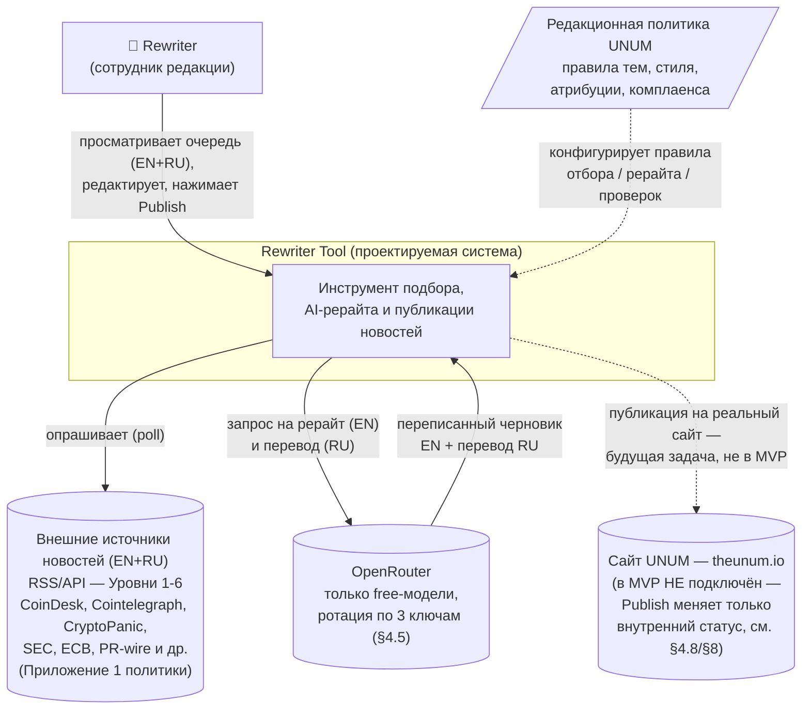
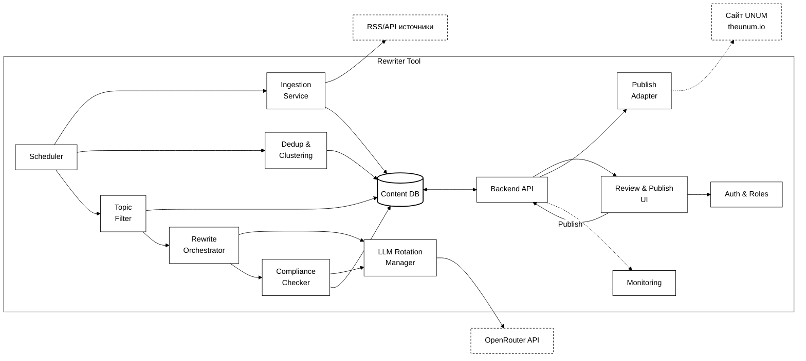
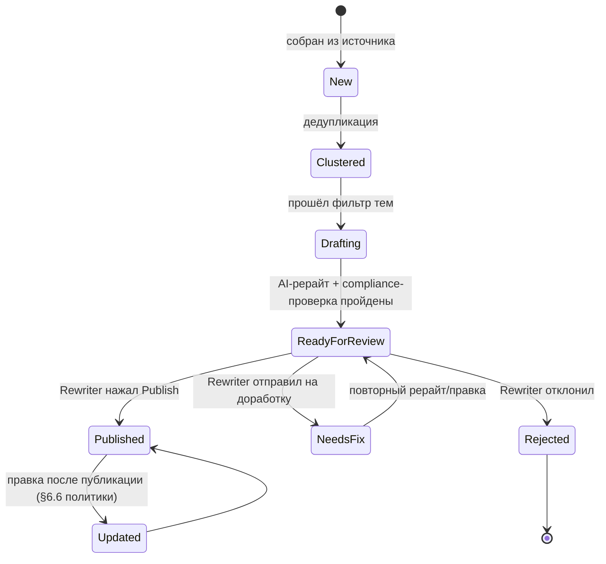

# Техническое задание: Rewriter Tool

**Статус:** v0.3 — зафиксировано как базовая версия для реализации (2026-07-31); дальнейшие изменения — только по ходу разработки, не пересмотр архитектуры
**Проект:** UNUM_news_100
**Источник требований:** [Редакционная_Политика_UNUM_Глобальная_версия.md](Редакционная_Политика_UNUM_Глобальная_версия.md)
**Стиль и правила рерайта:** [Правила_Рерайта_и_Стиля_Черновик.md](Правила_Рерайта_и_Стиля_Черновик.md)
**Технический реестр источников (RSS/API-эндпоинты):** [Реестр_Источников_Технический_Черновик.md](Реестр_Источников_Технический_Черновик.md)

> Документ описывает инструмент, который отбирает инфоповоды из внешних
> источников, переписывает их с помощью AI и отдаёт сотруднику редакции
> (rewriter) на просмотр и публикацию по кнопке **Publish**. Это черновик —
> после ревью пользователем будет составлен план реализации.

## Изменения v0.2 → v0.3 (по ответам на открытые вопросы)

- **RU-перевод тоже публикуется на сайт** — не только для ревью. Publish
  публикует обе языковые версии одним действием (§1.1, §4.4, §4.8, §8).
- **Ротация LLM упрощена**: OpenRouter имеет встроенный параметр `models`
  (массив моделей по приоритету) — сам переключается между моделями при
  ошибке (rate limit/модерация/контекст/даунтайм). Кастомная логика нужна
  только для переключения между 3 ключами (§4.5, обновлён).
- **Ключи OpenRouter** хранятся в `.env` (§4.5, §5).
- **SSO с системой редакции нужен, но не в MVP** (§3, §8).
- **Целевая CMS для будущей реальной интеграции — theunum.io** (§4.8, §7,
  §8); в MVP по-прежнему no-op.
- Добавлен отдельный документ со стайл-гайдом рерайта (заголовки, орфография,
  атрибуция, объём, тон) — см. [Правила_Рерайта_и_Стиля_Черновик.md](Правила_Рерайта_и_Стиля_Черновик.md),
  на него ссылается §4.4.
- Открытые вопросы, оставшиеся после этого раунда — в §8.

## Изменения v0.1 → v0.2 (по ответам на открытые вопросы)

- **Publish в MVP** — только смена статуса материала на `published` внутри
  системы, без реального вызова сайта/CMS (§4.8, §6.2 диаграмма, §8).
- **LLM** — только free-модели OpenRouter, ротация по кругу между 3
  API-ключами (§4.5 — новый раздел, §6.2, §6.3).
- **Стек** — подтверждён Python (§6.3).
- **KPI** — мягкий таргет **100 ± 10 в сутки**, часовой пояс для MVP не
  учитывается (§1, §4.7, §9).
- **Языки** — источники EN+RU, кросс-языковая дедупликация, рерайт
  выполняется на английском (язык публикации), плюс русский перевод того же
  черновика для ревью (§4.2, §4.4, §6.4).

---

## 1. Цель и контекст

Редакционная политика UNUM требует ежесуточно публиковать значительный поток
уникальных переписанных новостей по темам из §1.4 политики (крипто, DeFi,
блокчейн/Web3, финтех, регулирование, макроэкономика, цифровая безопасность,
NFT, майнинг/стейкинг, биржи/кошельки). Приложение 1 политики фиксирует
реестр источников (RSS/API) и обосновывает, что для этого объёма ежедневно
доступно 200–350+ инфоповодов.

**Цель проекта** — построить инструмент, который:

1. Автоматически собирает инфоповоды из реестра источников (Приложение 1),
   как англо-, так и русскоязычных.
2. Дедуплицирует/кластеризует их по факту события — кросс-язык — (для
   перекрёстной верификации, §2.1) и фильтрует по темам политики (§1.4).
3. Генерирует AI-рерайт **на английском языке** (основной язык публикации,
   через OpenRouter) с соблюдением требований к атрибуции, стилю и структуре
   (§5, §6.3, §7, П10).
4. Прогоняет черновик через автоматические compliance-проверки (маркировка
   спонсорского/PR-контента, дисклеймеры, запрещённый контент — §4.7 и §4.8
   редполитики, §2.5 и §11.4 редполитики).
5. Переводит английский рерайт на русский язык (вспомогательно, для
   удобства ревью) и показывает сотруднику редакции (**rewriter**) очередь
   готовых черновиков (EN + RU) для просмотра/правки.
6. По нажатию **Publish** переводит материал в статус «опубликован» —
   в MVP это внутренняя смена статуса, без реального вызова сайта/CMS
   (см. §4.8, §8).

> **Целевой объём (уточнено).** Задача — **мягкий таргет 100 ± 10**
> переписанных новостей в сутки (диапазон 90–110), а не жёсткий минимум
> «не менее 100» из Приложения 1/П8 политики и не жёсткий потолок «до 100».
> Система не должна ни принудительно «добирать» до 100, ни жёстко
> останавливаться на 100 — приоритизация (§4.3) естественным образом
> держит поток в этом диапазоне. Часовой пояс отсчёта суток для MVP не
> учитывается (используется обычный календарный день, без привязки к
> UTC+3 из §15.2 политики).

### 1.1. Вне скоупа MVP (Out of scope)

- Реальная интеграция с сайтом/CMS — в MVP Publish меняет только внутренний
  статус материала; `Publish Adapter` — интерфейс на будущее, конкретная
  система публикации не выбрана (см. §8).
- Двухэтапное редакторское одобрение (rewriter → главный редактор) — для MVP
  workflow одноэтапный; данные проектируются так, чтобы шаг добавить позже
  без миграции модели.
- Раздельная по времени/локали публикация EN и RU — решено, что обе версии
  публикуются одним действием Publish (см. §4.8); отдельный workflow
  «опубликовать сначала одну локаль, потом другую» не рассматривается в MVP.
- Полностью автономная публикация без участия человека — не рассматривается,
  human-in-the-loop обязателен по духу политики (§2 «Основные редакционные
  принципы», §6.4 «Редактирование»).

---

## 2. Термины

| Термин | Значение |
|---|---|
| **Source** | Внешний источник новостей из реестра (Приложение 1 политики) — RSS-лента или API. |
| **Raw Item** | Необработанная запись, полученная от источника (заголовок, тело, ссылка, время публикации). |
| **News Cluster** | Группа Raw Item от разных источников, описывающих один и тот же инфоповод (результат дедупликации). |
| **Draft** | AI-рерайт кластера: заголовок и текст на английском (публикуемый) + перевод на русский (для ревью), атрибуция, теги, дисклеймеры, статус. |
| **Rewriter** | Сотрудник редакции, просматривающий и публикующий черновики (основная роль MVP). |
| **Publish Adapter** | Абстрактный интерфейс публикации на целевую систему (сайт/CMS); в MVP — no-op-реализация (только смена внутреннего статуса). |

---

## 3. Роли и пользователи

| Роль | Права в MVP |
|---|---|
| **Rewriter** | Просмотр очереди черновиков, редактирование текста/метаданных, Publish, Reject, «на доработку». |
| **Admin/Tech** | Управление реестром источников, мониторинг пайплайна, настройка LLM/промптов. |
| **Editor-in-Chief** *(заложено на будущее, не реализуется в MVP UI)* | По политике §6.4/§13.2 — финальное одобрение; в MVP это делает сам Rewriter. Роль резервируется в модели данных. |

> **SSO — не в MVP.** Подтверждено, что доступ должен в итоге быть через SSO
> с существующей системой аккаунтов редакции UNUM, но в MVP аутентификация
> реализуется отдельно (локальные учётки), интеграция с SSO — пост-MVP
> задача (§8.1).

> **Тестовый Rewriter — реальный сотрудник редакции UNUM.** На этапе
> тестирования MVP роль Rewriter выполняет не сам заказчик, а кто-то из
> редакции (уточнено 2026-07-31). Из этого следует, что даже в MVP
> аутентификация должна быть настоящей (логин/пароль конкретного сотрудника
> в БД), а не хардкод/заглушка «для себя» — это всё ещё не SSO, но и не
> символическая заглушка.

---

## 4. Функциональные требования

### 4.1. Ingestion — сбор инфоповодов

- Периодический опрос источников из реестра (Приложение 1: Уровни 1–6 —
  специализированные крипто/финтех-издания, агрегаторы, регуляторы, деловые
  СМИ, официальные блоги проектов, PR wire-сервисы).
- Источники — как англоязычные (подавляющее большинство реестра Приложения
  1), так и русскоязычные (например, Нацбанк РБ, локализации некоторых
  изданий). Язык источника фиксируется в Raw Item и не влияет на то, что
  итоговый рерайт всегда делается на английском (§4.4).
- Частота опроса конфигурируется по источнику (для Уровня 1 — чаще, для
  регуляторов/PR — реже).
- Нормализация в единую структуру Raw Item (заголовок, тело/summary, ссылка,
  время публикации, источник, язык оригинала).
- Реестр источников — конфигурируемый (без изменения кода при добавлении
  источника), в духе П9 политики («Регламент работы со списком источников»).
  Точные RSS/API-эндпоинты, авторизация и статус проверки по каждому
  источнику — в отдельном техническом реестре
  [Реестр_Источников_Технический_Черновик.md](Реестр_Источников_Технический_Черновик.md);
  там же — обоснование архитектуры (1 универсальный RSS-коннектор + 6
  API-адаптеров для Уровня 2, а не адаптер на каждый источник).
- Обработка недоступности источника (retry, пометка «источник недоступен»,
  алерт в мониторинг) — без остановки всего пайплайна.

### 4.2. Дедупликация и кластеризация

- Группировка Raw Item, описывающих одно и то же событие, в News Cluster
  (для перекрёстной верификации фактов, §2.1, П1 политики).
- **Кластеризация кросс-языковая** (подтверждено, нужно уже в MVP, §8.1):
  один и тот же инфоповод может прийти и от англоязычного, и от
  русскоязычного источника — оба должны попасть в один кластер, а не
  породить два независимых черновика. Технически это требует сравнения не
  только по тексту одного языка (например, через многоязычные текстовые
  эмбеддинги), а не только точного/нечёткого совпадения строк.
- Кластер хранит ссылки на все исходные Raw Item (для последующей
  мульти-источниковой атрибуции, П10: «материалы, объединяющие данные
  нескольких источников, указывают все использованные первоисточники»).
- Повторные упоминания уже опубликованного инфоповода не создают дубликат
  черновика.

### 4.3. Фильтрация по темам и приоритизация

- Кластер проверяется на соответствие тематикам §1.4 политики (крипто, DeFi,
  блокчейн/Web3, финтех, регулирование, макроэкономика, цифровая
  безопасность, NFT, майнинг/стейкинг, биржи/кошельки).
- Нерелевантные кластеры не поступают в рерайт.
- Приоритизация кластеров для рерайта (важность/срочность/трендовость) —
  входной сигнал для того, чтобы в очередь Rewriter-а в первую очередь
  попадали наиболее значимые инфоповоды, а не просто «первые по времени».

### 4.4. AI-рерайт (через OpenRouter)

- Для каждого прошедшего фильтр кластера генерируется черновик **на
  английском языке** (основной язык публикации, т.к. целевая аудитория
  англоязычная): заголовок (без преувеличений, §6.3.5), лид-абзац по
  принципу перевёрнутой пирамиды (§6.3.6, §7.3), основной текст, разбивка
  на разделы при необходимости. Это верно независимо от того, был ли
  исходный кластер собран из англоязычных, русскоязычных или обоих типов
  источников (§4.1, §4.2).
- Дополнительно тот же черновик **переводится на русский язык**. Русский
  текст — не просто вспомогательный: он тоже публикуется на сайт (решено,
  см. §8.1), поэтому должен полностью соответствовать тем же стандартам
  качества, что и английский, а не быть «черновым для проверки смысла».
  В интерфейсе ревью (§4.7) оба текста показываются рядом.
- Рерайт — самостоятельный текст, не построчный парафраз (П10); прямые
  цитаты — с атрибуцией (§5.2). Это требование относится к английскому
  тексту как к первичному материалу; русский перевод — производный от него,
  но проходит те же проверки качества и compliance (§4.6) перед публикацией.
- Обязательная атрибуция источника(ов) с активной ссылкой на оригинал в
  каждом черновике, на обоих языках (§5.1, §5.2, П10) — независимо от языка
  источника.
- **Конкретные правила стиля, заголовка, орфографии, объёма и атрибуции** —
  вынесены в отдельный документ [Правила_Рерайта_и_Стиля_Черновик.md](Правила_Рерайта_и_Стиля_Черновик.md),
  который и есть основа системного промпта Rewrite Orchestrator. Он
  покрывает и общие требования (заголовок, структура, атрибуция — для обоих
  языков), и специфичные для русской версии (орфография, обороты речи).
- Промпт также учитывает общий тон издания (§7.1 редполитики: компетентный,
  доступный, беспристрастный, ответственный) и технические стандарты
  форматирования (§7.2: даты, суммы, названия проектов на английском).
- Вызовы к OpenRouter (и для рерайта, и для перевода) идут через
  Key & Model Rotation Manager — см. §4.5.

### 4.5. Ротация LLM-ключей и моделей (OpenRouter, free-tier)

Для MVP используются только бесплатные (free-tier) модели OpenRouter, чтобы
не создавать затрат при объёме 100±10 рерайтов в сутки (§1, §5). Доступно
**3 API-ключа** (хранятся в `.env`, §5).

OpenRouter уже даёт встроенный механизм переключения между моделями внутри
одного ключа — параметр `models` (массив идентификаторов моделей по
приоритету) в запросе: если модель из списка возвращает ошибку (rate limit,
модерация, превышение контекста, даунтайм — по документации OpenRouter),
запрос автоматически повторяется со следующей моделью из списка, без
дополнительного кода на нашей стороне.
[Источник: OpenRouter — Model Fallbacks](https://openrouter.ai/docs/guides/routing/model-fallbacks).
Это **не** распространяется на переключение между разными ключами/аккаунтами
— это должна делать наша собственная логика.

Итоговая схема ротации:

1. Ведётся конфигурируемый упорядоченный список free-моделей (модели с
   суффиксом `:free`; точный перечень — открытый технический вопрос, §8) —
   передаётся в параметр `models` каждого запроса к OpenRouter.
2. OpenRouter сам перебирает модели из этого списка при ошибке одной из них
   — это покрывает «ротацию по кругу между моделями» в рамках одного ключа.
3. Наша логика (Key & Model Rotation Manager) отвечает только за
   **переключение между 3 ключами**: если запрос с текущим ключом всё равно
   завершился ошибкой (то есть все модели из списка `models` под этим ключом
   исчерпаны/недоступны) — берём следующий ключ и повторяем тот же запрос с
   тем же списком моделей.
4. Когда все 3 ключа исчерпаны — задача уходит в отложенную retry-очередь
   (лимиты free-моделей обычно сбрасываются по времени), в мониторинг уходит
   алерт.
5. Текущий активный ключ и счётчики использования/ошибок сохраняются
   persistently (не только в памяти процесса), чтобы ротация не сбрасывалась
   при перезапуске сервиса.
6. Ограничение API (для некоторых эндпоинтов OpenRouter, например Anthropic-
   совместимого `/messages`) — не более 3 моделей в списке фолбэков; для
   обычного эндпоинта явного лимита нет, но список моделей стоит держать
   разумно коротким (проверяется на этапе реализации).

### 4.6. Compliance/Policy-проверки

Автоматическая проверка черновика (на **обоих** языках — EN и RU, т.к. обе
версии публикуются, §4.8) перед попаданием в очередь на ревью:

- Материал из категории пресс-релиз/спонсорский/партнёрский контент —
  помечается соответствующей меткой (§4.7 и §4.8 редполитики).
- Текст, который может быть истолкован как инвестиционная рекомендация —
  помечается для добавления дисклеймера (§2.5, §11.4).
- Проверка на признаки запрещённого контента (§11.4: насилие, экстремизм,
  дискриминация, нарушение авторских прав и т.п.) — при срабатывании
  черновик не публикуется автоматически, требует ручного решения Rewriter-а.
- Проверка наличия обязательной атрибуции/ссылки на источник — черновик без
  неё не может быть переведён в статус «готов к публикации».

### 4.7. Очередь на ревью и интерфейс Rewriter-а

- Список черновиков со статусом «готов к ревью», с сортировкой по
  приоритету/времени.
- Просмотр черновика рядом с оригиналом(ами) источника (side-by-side):
  **английский рерайт** и **русский перевод** — оба публикуемые версии,
  показываются вместе для ревью, плюс ссылки на исходные Raw Item (в т.ч.
  если кластер собран из разноязычных источников, §4.2).
- Редактирование текста (EN и RU по отдельности — оба идут на публикацию),
  заголовка, категории/тегов, флагов (спонсорский, дисклеймер).
- Видимость compliance-пометок и причины, если материал требует особого
  внимания.
- Действия: **Publish**, Reject (с указанием причины), «Отправить на
  доработку» (повторная генерация/правка).
- Счётчик опубликованных материалов за текущие сутки относительно целевого
  диапазона **90–110** (без привязки к конкретному часовому поясу в MVP,
  см. §1).
- Поиск/фильтры по теме, источнику, статусу.

### 4.8. Публикация

- Кнопка **Publish** — одно действие, которое публикует **обе языковые
  версии** черновика (EN и RU) одновременно. В MVP это переводит статус
  материала в `published` **внутри системы** — обычная смена статуса в
  Content DB, без вызова какой-либо внешней системы.
- Целевая система для будущей реальной интеграции — сайт **theunum.io**
  (уточнено, §8.1); в MVP `Publish Adapter` — интерфейс на будущее, его
  реализация — no-op, просто подтверждает смену статуса. Контракт интерфейса
  не должен меняться, когда появится настоящая интеграция с theunum.io — это
  исключительно вопрос будущей замены реализации (например, вызов API/записи
  в БД сайта для обеих языковых версий).
- Поле для внешнего идентификатора/URL публикации существует в модели данных
  заранее (для будущей интеграции), но в MVP остаётся пустым.

### 4.9. Обновления после публикации

- Возможность внести правку в уже опубликованный материал с пометкой
  «Исправлено/Обновлено [дата]» (§2.1, §6.6, §10.3).

### 4.10. Аудит

- Журналирование всех действий редакции: кто и когда создал/отредактировал/
  опубликовал/отклонил материал (§13.2 «Ответственность редакции»), включая
  фактически использованные LLM-ключ/модель для рерайта и перевода (для
  прозрачности ротации, §4.5).

### 4.11. Отчётность

- Дашборд: объём инфоповодов на каждом этапе воронки (собрано → в кластере →
  прошло фильтр → отрерайчено → готово к ревью → опубликовано/отклонено),
  использование ротации LLM-ключей/моделей (какие модели/ключи активны,
  частота переключений при исчерпании лимитов), достижение целевого
  диапазона 90–110 публикаций в сутки.

---

## 5. Нефункциональные требования

- **Производительность**: пайплайн должен обрабатывать входящий поток
  200–350+ инфоповодов/сутки (оценка из П8 политики) без потери данных.
- **Отказоустойчивость источников**: недоступность одного источника не
  должна останавливать сбор с остальных; требуется алертинг о «мёртвых»
  RSS/API (перекликается с П9 политики).
- **Расширяемость реестра источников**: добавление нового источника —
  конфигурация, а не код.
- **Устойчивость к лимитам free-моделей**: используются только free-tier
  модели OpenRouter (без бюджета на LLM, см. §4.5) — система должна
  автоматически переживать исчерпание лимита у любой отдельной модели/ключа
  за счёт ротации, не теряя задачи на рерайт/перевод (retry-очередь при
  полном исчерпании всех 3 ключей × всех моделей).
- **Безопасность доступа**: доступ к инструменту — только у сотрудников
  редакции по ролям (в MVP — локальные учётки, SSO с системой редакции — не
  в MVP, см. §3); секреты (3 ключа OpenRouter в `.env`, API-ключи источников,
  будущие ключи Publish Adapter) не хранятся в открытом виде и не коммитятся
  в репозиторий.
- **Языковая архитектура**: система изначально двуязычная по конструкции —
  хранит и показывает и английский (публикуемый), и русский (для ревью)
  тексты для каждого черновика; архитектура не должна жёстко зашивать
  ровно два языка так, чтобы нельзя было добавить третий в будущем.
- **Аудируемость**: любое действие с материалом восстановимо из журнала.

---

## 6. Архитектура

### 6.1. Контекстная диаграмма

### 6.2. Компонентная диаграмма

Упрощения ради читаемости (детали см. в §6.3 и §4.x):

- Пунктирная рамка = внешняя система (Sources, OpenRouter, Site); сплошная —
  внутренний компонент.
- `Adapter → Site` — пунктир: связь спроектирована, но не вызывается в MVP.
- На диаграмме логи в Monitoring показаны только от Backend API — на
  практике логи/метрики также шлют Ingestion, Rewrite Orchestrator и LLM
  Rotation Manager (опущено на схеме, чтобы не перегружать её линиями).

### 6.3. Описание компонентов

| Компонент | Назначение | Технология-кандидат* |
|---|---|---|
| Scheduler/Orchestrator | Планирует опрос источников, запуск дедупликации/фильтрации/рерайта | Python: APScheduler или Celery beat, как отдельный worker-сервис на Railway |
| Ingestion Service | Коннекторы к RSS/API (EN+RU), нормализация в Raw Item | Python: feedparser, httpx |
| Dedup & Clustering Service | Кросс-языковая группировка Raw Item по событию | Python: многоязычные текстовые эмбеддинги + правила |
| Topic Filter & Prioritizer | Отбор по темам §1.4, приоритизация | Python: правила + скоринг |
| Rewrite Orchestrator | Промпты для EN-рерайта и RU-перевода, парсинг результата | Python: HTTP-клиент к OpenRouter (через Rotation Manager) |
| LLM Key & Model Rotation Manager | Ротация 3 ключей × списка free-моделей OpenRouter (§4.5) | Python: конфигурируемый список + persisted state (Postgres/Redis) |
| Policy/Compliance Checker | Автоматическая маркировка (PR/спонсор/дисклеймер), фильтр запрещённого контента | Python: правила + LLM-классификация (через тот же Rotation Manager) |
| Content DB | Хранение всех сущностей и статусов | PostgreSQL (managed-инстанс на Railway) |
| Backend API | Единая точка доступа для UI, оркестрация Publish Adapter | Python: FastAPI, деплой как сервис на Railway |
| Review & Publish UI | Веб-интерфейс Rewriter-а (EN+RU side-by-side) | Python-first по умолчанию: FastAPI + Jinja2/HTMX (внутренний инструмент, минимум JS); альтернатива — отдельный React/Next.js SPA, если понадобится более богатая интерактивность |
| Publish Adapter | Абстракция публикации; в MVP — no-op (только смена статуса) | Python-интерфейс + конкретные реализации по мере выбора CMS |
| Auth & Roles | Аутентификация и роли (Rewriter/Admin/будущий Editor-in-Chief) | Python: например, fastapi-users |
| Monitoring/Logging | Метрики воронки, ошибки источников, состояние ротации LLM | Python logging + метрики в БД / Prometheus client |

\* Стек подтверждён как Python (backend и пайплайн); конкретные библиотеки —
предложение по умолчанию, могут быть скорректированы на этапе планирования
реализации.

**Хостинг окружения разработки — Railway** (railway.com; уточнено
2026-07-31): управляемый PostgreSQL-инстанс + сервисы (API/web и
scheduler/worker) разворачиваются как отдельные Railway-сервисы в одном
проекте, секреты (3 ключа OpenRouter, API-ключи источников) — через Railway
Variables. Продовое окружение (если будет отличаться от dev) — вопрос
пост-MVP.

### 6.4. Модель данных (верхнеуровнево)

- **Source** — id, название, url, тип (RSS/API), уровень (1–6 из Приложения
  1), активность.
- **RawItem** — id, source_id, внешний id/url, заголовок, тело, время
  публикации, время получения.
- **NewsCluster** — id, тема/категория, список RawItem (может включать и
  EN-, и RU-источники по одному событию), статус фильтрации.
- **Draft** — id, cluster_id, `title_en`/`body_en` (основной, публикуемый
  текст), `title_ru`/`body_ru` (перевод для ревью), категория, теги, флаги
  (спонсорский/PR/дисклеймер), список атрибуций источников, LLM-ключ/модель,
  фактически использованные для рерайта и для перевода (для аудита
  ротации), статус, автор правки, таймстемпы.
- **PublishRecord** — id, draft_id, время публикации, кто опубликовал,
  внешний id/url (в MVP всегда пусто — поле зарезервировано под будущую
  реальную интеграцию Publish Adapter).
- **LLMRotationState** — id ключа, текущий индекс модели в списке free-
  моделей, счётчики использования/ошибок по паре (ключ, модель), время
  последнего переключения — нужно для персистентности ротации между
  перезапусками (§4.5).
- **AuditLog** — actor, действие, сущность, время, детали изменения.
- **User** — id, имя, роль (rewriter/admin/editor_in_chief-резерв).

### 6.5. Жизненный цикл материала

---

## 7. Интеграции

- **Источники** — реестр по Приложению 1 политики (EN+RU); технические
  адреса RSS/API ведутся отдельно от политики (см. П9) и должны
  конфигурироваться в системе без изменения кода.
- **OpenRouter** — единая точка доступа к LLM для рерайта (EN) и перевода
  (RU); используются только free-модели, ротация по 3 ключам (§4.5) —
  переключение между моделями решается встроенным параметром `models`
  OpenRouter, между ключами — нашей логикой; точный перечень free-моделей —
  открытый технический вопрос (§8.2).
- **Publish Adapter** — интерфейс `publish(draft) -> {externalId, url}`;
  в MVP реализация — no-op (только смена внутреннего статуса на
  `published` для обеих языковых версий, без вызова внешней системы);
  конкретная интеграция — с сайтом **theunum.io** (уточнено, §8.1), отдельная
  задача после MVP.

---

## 8. Открытые вопросы

### 8.1. Решено (для справки/трассировки решений)

| № | Вопрос | Решение |
|---|---|---|
| 1 | «До 100» vs «не менее 100» в сутки | Мягкий таргет **100 ± 10** (90–110), без жёсткого пола/потолка (§1) |
| 2 | Куда публикуем в MVP | Никуда — Publish меняет только внутренний статус, реальной интеграции с сайтом нет (§4.8) |
| 3 | Какие LLM | OpenRouter, только free-модели, ротация по 3 ключам (§4.5) |
| 4 | Технологический стек | Python (§6.3) |
| 5 | Языковой охват | Источники EN+RU, рерайт на английском + русский перевод (§4.4) |
| 6 | Часовой пояс KPI | Для MVP игнорируется (§1) |
| 7 | Бюджет на LLM | Не требуется — только free-модели (§4.5) |
| 8 | Публикуется ли RU-перевод на сайт | Да, обе версии (EN+RU) публикуются одним действием Publish (§4.4, §4.8) |
| 9 | Как хранить 3 ключа OpenRouter | В `.env` (§4.5, §5) |
| 10 | Механика ротации моделей | Через встроенный параметр `models` OpenRouter (авто-фолбэк); наша логика — только для переключения ключей (§4.5) |
| 11 | SSO с системой редакции | Нужен в перспективе, но НЕ в MVP (§3, §5) |
| 12 | Целевая CMS для реальной публикации (пост-MVP) | theunum.io (§4.8, §7) |
| 13 | Кросс-языковая дедупликация в MVP | Да, нужна уже в MVP — EN- и RU-источники об одном событии объединяются в один кластер (§4.2) |

### 8.2. Остаются открытыми — нужны до перехода к плану реализации

1. **Точный перечень free-моделей OpenRouter** (конкретные ID моделей с
   суффиксом `:free`) для параметра `models` — технический, некритичный для
   архитектуры вопрос, но нужен перед реализацией Rotation Manager (§4.5).
2. **Источник обложек/изображений** к материалам — остаётся TBD (брать с
   источника с указанием авторства/лицензии, §5.3, или использовать другой
   подход).
3. **Объём материала в стайл-гайде** — «3 небольших абзаца до 2 000
   символов» истолкован как ~2 000 символов **суммарно** на весь материал
   (не по 2 000 на каждый абзац) — см. допущение в
   [Правила_Рерайта_и_Стиля_Черновик.md](Правила_Рерайта_и_Стиля_Черновик.md#5-структура-и-объём-текста),
   нужно подтвердить.

---

## 9. Критерии приёмки MVP

- Система непрерывно опрашивает согласованный поднабор источников из
  Приложения 1 — как англо-, так и русскоязычных (например, топ источников
  Уровня 1 + Нацбанк РБ) — и агрегирует свежие инфоповоды.
- Дедупликация группирует материалы об одном событии из разных источников,
  включая разноязычные, в один кластер (демонстрируется хотя бы на одном
  примере «EN-источник + RU-источник → один кластер»).
- Кластеры, прошедшие фильтр тем (§1.4), автоматически получают AI-рерайт
  **на английском языке** через OpenRouter — с заголовком, лид-абзацем и
  атрибуцией источника(ов) — плюс **русский перевод** того же черновика.
- Демонстрируется работа ротации LLM-ключей/моделей (§4.5): при
  срабатывании лимита/ошибки текущей модели система переключается на
  следующую модель/ключ и рерайт всё равно успешно завершается.
- Compliance-проверка помечает материалы, требующие дисклеймера/маркировки
  (пресс-релиз, спонсорский, инвест-рекомендация), и не пропускает в очередь
  явно запрещённый контент (§11.4) без ручного решения.
- Rewriter видит очередь черновиков, может открыть оригинал(ы) рядом с
  EN-рерайтом и RU-переводом, отредактировать текст/метаданные и увидеть
  compliance-пометки.
- Нажатие **Publish** переводит материал в статус `published` (внутренняя
  смена статуса, без вызова внешней системы в MVP), с фиксацией времени и
  автора публикации.
- Интерфейс показывает счётчик опубликованных материалов за текущие сутки
  относительно целевого диапазона 90–110.
- Все действия с материалом (создание, правка, публикация, отклонение)
  фиксируются в audit log, включая использованные LLM-ключ/модель.

---

## 10. Дальнейшие шаги

После ревью этого черновика пользователем — согласовать открытые вопросы
(§8) и составить пошаговый план реализации (фазы, приоритеты, оценки).
Реализация не начинается до этого шага.
