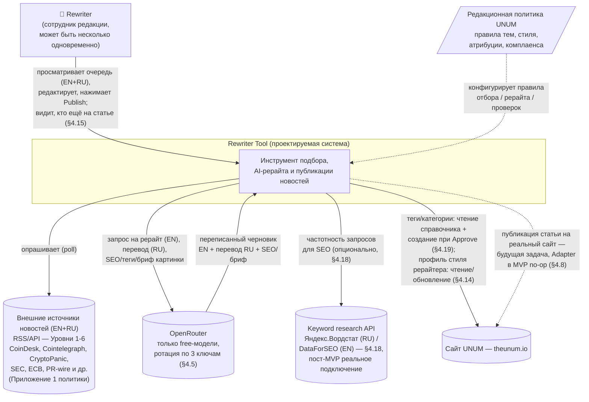
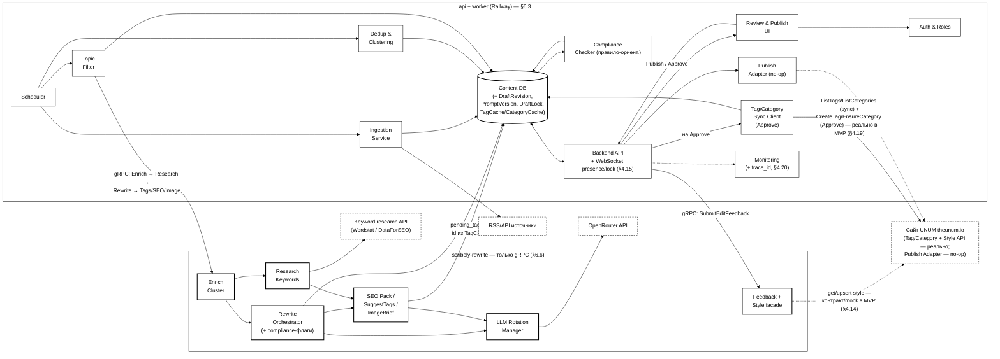
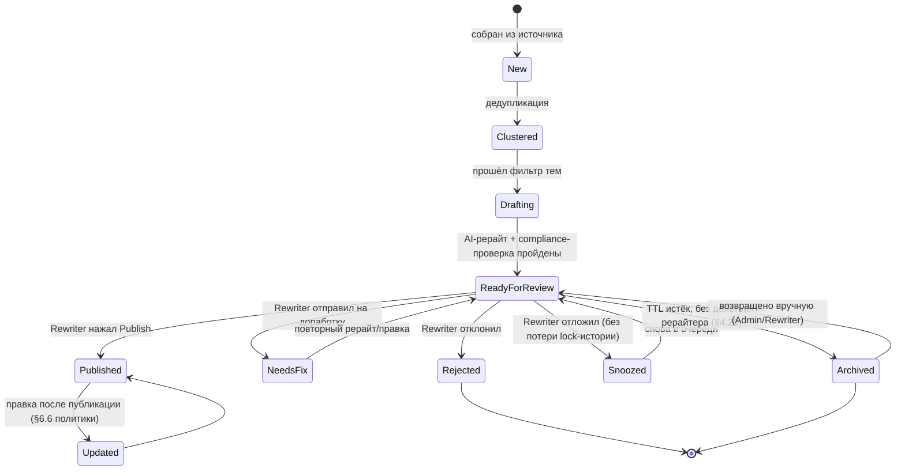

# Техническое задание: Rewriter Tool

**Статус:** v0.5 — добавлена runtime-конфигурация без редеплоя (§4.21,
по прямому запросу заказчика от 2026-08-03); архитектурные решения v0.4
не пересматриваются, только дополняются
**Проект:** UNUM_news_100
**Источник требований:** [Редакционная_Политика_UNUM_Глобальная_версия.md](Редакционная_Политика_UNUM_Глобальная_версия.md)
**Стиль и правила рерайта:** [Правила_Рерайта_и_Стиля_Черновик.md](Правила_Рерайта_и_Стиля_Черновик.md)
**Технический реестр источников (RSS/API-эндпоинты):** [Реестр_Источников_Технический_Черновик.md](Реестр_Источников_Технический_Черновик.md)
**Заметки-источник этого обновления:** [Заметки_Обогащение_Правки_Промпт.md](Заметки_Обогащение_Правки_Промпт.md)

> Документ описывает инструмент, который отбирает инфоповоды из внешних
> источников, переписывает их с помощью AI и отдаёт сотруднику редакции
> (rewriter) на просмотр и публикацию по кнопке **Publish**. Это черновик —
> после ревью пользователем будет составлен план реализации.

## Изменения v0.4 → v0.5 (по прямому запросу заказчика от 2026-08-03)

Во время реализации Фазы 4 заказчик прямо запросил: часть параметров
пайплайна (список источников, список тем, промпты рерайта, список
free-моделей OpenRouter для ротации — и всё, что имеет смысл вынести в
тонкую/грубую настройку) должна редактироваться через интерфейс или
конфигурацию **без правки исходного кода и без полного передеплоя/
перезапуска приложения**.

- Новый **§4.21 «Runtime-конфигурация без редеплоя (Admin Settings)»** —
  сводит воедино то, что уже было заявлено по частям (реестр источников
  как конфигурация — §5 НФТ; конфигурируемый список free-моделей — §4.5
  п.1; активация версии промпта Admin-ом — §4.13), и добавляет
  конкретный механизм: три новые сущности данных (`Topic`,
  `LlmRotationModel`, `AppSetting`) + Admin REST API + (начиная с Фазы 6,
  когда в инструменте вообще появляется HTML-интерфейс) UI-экраны поверх
  того же API.
- Обновлена модель данных (§6.4): добавлены `Topic`, `LlmRotationModel`,
  `AppSetting`.
- Уточнён §4.5 п.6 — лимит «не более 3 моделей в списке `models`» на
  обычном (не только Anthropic-совместимом) эндпоинте OpenRouter
  подтверждён практически в ходе реализации Фазы 4, был открытым
  предположением в v0.4.
- План реализации (v0.2 → v0.3): задача встроена в Фазу 5 (данные +
  Admin API — ближайшая нереализованная фаза на момент запроса) и Фазу 6
  (UI поверх того же API, т.к. раньше в инструменте физически нет
  HTML-интерфейса).

## Изменения v0.3 → v0.4 (по заметкам заказчика от 2026-08-01)

Источник изменений — [Заметки_Обогащение_Правки_Промпт.md](Заметки_Обогащение_Правки_Промпт.md).
Открытые вопросы §10 этих заметок решены самостоятельно (в интересах
разработки) и зафиксированы в §8.1 ниже.

- **Отдельный Python-микросервис `scribely-rewrite` за gRPC — с Фазы 0**,
  не монолит (новый §6.6). Три Railway-сервиса с первого дня: `api`,
  `worker`, `rewrite`.
- **Enrichment кластера** перед рерайтом — факты, полный текст Tier 1,
  конфликт фактов (§4.12).
- **Версионирование промпта + цикл обратной связи** по правкам рерайтера,
  снимки `ai_generated`/`human_final` (§4.13).
- **Профиль стиля рерайтера** — вектор на **theunum.io** (мастер), сборщик
  — фасад/кэш (§4.14).
- **Soft-lock + WebSocket presence** при 2+ одновременных рерайтерах —
  без двойного Publish (§4.15).
- **SEO-пакет** (title/description/slug/OG/focus keyphrase) генерируется
  вместе с рерайтом, EN+RU (§4.16).
- **Image brief** — текстовое описание обложки вместо файла (закрывает
  открытый вопрос §8.2 ТЗ v0.3) (§4.17).
- **Keyword research** (Яндекс.Вордстат RU / DataForSEO EN, гео — мир) —
  интерфейс в MVP, реальное подключение — пост-MVP (§4.18).
- **Тегирование** — справочник Category/Tag мастер на theunum.io; на
  Approve создаются реальные теги **уже в MVP** — единственное осознанное
  исключение из принципа «внешние вызовы к сайту не в MVP» (§4.19).
- **Надёжность пайплайна**: `trace_id`, идемпотентность, JSON-схема ответа
  LLM, dead-letter, similarity-to-source gate, TTL черновиков (§4.20).

## Изменения v0.2 → v0.3 (по ответам на открытые вопросы)

- **RU-перевод тоже публикуется на сайт** — не только для ревью. Publish
  публикует обе языковые версии одним действием (§1.1, §4.4, §4.8, §8).
- **Ротация LLM упрощена**: OpenRouter имеет встроенный параметр `models`
  (массив моделей по приоритету) — сам переключается между моделями при
  ошибке (rate limit/модерация/контекст/даунтайм). Кастомная логика нужна
  только для переключения между 3 ключами (§4.5, обновлён).
- **Ключи OpenRouter** хранятся в `.env` (§4.5, §5).
- **SSO с системой редакции нужен, но не в MVP** (§3, §8).
- **Целевая CMS для будущей реальной интеграции — theunum.io** (§4.8, §7,
  §8); в MVP по-прежнему no-op.
- Добавлен отдельный документ со стайл-гайдом рерайта (заголовки, орфография,
  атрибуция, объём, тон) — см. [Правила_Рерайта_и_Стиля_Черновик.md](Правила_Рерайта_и_Стиля_Черновик.md),
  на него ссылается §4.4.
- Открытые вопросы, оставшиеся после этого раунда — в §8.

## Изменения v0.1 → v0.2 (по ответам на открытые вопросы)

- **Publish в MVP** — только смена статуса материала на `published` внутри
  системы, без реального вызова сайта/CMS (§4.8, §6.2 диаграмма, §8).
- **LLM** — только free-модели OpenRouter, ротация по кругу между 3
  API-ключами (§4.5 — новый раздел, §6.2, §6.3).
- **Стек** — подтверждён Python (§6.3).
- **KPI** — мягкий таргет **100 ± 10 в сутки**, часовой пояс для MVP не
  учитывается (§1, §4.7, §9).
- **Языки** — источники EN+RU, кросс-языковая дедупликация, рерайт
  выполняется на английском (язык публикации), плюс русский перевод того же
  черновика для ревью (§4.2, §4.4, §6.4).

---

## 1. Цель и контекст

Редакционная политика UNUM требует ежесуточно публиковать значительный поток
уникальных переписанных новостей по темам из §1.4 политики (крипто, DeFi,
блокчейн/Web3, финтех, регулирование, макроэкономика, цифровая безопасность,
NFT, майнинг/стейкинг, биржи/кошельки). Приложение 1 политики фиксирует
реестр источников (RSS/API) и обосновывает, что для этого объёма ежедневно
доступно 200–350+ инфоповодов.

**Цель проекта** — построить инструмент, который:

1. Автоматически собирает инфоповоды из реестра источников (Приложение 1),
   как англо-, так и русскоязычных.
2. Дедуплицирует/кластеризует их по факту события — кросс-язык — (для
   перекрёстной верификации, §2.1) и фильтрует по темам политики (§1.4).
3. Генерирует AI-рерайт **на английском языке** (основной язык публикации,
   через OpenRouter) с соблюдением требований к атрибуции, стилю и структуре
   (§5, §6.3, §7, П10).
4. Прогоняет черновик через автоматические compliance-проверки (маркировка
   спонсорского/PR-контента, дисклеймеры, запрещённый контент — §4.7 и §4.8
   редполитики, §2.5 и §11.4 редполитики).
5. Переводит английский рерайт на русский язык (вспомогательно, для
   удобства ревью) и показывает сотруднику редакции (**rewriter**) очередь
   готовых черновиков (EN + RU) для просмотра/правки.
6. По нажатию **Publish** переводит материал в статус «опубликован» —
   в MVP это внутренняя смена статуса, без реального вызова сайта/CMS
   (см. §4.8, §8).

> **Целевой объём (уточнено).** Задача — **мягкий таргет 100 ± 10**
> переписанных новостей в сутки (диапазон 90–110), а не жёсткий минимум
> «не менее 100» из Приложения 1/П8 политики и не жёсткий потолок «до 100».
> Система не должна ни принудительно «добирать» до 100, ни жёстко
> останавливаться на 100 — приоритизация (§4.3) естественным образом
> держит поток в этом диапазоне. Часовой пояс отсчёта суток для MVP не
> учитывается (используется обычный календарный день, без привязки к
> UTC+3 из §15.2 политики).

### 1.1. Вне скоупа MVP (Out of scope)

- Реальная интеграция с сайтом/CMS — в MVP Publish меняет только внутренний
  статус материала; `Publish Adapter` — интерфейс на будущее, конкретная
  система публикации не выбрана (см. §8).
- Двухэтапное редакторское одобрение (rewriter → главный редактор) — для MVP
  workflow одноэтапный; данные проектируются так, чтобы шаг добавить позже
  без миграции модели.
- Раздельная по времени/локали публикация EN и RU — решено, что обе версии
  публикуются одним действием Publish (см. §4.8); отдельный workflow
  «опубликовать сначала одну локаль, потом другую» не рассматривается в MVP.
- Полностью автономная публикация без участия человека — не рассматривается,
  human-in-the-loop обязателен по духу политики (§2 «Основные редакционные
  принципы», §6.4 «Редактирование»).
- Полноценный vector store профиля стиля рерайтера, реальные
  keyword-провайдеры (Wordstat/DataForSEO), реальный подбор/генерация
  обложки, обучение автотегера на правках, A/B/canary новых версий
  промпта, fine-tuning модели на корпусе `human_final`, обратный sync
  правок с CMS, полноценный collaborative editing — сознательно не
  делаются в MVP (полный backlog — [План_Реализации_MVP.md](План_Реализации_MVP.md#11-что-осознанно-остаётся-за-пределами-mvp-backlog)).
- Публичный gRPC-доступ к сервису `scribely-rewrite` (§6.6) для других
  продуктов UNUM — не в MVP, только внутренняя сеть Railway (§8).
- Автоматическое (без участия Admin) выкатывание новой версии системного
  промпта в прод — не в MVP (§4.13).

---

## 2. Термины

| Термин | Значение |
|---|---|
| **Source** | Внешний источник новостей из реестра (Приложение 1 политики) — RSS-лента или API. |
| **Raw Item** | Необработанная запись, полученная от источника (заголовок, тело, ссылка, время публикации). |
| **News Cluster** | Группа Raw Item от разных источников, описывающих один и тот же инфоповод (результат дедупликации). |
| **Draft** | AI-рерайт кластера: заголовок и текст на английском (публикуемый) + перевод на русский (для ревью), атрибуция, теги, дисклеймеры, статус. |
| **Rewriter** | Сотрудник редакции, просматривающий и публикующий черновики (основная роль MVP). |
| **Publish Adapter** | Абстрактный интерфейс публикации на целевую систему (сайт/CMS); в MVP — no-op-реализация (только смена внутреннего статуса). |
| **ClusterContext** | Обогащённый контекст кластера перед рерайтом: полный текст (fallback для Tier 1), извлечённые факты, флаги, конфликт фактов между источниками кластера (§4.12). |
| **DraftRevision** | Снимок черновика (`ai_generated` / `human_final` / `regen`) для diff и обучения промпта (§4.13). |
| **EditSignal** | Сигнал о категории правки (факт/стиль/заголовок/атрибуция/длина/тон/перевод/SEO/теги/картинка), привязан к `draft_id`/`author_id`, основа отчётности по паттернам правок (§4.13). |
| **PromptVersion** | Версия системного промпта Rewrite Orchestrator, привязанная к каждому Draft (§4.13). |
| **RewriterStyleProfile** | Профиль стиля рерайтера в векторном виде — мастер на **theunum.io**; на сборщике — только read-through кэш (§4.14). |
| **DraftLock** | Soft-lock черновика на время редактирования, с TTL/heartbeat, чтобы двое не публиковали один материал (§4.15). |
| **SEO-пакет** | `seo_title/description/slug/og_title/og_description/focus_keyphrase/keywords` для EN и RU, генерируется вместе с рерайтом (§4.16). |
| **Image brief** | Текстовое описание обложки (настроение/объекты/alt/caption/лицензия) без файла картинки (§4.17). |
| **KeywordResearchProvider** | Единый интерфейс к внешним keyword-сервисам (Яндекс.Вордстат, DataForSEO и др.) для донастройки SEO (§4.18). |
| **Tag / Category** | Справочник рубрик и тегов; мастер — **theunum.io**, сборщик — читающая реплика + локальные кандидаты до Approve (§4.19). |
| **scribely-rewrite** | Отдельный Python-микросервис (только gRPC): Enrichment, рерайт/перевод, SEO/теги/бриф картинки, keyword research, версии промпта, фасад к профилю стиля (§6.6). |
| **trace_id** | Сквозной идентификатор материала через весь пайплайн (RawItem → NewsCluster → Draft → PublishRecord), для отладки и аудита (§4.20). |

---

## 3. Роли и пользователи

| Роль | Права в MVP |
|---|---|
| **Rewriter** | Просмотр очереди черновиков, редактирование текста/метаданных, Publish, Reject, «на доработку». |
| **Admin/Tech** | Управление реестром источников, мониторинг пайплайна, настройка LLM/промптов, утверждение новой `PromptVersion` (§4.13). |
| **Editor-in-Chief** *(заложено на будущее, не реализуется в MVP UI)* | По политике §6.4/§13.2 — финальное одобрение; в MVP это делает сам Rewriter. Роль резервируется в модели данных. |

> **Важное уточнение (2026-08-01).** Система должна поддерживать **2 и
> более** одновременно работающих Rewriter-ов, не только одного тестового
> — отсюда требования к soft-lock/presence (§4.15) и обязательному учёту
> `author_id` на правках и стиле (§4.13, §4.14). Однопользовательский
> сценарий остаётся допустимым частным случаем, но не единственным
> проектируемым.

> **SSO — не в MVP.** Подтверждено, что доступ должен в итоге быть через SSO
> с существующей системой аккаунтов редакции UNUM, но в MVP аутентификация
> реализуется отдельно (локальные учётки), интеграция с SSO — пост-MVP
> задача (§8.1).

> **Тестовый Rewriter — реальный сотрудник редакции UNUM.** На этапе
> тестирования MVP роль Rewriter выполняет не сам заказчик, а кто-то из
> редакции (уточнено 2026-07-31). Из этого следует, что даже в MVP
> аутентификация должна быть настоящей (логин/пароль конкретного сотрудника
> в БД), а не хардкод/заглушка «для себя» — это всё ещё не SSO, но и не
> символическая заглушка.

---

## 4. Функциональные требования

### 4.1. Ingestion — сбор инфоповодов

- Периодический опрос источников из реестра (Приложение 1: Уровни 1–6 —
  специализированные крипто/финтех-издания, агрегаторы, регуляторы, деловые
  СМИ, официальные блоги проектов, PR wire-сервисы).
- Источники — как англоязычные (подавляющее большинство реестра Приложения
  1), так и русскоязычные (например, Нацбанк РБ, локализации некоторых
  изданий). Язык источника фиксируется в Raw Item и не влияет на то, что
  итоговый рерайт всегда делается на английском (§4.4).
- Частота опроса конфигурируется по источнику (для Уровня 1 — чаще, для
  регуляторов/PR — реже).
- Нормализация в единую структуру Raw Item (заголовок, тело/summary, ссылка,
  время публикации, источник, язык оригинала).
- Реестр источников — конфигурируемый (без изменения кода при добавлении
  источника), в духе П9 политики («Регламент работы со списком источников»).
  Точные RSS/API-эндпоинты, авторизация и статус проверки по каждому
  источнику — в отдельном техническом реестре
  [Реестр_Источников_Технический_Черновик.md](Реестр_Источников_Технический_Черновик.md);
  там же — обоснование архитектуры (1 универсальный RSS-коннектор + 6
  API-адаптеров для Уровня 2, а не адаптер на каждый источник).
- Обработка недоступности источника (retry, пометка «источник недоступен»,
  алерт в мониторинг) — без остановки всего пайплайна; при повторяющихся
  подряд сбоях — circuit breaker, ставящий источник на паузу (§4.20).
- **Ручной inject по URL**: отдельный вход для Rewriter-а/Admin — добавить
  статью по ссылке вручную, минуя обычный RSS-опрос (для эксклюзивов
  редакции). Создаёт `RawItem` напрямую, дальше проходит тот же пайплайн
  (кластеризация → фильтр → рерайт), с той же идемпотентностью по
  ссылке, что и обычный опрос (§4.20).

### 4.2. Дедупликация и кластеризация

- Группировка Raw Item, описывающих одно и то же событие, в News Cluster
  (для перекрёстной верификации фактов, §2.1, П1 политики).
- **Кластеризация кросс-языковая** (подтверждено, нужно уже в MVP, §8.1):
  один и тот же инфоповод может прийти и от англоязычного, и от
  русскоязычного источника — оба должны попасть в один кластер, а не
  породить два независимых черновика. Технически это требует сравнения не
  только по тексту одного языка (например, через многоязычные текстовые
  эмбеддинги), а не только точного/нечёткого совпадения строк.
- Кластер хранит ссылки на все исходные Raw Item (для последующей
  мульти-источниковой атрибуции, П10: «материалы, объединяющие данные
  нескольких источников, указывают все использованные первоисточники»).
- Повторные упоминания уже опубликованного инфоповода не создают дубликат
  черновика.

### 4.3. Фильтрация по темам и приоритизация

- Кластер проверяется на соответствие тематикам §1.4 политики (крипто, DeFi,
  блокчейн/Web3, финтех, регулирование, макроэкономика, цифровая
  безопасность, NFT, майнинг/стейкинг, биржи/кошельки).
- Нерелевантные кластеры не поступают в рерайт.
- Приоритизация кластеров для рерайта (важность/срочность/трендовость) —
  входной сигнал для того, чтобы в очередь Rewriter-а в первую очередь
  попадали наиболее значимые инфоповоды, а не просто «первые по времени».
- **Fairness-квоты по источнику**: один шумный RSS не должен занимать всю
  очередь на рерайт — доля одного источника в топ-N приоритета
  ограничивается (backlog notes §11.2), чтобы разнообразие тем/изданий не
  страдало от объёма одного канала.
- **TTL/возраст как часть скоринга**: свежесть кластера учитывается при
  расчёте приоритета уже здесь; фактическая архивация/понижение статуса
  устаревших черновиков после того, как они попали на ревью, — отдельный
  механизм (§6.5, §4.20).
- **Буфер вокруг целевого диапазона 90–110**: при превышении верхней
  границы (110) низкоприоритетные кластеры не отправляются на рерайт —
  не тратим free-лимиты OpenRouter впустую; при явном недоборе кластеров
  за день — сигнал в отчётность (§4.11), а не попытка искусственно
  «добрать» до 100 нерелевантным контентом (§1, мягкий таргет уже не
  предполагает форсирования).

### 4.4. AI-рерайт (через OpenRouter)

- Для каждого прошедшего фильтр кластера генерируется черновик **на
  английском языке** (основной язык публикации, т.к. целевая аудитория
  англоязычная): заголовок (без преувеличений, §6.3.5), лид-абзац по
  принципу перевёрнутой пирамиды (§6.3.6, §7.3), основной текст, разбивка
  на разделы при необходимости. Это верно независимо от того, был ли
  исходный кластер собран из англоязычных, русскоязычных или обоих типов
  источников (§4.1, §4.2).
- Дополнительно тот же черновик **переводится на русский язык**. Русский
  текст — не просто вспомогательный: он тоже публикуется на сайт (решено,
  см. §8.1), поэтому должен полностью соответствовать тем же стандартам
  качества, что и английский, а не быть «черновым для проверки смысла».
  В интерфейсе ревью (§4.7) оба текста показываются рядом.
- Рерайт — самостоятельный текст, не построчный парафраз (П10); прямые
  цитаты — с атрибуцией (§5.2). Это требование относится к английскому
  тексту как к первичному материалу; русский перевод — производный от него,
  но проходит те же проверки качества и compliance (§4.6) перед публикацией.
- Обязательная атрибуция источника(ов) с активной ссылкой на оригинал в
  каждом черновике, на обоих языках (§5.1, §5.2, П10) — независимо от языка
  источника.
- **Конкретные правила стиля, заголовка, орфографии, объёма и атрибуции** —
  вынесены в отдельный документ [Правила_Рерайта_и_Стиля_Черновик.md](Правила_Рерайта_и_Стиля_Черновик.md),
  который и есть основа системного промпта Rewrite Orchestrator. Он
  покрывает и общие требования (заголовок, структура, атрибуция — для обоих
  языков), и специфичные для русской версии (орфография, обороты речи).
- Промпт также учитывает общий тон издания (§7.1 редполитики: компетентный,
  доступный, беспристрастный, ответственный) и технические стандарты
  форматирования (§7.2: даты, суммы, названия проектов на английском).
- **Глоссарий терминов**: единые написания названий и терминов (MiCA,
  тикеры, названия бирж/проектов и т.п.) — в MVP статичный список,
  зашитый в промпт вместе со стайл-гайдом (не отдельный API-вызов).
  Полноценная синхронизация словаря с theunum.io (аналогично Tag/Category,
  §4.19, без дубля-истины) — пост-MVP (План §11), когда объём терминов
  оправдает отдельный справочник.
- Вызовы к OpenRouter (и для рерайта, и для перевода) идут через
  Key & Model Rotation Manager — см. §4.5.

### 4.5. Ротация LLM-ключей и моделей (OpenRouter, free-tier)

Для MVP используются только бесплатные (free-tier) модели OpenRouter, чтобы
не создавать затрат при объёме 100±10 рерайтов в сутки (§1, §5). Доступно
**3 API-ключа** (хранятся в `.env`, §5).

OpenRouter уже даёт встроенный механизм переключения между моделями внутри
одного ключа — параметр `models` (массив идентификаторов моделей по
приоритету) в запросе: если модель из списка возвращает ошибку (rate limit,
модерация, превышение контекста, даунтайм — по документации OpenRouter),
запрос автоматически повторяется со следующей моделью из списка, без
дополнительного кода на нашей стороне.
[Источник: OpenRouter — Model Fallbacks](https://openrouter.ai/docs/guides/routing/model-fallbacks).
Это **не** распространяется на переключение между разными ключами/аккаунтами
— это должна делать наша собственная логика.

Итоговая схема ротации:

1. Ведётся конфигурируемый упорядоченный список free-моделей (модели с
   суффиксом `:free`; точный перечень — открытый технический вопрос, §8) —
   передаётся в параметр `models` каждого запроса к OpenRouter.
2. OpenRouter сам перебирает модели из этого списка при ошибке одной из них
   — это покрывает «ротацию по кругу между моделями» в рамках одного ключа.
3. Наша логика (Key & Model Rotation Manager) отвечает только за
   **переключение между 3 ключами**: если запрос с текущим ключом всё равно
   завершился ошибкой (то есть все модели из списка `models` под этим ключом
   исчерпаны/недоступны) — берём следующий ключ и повторяем тот же запрос с
   тем же списком моделей.
4. Когда все 3 ключа исчерпаны — задача уходит в отложенную retry-очередь
   (лимиты free-моделей обычно сбрасываются по времени), в мониторинг уходит
   алерт.
5. Текущий активный ключ и счётчики использования/ошибок сохраняются
   persistently (не только в памяти процесса), чтобы ротация не сбрасывалась
   при перезапуске сервиса.
6. Ограничение API — **подтверждено практически при реализации Фазы 4**:
   не более 3 моделей в списке `models` за один запрос — не только на
   Anthropic-совместимом `/messages`, но и на обычном
   `/chat/completions` (`400 'models' array must have 3 items or fewer`,
   живой ответ OpenRouter). Список free-моделей для ротации в MVP —
   ровно 3 позиции; при редактировании через Admin Settings (§4.21) это
   валидируется явно, а не оставляется на усмотрение количества строк в
   таблице.

### 4.6. Compliance/Policy-проверки

Автоматическая проверка черновика (на **обоих** языках — EN и RU, т.к. обе
версии публикуются, §4.8) перед попаданием в очередь на ревью:

- Материал из категории пресс-релиз/спонсорский/партнёрский контент —
  помечается соответствующей меткой (§4.7 и §4.8 редполитики).
- Текст, который может быть истолкован как инвестиционная рекомендация —
  помечается для добавления дисклеймера (§2.5, §11.4).
- Проверка на признаки запрещённого контента (§11.4: насилие, экстремизм,
  дискриминация, нарушение авторских прав и т.п.) — при срабатывании
  черновик не публикуется автоматически, требует ручного решения Rewriter-а.
- Проверка наличия обязательной атрибуции/ссылки на источник — черновик без
  неё не может быть переведён в статус «готов к публикации».
- Дополнительно (§4.20): similarity-to-source gate (близость EN-рерайта к
  оригиналу) и флаг `fact_conflict` из `ClusterContext` (§4.12) — тоже
  блокируют переход в `ReadyForReview` до ручного решения.

### 4.7. Очередь на ревью и интерфейс Rewriter-а

- Список черновиков со статусом «готов к ревью», с сортировкой по
  приоритету/времени.
- Просмотр черновика рядом с оригиналом(ами) источника (side-by-side):
  **английский рерайт** и **русский перевод** — оба публикуемые версии,
  показываются вместе для ревью, плюс ссылки на исходные Raw Item (в т.ч.
  если кластер собран из разноязычных источников, §4.2).
- Редактирование текста (EN и RU по отдельности — оба идут на публикацию),
  заголовка (в т.ч. выбор одного из **2–3 предложенных вариантов**, если
  `RewriteCluster` их вернул, §6.6 — рерайтер выбирает или пишет свой),
  категории/тегов, флагов (спонсорский, дисклеймер).
- Простое SERP/OG-превью рядом с SEO-блоком (§4.16) — как заголовок и
  description будут выглядеть в выдаче/соцсетях, до Publish.
- Видимость compliance-пометок и причины, если материал требует особого
  внимания.
- Действия: **Publish**, Reject (с указанием причины из обязательного
  enum, §4.13), «Отправить на доработку» (повторная генерация/правка,
  создаёт `DraftRevision` с `kind=regen`, §4.13), **«Отложить» (Snooze)**
  — черновик остаётся в `ReadyForReview` логически, но временно уходит из
  активного поля зрения без потери lock-истории (§6.5), возвращается в
  обычную очередь вручную или по истечении паузы.
- Черновик, не дождавшийся решения дольше TTL-порога (§4.3, §4.20),
  автоматически уходит в статус `Archived` (§6.5) — не блокирует ревью
  остальных, но перестаёт занимать активную очередь; возврат из архива —
  вручную (Admin/Rewriter).
- Счётчик опубликованных материалов за текущие сутки относительно целевого
  диапазона **90–110** (без привязки к конкретному часовому поясу в MVP,
  см. §1).
- Поиск/фильтры по теме, источнику, статусу.

### 4.8. Публикация

- Кнопка **Publish** — одно действие, которое публикует **обе языковые
  версии** черновика (EN и RU) одновременно. В MVP это переводит статус
  материала в `published` **внутри системы** — обычная смена статуса в
  Content DB, без вызова какой-либо внешней системы.
- Целевая система для будущей реальной интеграции — сайт **theunum.io**
  (уточнено, §8.1); в MVP `Publish Adapter` — интерфейс на будущее, его
  реализация — no-op, просто подтверждает смену статуса. Контракт интерфейса
  не должен меняться, когда появится настоящая интеграция с theunum.io — это
  исключительно вопрос будущей замены реализации (например, вызов API/записи
  в БД сайта для обеих языковых версий).
- Поле для внешнего идентификатора/URL публикации существует в модели данных
  заранее (для будущей интеграции), но в MVP остаётся пустым.

### 4.9. Обновления после публикации

- Возможность внести правку в уже опубликованный материал с пометкой
  «Исправлено/Обновлено [дата]» (§2.1, §6.6, §10.3).

### 4.10. Аудит

- Журналирование всех действий редакции: кто и когда создал/отредактировал/
  опубликовал/отклонил материал (§13.2 «Ответственность редакции»), включая
  фактически использованные LLM-ключ/модель для рерайта и перевода (для
  прозрачности ротации, §4.5).

### 4.11. Отчётность

- Дашборд: объём инфоповодов на каждом этапе воронки (собрано → в кластере →
  прошло фильтр → отрерайчено → готово к ревью → опубликовано/отклонено),
  использование ротации LLM-ключей/моделей (какие модели/ключи активны,
  частота переключений при исчерпании лимитов), достижение целевого
  диапазона 90–110 публикаций в сутки.
- Еженедельная сводка правок рерайтеров: топ причин Reject/NeedsFix и типов
  правок, в целом по редакции и **в разрезе рерайтера** (§4.13).

### 4.12. Enrichment кластера (ClusterContext)

Перед вызовом Rewrite Orchestrator кластер, прошедший фильтр тем (§4.3),
обогащается структурированным контекстом (`ClusterContext`, §6.4) —
предложение из заметок §2.2:

- Для источников Tier 1, где RSS отдаёт только summary, — fallback-догрузка
  полного текста статьи по `<link>`; при недоступности страницы пайплайн не
  блокируется, работаем с тем, что есть.
- Извлечение структурированных фактов (кто/что/когда/цифры/цитаты) из
  текстов кластера — единый согласованный набор фактов для EN-рерайта, а не
  «на глаз» из сырого RSS.
- Флаги контекста: press-release?, regulated?, market-sensitive? —
  используются дальше в Compliance (§4.6).
- Проверка **конфликта фактов** между источниками одного кластера
  (расхождение в цифре/дате/имени) — при обнаружении кластер помечается
  `fact_conflict`, видно Rewriter-у в ревью (§4.7) как «сверить факты».
- Вход в Rewrite Orchestrator — не сырой RSS-текст, а `ClusterContext`:
  список источников (title/url/tier/language/excerpt-или-full),
  извлечённые факты, флаги, приоритет и тема.
- Рыночный контекст (текущая цена/изменение по активу) и связь с ранее
  опубликованными материалами UNUM — осознанно вне MVP (backlog, План
  §11); в MVP факты берутся только из текстов кластера.

### 4.13. Версионирование промпта и цикл обратной связи по правкам

- При Publish, Reject и NeedsFix сохраняются снимки черновика
  (`DraftRevision`, §6.4): `ai_generated` — сразу после генерации, до
  правок человека; `human_final` — на момент публикации/решения. Это
  минимум, достаточный для diff «AI → человек» (без полной истории каждого
  промежуточного PATCH — та детализация избыточна для MVP). Отдельно, при
  вызове `RegenerateDraft` (NeedsFix → повторная генерация, §6.6),
  сохраняется ещё одна ревизия с `kind=regen` — чтобы отличать
  «перегенерировано моделью» от «дописано человеком».
- Каждый Draft хранит `prompt_version_id` (`PromptVersion`, §6.4) — какая
  версия системного промпта его породила. Промпт по-прежнему собирается из
  стайл-гайда (§4.4); версионирование фиксирует его эволюцию во времени, не
  меняет источник правил.
- Каждая ревизия и снимок обязательно хранят `author_id` — без него нельзя
  ни считать отчётность по рерайтеру (§4.11), ни строить будущий
  стиль-профиль (§4.14).
- Отчётность (§4.11) резюмирует паттерны правок: топ причин Reject/NeedsFix
  и типов правок (факт/стиль/заголовок/атрибуция/длина/тон/перевод/SEO/
  теги/картинка) — в целом по редакции и по рерайтеру.
- Разбор паттернов → правка стайл-гайда/общего промпта/few-shot — процесс
  людей (Admin/редакция), не автоматика. **Новую версию промпта технически
  утверждает и активирует Admin инструмента** (роль уже определена в §3) по
  итогам еженедельной сводки; содержательные споры о стиле редакции
  выносятся на редсовет отдельно, но сама активация `prompt_version` —
  прерогатива Admin, чтобы не вводить отдельный формальный процесс
  согласования в MVP.
- Автоматическое (без участия человека) выкатывание новой версии промпта в
  прод — вне скоупа MVP (§1.1).
- Fine-tuning модели на текстах UNUM — вне скоупа MVP (§1.1). Финальные
  тексты рерайтеров (`human_final`) допускается использовать как few-shot
  примеры внутри самого инструмента (это внутренний контент редакции UNUM,
  используемый для повышения качества её же черновиков) — предполагается,
  что это разрешено по умолчанию; если для конкретных сотрудников
  действуют иные ограничения по договору, это нужно сверить с HR/юристами
  до продакшена (допущение, §8.2).
- **Целевой KPI автоматизации через 1 месяц эксплуатации** (после Фазы 8):
  медианный edit-distance (доля изменённых символов между `ai_generated` и
  `human_final`) **< 15%** и медианное время `ReadyForReview → Publish`
  **< 10 минут**, с устойчивым нисходящим трендом от недели к неделе, а не
  разовым попаданием в цифру.

### 4.14. Профиль стиля рерайтера (при 2+ рерайтерах)

- Каждый Draft и каждая `DraftRevision` хранит `author_id` — обязательное
  поле уже в MVP (без этого нельзя разделять правки по человеку, §4.13).
- **Источник истины для профиля стиля — основной проект (theunum.io), в
  векторном виде**: `RewriterStyleProfile` (`user_id`, `style_embedding`,
  `summary`, `preferences_json`, `embedding_model/version`, `updated_at`,
  `sample_count`). Rewriter Tool не ведёт второй мастер-профиль — на
  сборщике хранится только `RewriterStyleCache` (§6.4): read-through кэш с
  TTL по `user_id`, не источник истины.
- Сервис `scribely-rewrite` — фасад: `SubmitEditFeedback` (ai vs
  human_final + author_id) инициирует пересчёт/upsert `style_embedding` на
  основном бэке; `GetRewriterStyle` читает профиль/ближайшие few-shot
  оттуда для оверлея в промпте (§6.6).
- **Оверлей применяется только после назначения** (`assignee_user_id`)
  черновика конкретному рерайтеру, не «в среднем на всех» — до назначения
  используется только общий house style. После назначения доступно явное
  действие Regenerate «под стиль этого рерайтера» — не автоматически при
  каждом claim, чтобы не тратить лишние LLM-запросы на free-лимитах.
- **Единый голос UNUM — жёсткий пол.** Оверлей может настраивать
  длину/тон/предпочтительные формулировки в пределах, разрешённых
  стайл-гайдом ([Правила_Рерайта_и_Стиля_Черновик.md](Правила_Рерайта_и_Стиля_Черновик.md)),
  но не может отменять обязательные правила (орфография, атрибуция, запрет
  кликбейта и т.п.). Если правки одного рерайтера систематически
  противоречат house style — это сигнал для отчёта/коучинга (§4.13), а не
  повод менять его персональный профиль в сторону нарушения правил.
- В MVP без реального vector store на theunum.io (см. §8) достаточно,
  чтобы контракт `GetRewriterStyle`/`UpsertRewriterStyle` существовал и
  отчётность резалась по `author_id` — сам vector store и оверлей
  подключаются, когда основной бэк готов (План §11).

### 4.15. Concurrent-редактирование: soft-lock и presence в реальном времени

- При 2+ рерайтерах, работающих одновременно, система не должна допускать
  двух Publish одной статьи или двух параллельных правок без
  предупреждения.
- **Lock — на editing, не на viewing.** Просмотр черновика транслируется
  остальным как presence-инфо («сейчас смотрит X»), но не блокирует;
  переход в режим редактирования забирает soft-lock (`DraftLock`, §6.4:
  `draft_id`, `user_id`, `mode`, `locked_at`, `heartbeat_at`,
  `expires_at`).
- Publish/Reject/NeedsFix — только у держателя lock; PATCH без актуального
  lock или устаревшей `version` черновика получает `409 Conflict`
  (optimistic concurrency, defense-in-depth поверх WS).
- Lock снимается при закрытии экрана/потере соединения (heartbeat + TTL).
  Перехват чужого lock: пока heartbeat живой — только запрос на перехват
  (уведомление держателю); автоматический захват — лишь по истечении TTL
  или force-действием Admin (с записью в AuditLog).
- **Realtime — через WebSocket** на Backend API (не через gRPC-сервис
  `scribely-rewrite`): события `draft.presence`, `draft.locked`/
  `draft.unlocked`, `draft.updated`, `draft.published`/`rejected`/
  `needs_fix`, `draft.lock_expired` — очередь и карточка обновляются без
  F5. Short polling + только 409 недостаточно как основной механизм при
  2+ рерайтерах — это прямой риск двойного Publish.
- Для MVP один инстанс `api` на Railway — in-memory pub/sub достаточно;
  Redis pub/sub закладывается как решение только если `api` когда-нибудь
  масштабируется на несколько инстансов (не планируется в MVP).
- В UI очереди — кто сейчас смотрит/редактирует (аватар/имя, бейдж
  Viewing/Editing); на карточке с чужим editing-lock — read-only +
  «запросить перехват».

### 4.16. SEO-пакет черновика

- Вместе с рерайтом (в рамках `RewriteCluster`/следующим шагом
  `GenerateSeoPack`, §6.6) генерируется SEO-пакет **отдельно для EN и RU**
  (оба языка публикуются, §4.4): `seo_title`, `seo_description`, `slug`,
  `og_title`, `og_description`, `focus_keyphrase`, `keywords[]` — SEO
  keywords, не редакционные теги (§4.19, не смешивать в одно поле).
- Правила генерации — без кликбейта, без искажения фактов в description
  ради CTR, цифры только из текста, атрибуция не превращается в
  meta-спам (та же дисциплина, что и для основного текста, §4.4).
- SEO-блок редактируемый в UI ревью (§4.7) рядом с текстом; правки SEO
  логируются как отдельная категория `EditSignal` (§4.13) — иначе
  SEO-генерация не улучшится со временем.
- `focus_keyphrase` может корректироваться по данным keyword research
  (§4.18), если тот подключён; без него SEO-пакет генерируется LLM-only —
  уже шаг вперёд относительно текущего состояния (SEO вручную при
  размещении на сайте, §6.4 п.4 редполитики).
- Точная схема обязательных полей под реальную CMS theunum.io (например,
  `hreflang` EN↔RU, формат `slug`) — допущение до подтверждения у команды
  theunum.io (§8); модель Draft закладывает эти поля уже сейчас, чтобы не
  блокировать Фазу 4/6.
- JSON-LD `NewsArticle` можно дёшево собрать из тех же SEO-полей уже в
  MVP; фактическая публикация такого блока как части страницы —
  только когда Publish Adapter станет реальным (пост-MVP, §1.1).

### 4.17. Предложение обложки (image brief)

- Для каждого черновика генерируется **текстовый бриф обложки**, не файл:
  `image_brief` (2–4 предложения — что на обложке, настроение, объекты,
  чего избегать), `image_mood`, `image_subjects[]`, `image_style`,
  `image_do_not[]`, `image_alt` (готовый alt-текст), `image_caption`
  (с напоминанием про источник/лицензию, §5.3 политики),
  `image_source_suggestion`.
- В MVP файл обложки не генерируется и не подбирается автоматически —
  Rewriter вручную подбирает/загружает картинку по брифу и **обязан
  подтвердить лицензию/атрибуцию** перед Publish: булево поле
  `image_license_confirmed`; отсутствие подтверждения блокирует Publish
  (аналогично проверке атрибуции текста, §4.6).
- Это закрывает открытый в ТЗ v0.3 §8.2 вопрос «источник обложек TBD» для
  MVP: ответ — «бриф + ручной подбор с обязательным подтверждением
  лицензии»; реальный подбор из стока/банка изображений или генерация —
  пост-MVP (План §11).

### 4.18. Keyword research (донастройка текста и SEO)

- Опциональный слой поверх `ClusterContext` (§4.12): по seed-фразам
  (заголовок кластера, тикеры/сущности, тема) запрашивается
  частотность/related-запросы через провайдера, реализующего единый
  интерфейс `KeywordResearchProvider`.
- Гео — **мир** (global), в духе редполитики (§1.4, международная
  аудитория): EN — worldwide/multi-geo провайдер (не US-only); RU —
  Яндекс.Вордстат (Yandex Cloud Search API) для формулировок
  русскоязычной аудитории.
- **Провайдеры на старте MVP+**: RU — Яндекс.Вордстат; EN — **DataForSEO**
  (pay-as-you-go, без тяжёлой подписки — соразмерно объёму ~50
  EN-черновиков/сутки). Semrush/Ahrefs — избыточны по стоимости для этого
  объёма; Serpstat/Keys.so — не нужны на старте, рассматриваются только
  если DataForSEO/Wordstat не хватит для RU-конкурентного анализа.
- Используется только для донастройки `focus_keyphrase`/
  `seo_description`/лёгких формулировок (§4.16) — **никогда** в ущерб
  фактам и стилю. Для breaking news — слабее (свежесть важнее объёма
  запроса); для аналитических/evergreen материалов — сильнее.
- В UI ревью — блок «Запросы»: источник метрики (`wordstat`/`dataforseo`)
  и locale, чтобы не путать частоту Яндекса и Google; рерайтер
  принимает/отклоняет подсказки, отклонения — сигнал в `EditSignal`.
- **Объём в MVP**: интерфейс `KeywordResearchProvider` + кэш по
  нормализованной фразе+locale + mock-бэкенд. Живое подключение реального
  провайдера (Wordstat/DataForSEO) — пост-MVP, чтобы не вводить новую
  платную зависимость до того, как основной пайплайн подтвердит себя
  (План §11). Ключи провайдеров — только в `scribely-rewrite` (Railway
  Variables), как и ключи OpenRouter.

### 4.19. Тегирование и обмен с theunum.io

- **Category и Tag — справочник на theunum.io (source of truth)**;
  Rewriter Tool не ведёт независимый боевой справочник. На сборщике —
  только read-only реплика (`TagCache`/`CategoryCache`, §6.4) с TTL, для
  автокомплита в UI.
- `SuggestTags` (на этапе рерайта, `scribely-rewrite`) предлагает **1
  category + 3–7 tags** по: сущностям из Enrichment (§4.12), теме из Topic
  Filter (§4.3), тексту рерайта (LLM предлагает только из
  синхронизированного справочника), слабому сигналу `category_hint` из
  RSS.
- До Approve на Draft хранятся либо реальные `category_id`/`tag_ids[]` с
  основного проекта (если LLM/rewriter выбрали существующий тег), либо
  `pending_tags[]` — кандидаты (slug/название) без боевого id.
- **Флоу на Approve (реальная интеграция, не no-op)**: для каждого
  кандидата — dedupe по slug/aliases/name на theunum.io →
  `CreateTag`/`EnsureCategory` → получить реальные `category_id`/`tag_id`
  → записать на Draft → только после этого пост статьи (см. ниже).
- Это единственное осознанное исключение из принципа «Publish Adapter —
  no-op в MVP» (§1.1, §4.8): создание тегов/категорий — реальный вызов
  theunum.io уже в MVP, потому что справочник тегов — независимая от
  полной публикации статьи мастер-система, и откладывать синхронизацию id
  на пост-MVP означало бы позже мигрировать локальные дубли. **Сама
  публикация статьи (текст EN/RU на сайт) остаётся no-op**, как
  зафиксировано ранее — Approve доходит до реальных id тегов, но не до
  реального появления статьи на сайте.
- Если API theunum.io для тегов ещё не готово к моменту Фазы 6/7 —
  Rewriter Tool переходит на mock-реализацию этого шага (тот же контракт,
  локальный стаб), не блокируя остальной MVP (допущение, §8.2).
- SEO keywords (§4.16) — отдельный слой, **не** записываются в справочник
  Tag/Category сайта.

### 4.20. Надёжность и трассируемость пайплайна

- **`trace_id`** — сквозной идентификатор от RawItem → NewsCluster →
  Draft → PublishRecord, присутствует в логах и в UI (для отладки
  конкретного материала через весь путь) — вводится с Фазы 0/1, не
  добавляется задним числом.
- **Идемпотентность джобов**: один `cluster_id` → один успешный `Draft`;
  повторный запуск/ретрай генерации не создаёт дублей.
- **Контракт ответа LLM** — жёсткая JSON-схема (EN/RU текст, SEO-пакет,
  теги-кандидаты, image brief) на стороне `scribely-rewrite`; ответ, не
  прошедший парсинг по схеме, не долетает до Draft как есть — идёт на
  `regenerate` (в пределах лимита попыток) или в **dead-letter карантин**,
  не блокируя остальную очередь.
- **Circuit breaker на источник**: источник, N раз подряд отдающий
  ошибку/мусор, ставится на паузу с алертом в мониторинг, а не
  бесконечный retry каждый цикл опроса.
- **Similarity-to-source gate**: замер близости EN-рерайта к исходному
  тексту (эмбеддинги/шинглы); слишком высокая близость → блок перехода в
  `ReadyForReview`, статус `NeedsFix` с пометкой (защита от построчного
  парафраза, П10 политики) — см. также §4.6.
- **TTL устаревших черновиков**: черновик в `ReadyForReview` дольше
  настроенного порога (например, для формально «breaking» тем) —
  понижается в приоритете или уходит в архив, чтобы не публиковать
  позавчерашнее как срочное.

### 4.21. Runtime-конфигурация без редеплоя (Admin Settings)

Прямой запрос заказчика (2026-08-03): часть параметров пайплайна должна
редактироваться через интерфейс или конфигурацию **без изменения
исходного кода и без полного передеплоя/перезапуска приложения**. Ниже —
что именно редактируется, кем и через какой механизм.

**Что редактируется:**

- **Реестр источников** (`Source`, §4.1, §6.4) — уже смоделирован как
  таблица БД; не хватало Admin CRUD (добавить/выключить/поменять
  частоту опроса источника без деплоя).
- **Список тем и ключевых слов фильтра** (§4.3) — новая сущность
  `Topic` (заменяет захардкоженный в коде список): id, название темы,
  ключевые слова/regex-паттерны EN+RU одним списком (как сейчас в
  реализации), признак активности.
- **Промпты рерайта** (§4.4, §4.13) — уже смоделированы как
  `PromptVersion` (draft/active/retired, §6.4); §4.13 уже определяет,
  что новую версию технически активирует Admin. Не хватало самого
  Admin CRUD/activate-эндпоинта — по факту версии до сих пор заводятся
  только «бутстрапом» первой версии из стайл-гайда при первом запуске.
- **Список моделей OpenRouter для ротации** (§4.5) — новая сущность
  `LlmRotationModel` (заменяет захардкоженный список `FREE_MODELS`):
  id модели (с суффиксом `:free`), порядок в списке `models`, признак
  активности. **Валидация: не более 3 активных одновременно** — жёсткий
  лимит самого OpenRouter API на длину списка `models` в одном запросе
  (§4.5 п.6, подтверждено практически).

**Дополнительно — тонкие/грубые настройки пайплайна** (предложение
исполнителя по прямому запросу заказчика «предложи что ещё вынести»),
через общую сущность `AppSetting` (ключ → значение, без отдельной
таблицы/миграции на каждый новый параметр):

| Группа | Параметр | Где сейчас (до этой доработки) |
|---|---|---|
| Очередь/приоритизация (§4.3) | суточный лимит отбора кластеров, fairness-квота доли одного источника, окно свежести скоринга | константы в коде фильтра/скоринга |
| Дедупликация (§4.2) | порог косинусного сходства эмбеддингов, окно кластеризации по времени | константы в коде дедупликации |
| Диспетчеризация рерайта (§4.4) | размер пачки кластеров за один цикл шедулера, интервал цикла шедулера, лимит попыток `regenerate` до dead-letter (§4.20) | константы в коде диспетчера/оркестратора |
| Источники (§4.1, §4.20) | порог последовательных ошибок circuit breaker до паузы источника, длительность паузы | константы в коде circuit breaker |
| Операционные kill-switches | независимый вкл/выкл-переключатель на каждый этап пайплайна (опрос/кластеризация/фильтр/рерайт) — для остановки конкретного этапа при инциденте (например, промпт начал впустую жечь free-лимит) без отката кода/редеплоя | переключателя нет вовсе |
| Compliance-пороги (заводятся вместе с Фазой 5/6, а не задним числом) | порог similarity-to-source gate (§4.6, §4.20), TTL архивации черновика (§4.20, §6.5) | будут константами, если не завести сразу через `AppSetting` |

Список не закрытый — `AppSetting` специально хранит `(key, value
JSONB, description)`, чтобы новый параметр добавлялся строкой данных, а
не миграцией схемы и релизом кода.

**Механизм (общий для всех четырёх пунктов и для `AppSetting`):**

1. **Не файл конфигурации на диске.** В контейнерной Railway-модели
   деплоя файл, зашитый в образ, требует пересборки/редеплоя на каждое
   изменение — это прямо противоречит запросу «без передеплоя». Внешний
   том (Railway Volume) добавляет инфраструктурную сложность ради
   свойства, которое уже даёт общая Postgres (§6.3) — правки видны сразу
   всем инстансам, без нового механизма синхронизации.
2. **Источник истины — Postgres**, как и для остального пайплайна.
   Каждый параметр читается **заново при каждом использовании** (у
   `worker` — на каждом тике шедулера, ~60 сек, §4.20; у `rewrite` — на
   каждом вызове `EnrichCluster`/`RewriteCluster`, тем же способом, что
   уже сделано для `PromptVersion` в Фазе 4). Кэш в процессе не нужен —
   при таком масштабе (единицы запросов за тик) это не нагрузка на БД;
   изменение через Admin API отражается в пайплайне в пределах текущего
   цикла, без перезапуска сервисов.
3. **Доступ — только роль Admin** (`require_role("admin")`, роль уже
   определена в §3), через Admin REST API в сервисе `api` (CRUD на
   `Source`/`Topic`/`PromptVersion`/`LlmRotationModel`/`AppSetting`).
4. **Аудит** — каждое изменение через Admin API пишется в существующий
   `AuditLog` (§4.10, §6.4: actor, действие, сущность, детали изменения)
   тем же механизмом, что уже используется для остальных действий
   рерайтера.
5. **Интерфейс появляется поэтапно, но сам механизм — нет**: Admin REST
   API — часть Фазы 5 (ближайшая нереализованная фаза на момент этого
   запроса) — уже само по себе «интерфейс» в смысле запроса (правка без
   кода/редеплоя, пусть пока не через HTML-форму). Полноценные
   HTML-экраны поверх того же API — Фаза 6, когда в инструменте вообще
   впервые появляется веб-UI (до Фазы 6 в системе нет ни одного
   HTML-интерфейса, только gRPC/HTTP API — значит и Admin UI раньше
   физически некуда встраивать).

---

## 5. Нефункциональные требования

- **Производительность**: пайплайн должен обрабатывать входящий поток
  200–350+ инфоповодов/сутки (оценка из П8 политики) без потери данных.
- **Отказоустойчивость источников**: недоступность одного источника не
  должна останавливать сбор с остальных; требуется алертинг о «мёртвых»
  RSS/API (перекликается с П9 политики).
- **Расширяемость реестра источников**: добавление нового источника —
  конфигурация, а не код.
- **Устойчивость к лимитам free-моделей**: используются только free-tier
  модели OpenRouter (без бюджета на LLM, см. §4.5) — система должна
  автоматически переживать исчерпание лимита у любой отдельной модели/ключа
  за счёт ротации, не теряя задачи на рерайт/перевод (retry-очередь при
  полном исчерпании всех 3 ключей × всех моделей).
- **Безопасность доступа**: доступ к инструменту — только у сотрудников
  редакции по ролям (в MVP — локальные учётки, SSO с системой редакции — не
  в MVP, см. §3); секреты (3 ключа OpenRouter в `.env`, API-ключи источников,
  будущие ключи Publish Adapter) не хранятся в открытом виде и не коммитятся
  в репозиторий.
- **Языковая архитектура**: система изначально двуязычная по конструкции —
  хранит и показывает и английский (публикуемый), и русский (для ревью)
  тексты для каждого черновика; архитектура не должна жёстко зашивать
  ровно два языка так, чтобы нельзя было добавить третий в будущем.
- **Аудируемость**: любое действие с материалом восстановимо из журнала.
- **Внутренняя связь сервисов**: `api`/`worker` ↔ `scribely-rewrite` —
  только по gRPC внутри приватной сети Railway (§6.6); наружу gRPC не
  публикуется (§1.1, §8). Между сервисами — внутренний service-token
  (не полноценный mTLS в MVP — избыточная сложность для одного
  Railway-проекта на старте).
- **Реальное время**: presence/lock (§4.15) — через WebSocket, задержка
  обновления очереди у других рерайтеров — секунды, без ручного
  обновления страницы.
- **Устойчивость пайплайна**: идемпотентные джобы, dead-letter карантин,
  circuit breaker на источник, `trace_id` (§4.20) — ни один из этих
  механизмов не должен приводить к тихой потере инфоповода.
- **Секреты новых интеграций**: ключи keyword-провайдеров
  (Wordstat/DataForSEO, §4.18) и токен доступа к API theunum.io
  (теги/категории/стиль, §4.14/§4.19) — только в `scribely-rewrite`/
  соответствующих сервисах через Railway Variables, как и ключи
  OpenRouter (§4.5).

---

## 6. Архитектура

### 6.1. Контекстная диаграмма

### 6.2. Компонентная диаграмма

Упрощения ради читаемости (детали см. в §6.3 и §4.x):

- Пунктирная рамка = внешняя система (Sources, OpenRouter, KeywordAPI,
  Site); сплошная — внутренний компонент.
- Диаграмма визуально сгруппирована в два блока для читаемости
  (`CoreSystem` = `api`+`worker`, `RewriteService` = `rewrite`), но
  физически это по-прежнему **три отдельных Railway-сервиса** (`api`,
  `worker`, `rewrite` — §6.3, §6.6), связанных через gRPC; `api` и
  `worker` не один процесс.
- `Adapter → Site` и `Feedback → Site` — пунктир: публикация текста
  статьи и работа с профилем стиля рерайтера спроектированы, но по
  умолчанию не вызываются в MVP (Adapter — no-op всегда; Feedback/Style —
  контракт/mock, пока theunum.io не даст vector store API, §4.14, §7,
  §8.1 решение 31). `TagSync → Site` — сплошная: создание тегов/категорий
  на Approve — единственный реальный вызов уже в MVP (§4.19, §8.1 решение
  30), отдельно от `SeoTagsImage` (который на этапе рерайта только
  предлагает теги из уже синхронизированного локального `TagCache`, не
  зовёт Site напрямую).
- На диаграмме логи в Monitoring показаны только от Backend API — на
  практике логи/метрики также шлют Ingestion и `scribely-rewrite`
  (опущено на схеме, чтобы не перегружать её линиями).

### 6.3. Описание компонентов

С учётом §6.6, компоненты **Rewrite Orchestrator / LLM Rotation Manager /
Enrichment / SEO-Tags-Image / Keyword Research / Feedback-Style facade**
физически живут в отдельном Railway-сервисе `rewrite` (`scribely-rewrite`,
только gRPC); остальные компоненты — в сервисах `api`/`worker`. Это
разделение — архитектурное решение заказчика (2026-08-01), не альтернатива
для дальнейшего обсуждения.

| Компонент | Сервис | Назначение | Технология-кандидат* |
|---|---|---|---|
| Scheduler/Orchestrator | worker | Планирует опрос источников, запуск дедупликации/фильтрации/рерайта | Python: APScheduler или Celery beat |
| Ingestion Service | worker | Коннекторы к RSS/API (EN+RU), нормализация в Raw Item | Python: feedparser, httpx |
| Dedup & Clustering Service | worker | Кросс-языковая группировка Raw Item по событию | Python: многоязычные текстовые эмбеддинги + правила |
| Topic Filter & Prioritizer | worker | Отбор по темам §1.4 политики, приоритизация, TTL-скоринг (§4.20) | Python: правила + скоринг |
| **Enrichment** | **rewrite** | Полный текст (fallback Tier 1), извлечённые факты, `fact_conflict` → `ClusterContext` (§4.12) | Python: httpx + экстрактор текста + правила/LLM-классификация |
| Rewrite Orchestrator | rewrite | Промпты для EN-рерайта и RU-перевода, парсинг результата по JSON-схеме, компlaince-флаги (§4.20) | Python: HTTP-клиент к OpenRouter (через Rotation Manager) |
| LLM Key & Model Rotation Manager | rewrite | Ротация 3 ключей × списка free-моделей OpenRouter (§4.5) | Python: конфигурируемый список + persisted state (Postgres) |
| **SEO / Tags / Image Generator** | **rewrite** | `GenerateSeoPack`, `SuggestTags`, `SuggestImageBrief` (§4.16–§4.17, §4.19) | Python: тот же LLM-клиент через Rotation Manager + справочник theunum.io |
| **Keyword Research Provider** | **rewrite** | `ResearchKeywords` — интерфейс к Wordstat/DataForSEO + кэш (§4.18) | Python: адаптер `KeywordResearchProvider`, mock в MVP |
| **Feedback & Style Facade** | **rewrite** | `SubmitEditFeedback`, `GetRewriterStyle`/`UpsertRewriterStyle` — проксирует theunum.io, без локального мастер-профиля (§4.14) | Python: gRPC + HTTP-клиент к API theunum.io |
| Policy/Compliance Checker | api/worker | Правило-ориентированная маркировка (PR/спонсор/дисклеймер, атрибуция), similarity-to-source и sensitive-hold поверх флагов из Enrichment/Rewrite | Python: правила над полями Draft/ClusterContext, без собственных вызовов LLM |
| Content DB | api/worker | Хранение всех сущностей и статусов, включая `DraftRevision`/`PromptVersion`/`DraftLock` | PostgreSQL (managed-инстанс на Railway) |
| Backend API | api | Единая точка доступа для UI, gRPC-клиент к `rewrite`, оркестрация Publish Adapter | Python: FastAPI, деплой как сервис на Railway |
| **DraftLock / Presence (WebSocket)** | **api** | Soft-lock на editing, presence-broadcast, события очереди в реальном времени (§4.15) | Python: FastAPI WebSocket, in-memory pub/sub (Redis — если несколько инстансов `api`) |
| Review & Publish UI | api | Веб-интерфейс Rewriter-а (EN+RU side-by-side, SEO/теги/бриф блоки, hotkeys) | Python-first по умолчанию: FastAPI + Jinja2/HTMX (внутренний инструмент, минимум JS); альтернатива — отдельный React/Next.js SPA, если понадобится более богатая интерактивность |
| Publish Adapter | api | Абстракция публикации статьи; в MVP — no-op (только смена статуса) | Python-интерфейс + конкретные реализации по мере выбора CMS |
| **Tag/Category Sync Client** | api (на Approve) | `ListTags`/`ListCategories` (кэш) + `CreateTag`/`EnsureCategory` на Approve — реальный вызов уже в MVP (§4.19) | Python: HTTP-клиент к API theunum.io + read-only реплика в Content DB |
| Auth & Roles | api | Аутентификация и роли (Rewriter/Admin/будущий Editor-in-Chief) | Python: например, fastapi-users |
| **Admin Settings API/UI** | **api** | CRUD на `Source`/`Topic`/`PromptVersion`/`LlmRotationModel`/`AppSetting` — runtime-конфигурация без редеплоя (§4.21); API — Фаза 5, HTML-экраны — Фаза 6 | Python: FastAPI (REST) + те же Jinja2/HTMX-шаблоны, что и Review & Publish UI |
| Monitoring/Logging | api/worker/rewrite | Метрики воронки, ошибки источников, состояние ротации LLM, `trace_id` (§4.20) | Python logging + метрики в БД / Prometheus client |

\* Стек подтверждён как Python (backend и пайплайн, все три сервиса);
конкретные библиотеки — предложение по умолчанию, могут быть
скорректированы на этапе планирования реализации.

**Хостинг окружения разработки — Railway** (railway.com; уточнено
2026-07-31): управляемый PostgreSQL-инстанс + сервисы (API/web и
scheduler/worker) разворачиваются как отдельные Railway-сервисы в одном
проекте, секреты (3 ключа OpenRouter, API-ключи источников) — через Railway
Variables. Продовое окружение (если будет отличаться от dev) — вопрос
пост-MVP.

### 6.4. Модель данных (верхнеуровнево)

- **Source** — id, название, url, тип (RSS/API), уровень (1–6 из Приложения
  1), активность.
- **RawItem** — id, source_id, внешний id/url, заголовок, тело, время
  публикации, время получения, `trace_id` (§4.20).
- **NewsCluster** — id, тема/категория, список RawItem (может включать и
  EN-, и RU-источники по одному событию), статус фильтрации,
  приоритет/скоринг (в т.ч. TTL-возраст, §4.20), `trace_id`.
- **ClusterContext** *(новое, 1:1 с NewsCluster, §4.12)* — извлечённые
  факты (who/what/when/numbers/quotes), полнотекстовые фрагменты Tier 1
  (fallback fetch), флаги (`press_release`/`regulated`/`market_sensitive`),
  флаг `fact_conflict`.
- **Draft** — id, cluster_id, `title_en`/`body_en` (основной, публикуемый
  текст), `title_ru`/`body_ru` (перевод для ревью), `title_en_variants[]`/
  `title_ru_variants[]` (2–3 предложенных `RewriteCluster` варианта
  заголовка на выбор рерайтера, §4.7, §6.6 — не обязаны быть заполнены,
  UI показывает `title_en`/`title_ru` как выбор по умолчанию), категория,
  флаги (спонсорский/PR/дисклеймер), список атрибуций источников,
  LLM-ключ/модель, фактически использованные для рерайта и для перевода
  (для аудита ротации), статус, `version` (optimistic concurrency, §4.15),
  `trace_id`, `prompt_version_id` (§4.13), `assignee_user_id` (§4.14),
  таймстемпы; плюс новые поля: SEO-пакет EN+RU (`seo_title/description/
  slug/og_title/og_description/focus_keyphrase/keywords`, §4.16), image
  brief (`image_brief/mood/subjects/style/do_not/alt/caption/
  source_suggestion`, `image_license_confirmed`, §4.17), теги
  (`category_id`/`tag_ids[]` — реальные id с theunum.io, `pending_tags[]`
  — кандидаты до Approve, §4.19), `similarity_score` и `fact_conflict`
  (унаследован из ClusterContext, §4.20).
- **DraftRevision** *(новое, §4.13)* — `draft_id`, `kind`
  (`ai_generated`|`human_final`|`regen`), `title_en`, `body_en`, `title_ru`,
  `body_ru`, `author_id`, `created_at`, `prompt_version_id`.
- **EditSignal** *(новое, опционально считается из diff, §4.13)* —
  `draft_id`, `author_id`, `category` (факт/стиль/заголовок/атрибуция/
  длина/тон/перевод/seo/теги/картинка), `note`, `created_at`.
- **PromptVersion** *(новое, §4.13)* — id, текст/шаблон, `created_at`,
  `approved_by` (Admin), статус (draft/active/retired), примечания.
- **DraftLock** *(новое, §4.15)* — `draft_id`, `user_id`, `mode`
  (`viewing`|`editing`), `locked_at`, `heartbeat_at`, `expires_at`.
- **RewriterStyleCache** *(новое, локальный read-through кэш, не мастер,
  §4.14)* — `user_id`, `summary`, `preferences_json`, `embedding_version`,
  `cached_at`/TTL. Реальный `RewriterStyleProfile` со `style_embedding` —
  на theunum.io (§2, §4.14).
- **TagCache** / **CategoryCache** *(новое, локальная read-only реплика,
  §4.19)* — id, slug, `name_en`, `name_ru`, `aliases[]`, тип
  (tag/category), `synced_at`.
- **KeywordResearchCache** *(новое, §4.18)* — `normalized_phrase`,
  `locale`, `provider`, `volume`, `related[]`, `fetched_at`/TTL.
- **PublishRecord** — id, draft_id, время публикации, кто опубликовал,
  реальные `category_id`/`tag_ids[]` (§4.19), `trace_id` (замыкает цепочку
  трассировки RawItem → NewsCluster → Draft → PublishRecord, §4.20),
  внешний id/url статьи (в MVP всегда пусто — поле зарезервировано под
  будущую реальную интеграцию Publish Adapter).
- **LLMRotationState** — id ключа, текущий индекс модели в списке free-
  моделей, счётчики использования/ошибок по паре (ключ, модель), время
  последнего переключения — нужно для персистентности ротации между
  перезапусками (§4.5).
- **AuditLog** — actor, действие, сущность, время, детали изменения,
  включая обязательный enum причины Reject/NeedsFix (§4.13), факт
  подтверждения лицензии обложки (§4.17) и изменения через Admin
  Settings (§4.21).
- **User** — id, имя, роль (rewriter/admin/editor_in_chief-резерв);
  используется и как `assignee_user_id`/`author_id`, и как `locked_by` в
  `DraftLock`.
- **Topic** *(новое, §4.3, §4.21)* — id, название темы, ключевые
  слова/regex-паттерны EN+RU (список), признак активности, кем/когда
  изменено. Заменяет захардкоженный в коде список тем.
- **LlmRotationModel** *(новое, §4.5, §4.21)* — id, идентификатор модели
  OpenRouter (с суффиксом `:free`), позиция в списке `models`, признак
  активности. Не более 3 активных одновременно (жёсткий лимит OpenRouter
  API на длину списка `models`, §4.5 п.6). Заменяет захардкоженный
  список free-моделей.
- **AppSetting** *(новое, §4.21)* — `key` (уникальный, человекочитаемый),
  `value` (JSONB — число/строка/bool/список в зависимости от параметра),
  `description`, кем/когда изменено. Общий механизм для тонких/грубых
  настроек пайплайна (лимиты очереди, пороги дедупликации, размер пачки
  диспетчера, kill-switches этапов пайплайна и т.д., см. таблицу в
  §4.21) — новый параметр не требует миграции схемы.

### 6.5. Жизненный цикл материала

### 6.6. Отдельный микросервис `scribely-rewrite` (gRPC)

**Решено (заметки заказчика, 2026-08-01):** обогащение (§4.12) + AI-рерайт/
перевод (§4.4) + SEO/image-brief (§4.16–§4.17) + тегирование с sync к
theunum.io (§4.19) + keyword research (§4.18) + версионирование промпта/
приём сигналов правок (§4.13) + фасад к профилю стиля (§4.14) — выносятся
в отдельный **Python**-микросервис `scribely-rewrite` **с Фазы 0**,
доступный только по **gRPC**. Путь «сначала монолит, потом вынесем» —
отклонён (сложнее резать позже, когда уже есть боевые данные).

**Методы (proto-контракт `scribely.rewrite.v1`):**

| Метод | Назначение |
|---|---|
| `EnrichCluster` | Полный текст / факты / контекст → `ClusterContext` (§4.12) |
| `ResearchKeywords` | seed-фразы → volume/related/intent (§4.18) |
| `RewriteCluster` | EN-рерайт + RU-перевод + compliance-флаги + 2–3 варианта заголовка (`title_*_variants[]`, §4.7, §6.4) → черновик + `prompt_version_id` (+ оверлей стиля, если передан `assignee_user_id`, §4.14) |
| `SuggestTags` | category + tags по синхронизированному справочнику theunum.io (§4.19) |
| `GenerateSeoPack` | SEO-поля EN+RU (§4.16) |
| `SuggestImageBrief` | Бриф обложки (§4.17) |
| `RegenerateDraft` | NeedsFix / повторная генерация |
| `SubmitEditFeedback` | ai vs human_final + author_id → триггер upsert стиля на theunum.io (§4.14) |
| `GetRewriterStyle` / `UpsertRewriterStyle` | Фасад к vector/profile API theunum.io — не локальный мастер |
| `GetPromptVersion` | Служебный (§4.13) |
| `health` / `metrics` | Служебные |

**Деплой:** три Railway-сервиса с первого дня — `api` (HTTP + WebSocket),
`worker` (ingestion/scheduler), `rewrite` (`scribely-rewrite`, только
gRPC). `api`/`worker` — gRPC-клиенты к `rewrite`, без общего импорта
бизнес-логики LLM. Каталог `proto/scribely/rewrite/v1/*.proto` — с
первого коммита Фазы 0 (см. План §2).

**Остаётся снаружи `scribely-rewrite`:** Ingestion/Scheduler, Review &
Publish UI + Backend API + WebSocket presence/lock (§4.15), Auth/AuditLog/
отчётность, само хранилище Content DB — эти живут в `api`/`worker`.
theunum.io (мастер Tag/Category, vector store стиля, Publish Adapter) и
сток/keyword-провайдеры — внешние системы, к которым `scribely-rewrite` —
клиент.

**Почему gRPC, а не только REST:** строгий `.proto`-контракт между
сервисами — меньше сюрпризов при эволюции Enrichment/Rewrite; удобно для
внутренних вызовов `worker`/`api` → `rewrite`, есть задел на стриминг
статуса длинного рерайта при необходимости. HTTP/REST наружу для UI
остаётся как есть (facade) — межсервисный канал именно gRPC.

**Auth между сервисами:** внутренний service-token через приватную сеть
Railway для MVP; mTLS — избыточно на этом масштабе (§5, §8).

---

## 7. Интеграции

- **Источники** — реестр по Приложению 1 политики (EN+RU); технические
  адреса RSS/API ведутся отдельно от политики (см. П9) и должны
  конфигурироваться в системе без изменения кода.
- **OpenRouter** — единая точка доступа к LLM для рерайта (EN) и перевода
  (RU); используются только free-модели, ротация по 3 ключам (§4.5) —
  переключение между моделями решается встроенным параметром `models`
  OpenRouter, между ключами — нашей логикой; точный перечень free-моделей —
  открытый технический вопрос (§8.2). Все вызовы к OpenRouter (рерайт,
  перевод, SEO/теги/бриф, LLM-часть compliance-классификации) идут только
  из `scribely-rewrite` (§6.6) — ключи не расползаются по сервисам.
- **theunum.io — Tag/Category (реальная интеграция уже в MVP)** —
  `ListTags`/`ListCategories` (sync, чтение) + `CreateTag`/`EnsureCategory`
  (запись на Approve, после dedupe) — единственное исключение из общего
  правила «внешние вызовы к сайту — не в MVP» (§4.19, §1.1).
- **theunum.io — Style profile (контракт в MVP, полная реализация — по
  готовности основного бэка)** — `GetRewriterStyle`/`UpsertRewriterStyle`,
  фасад через `scribely-rewrite` (§4.14, §6.6).
- **Keyword research providers** — интерфейс `KeywordResearchProvider` в
  MVP (Яндекс.Вордстат/DataForSEO), реальное подключение — пост-MVP
  (§4.18).
- **Внутренний gRPC** — `api`/`worker` ↔ `scribely-rewrite`, приватная
  сеть Railway, без публичного доступа (§6.6, §8).
- **Publish Adapter** — интерфейс `publish(draft) -> {externalId, url}`;
  в MVP реализация — no-op (только смена внутреннего статуса на
  `published` для обеих языковых версий, без вызова внешней системы);
  конкретная интеграция — с сайтом **theunum.io** (уточнено, §8.1), отдельная
  задача после MVP. Это не относится к Tag/Category-интеграции выше,
  которая реальна уже в MVP.

---

## 8. Открытые вопросы

### 8.1. Решено (для справки/трассировки решений)

| № | Вопрос | Решение |
|---|---|---|
| 1 | «До 100» vs «не менее 100» в сутки | Мягкий таргет **100 ± 10** (90–110), без жёсткого пола/потолка (§1) |
| 2 | Куда публикуем в MVP | Никуда — Publish меняет только внутренний статус, реальной интеграции с сайтом нет (§4.8) |
| 3 | Какие LLM | OpenRouter, только free-модели, ротация по 3 ключам (§4.5) |
| 4 | Технологический стек | Python (§6.3) |
| 5 | Языковой охват | Источники EN+RU, рерайт на английском + русский перевод (§4.4) |
| 6 | Часовой пояс KPI | Для MVP игнорируется (§1) |
| 7 | Бюджет на LLM | Не требуется — только free-модели (§4.5) |
| 8 | Публикуется ли RU-перевод на сайт | Да, обе версии (EN+RU) публикуются одним действием Publish (§4.4, §4.8) |
| 9 | Как хранить 3 ключа OpenRouter | В `.env` (§4.5, §5) |
| 10 | Механика ротации моделей | Через встроенный параметр `models` OpenRouter (авто-фолбэк); наша логика — только для переключения ключей (§4.5) |
| 11 | SSO с системой редакции | Нужен в перспективе, но НЕ в MVP (§3, §5) |
| 12 | Целевая CMS для реальной публикации (пост-MVP) | theunum.io (§4.8, §7) |
| 13 | Кросс-языковая дедупликация в MVP | Да, нужна уже в MVP — EN- и RU-источники об одном событии объединяются в один кластер (§4.2) |

**Решено 2026-08-01** (по заметкам [Заметки_Обогащение_Правки_Промпт.md](Заметки_Обогащение_Правки_Промпт.md#10-открытые-вопросы-к-обсуждению) —
открытые вопросы §10 заметок отвечены самостоятельно, в интересах
разработки):

| № | Вопрос | Решение |
|---|---|---|
| 14 | Enrichment полного текста в MVP? | Да — минимум: fallback-загрузка полного текста для Tier 1 (если RSS = summary) + извлечение структурированных фактов перед промптом, уже в MVP (§4.12) |
| 15 | Глубина ревизий/diff | MVP — минимум: два снимка на Publish/Reject/NeedsFix (`ai_generated` + `human_final`/на момент решения), не полная история каждого PATCH (§4.13) |
| 16 | Кто утверждает новую версию промпта | Admin инструмента технически активирует `prompt_version` по итогам еженедельной сводки; содержательные разногласия — на редсовет, но не отдельный формальный процесс согласования в MVP (§4.13) |
| 17 | Human-финалы как few-shot | Да, разрешено как внутренний контент редакции для повышения качества её же черновиков — допущение, требует финального подтверждения HR/юристами до продакшена (§4.13) |
| 18 | KPI автоматизации через 1 месяц | Медианный edit-distance < 15% и медианное время ReadyForReview→Publish < 10 минут к концу 4-й недели эксплуатации, с устойчивым нисходящим трендом, а не разовым попаданием в цифру (§4.13) |
| 19 | Ingestion → rewrite: gRPC-событие или poll | Poll: `worker` находит готовые (прошедшие фильтр) кластеры в Content DB и сам вызывает `RewriteCluster` по gRPC — отдельная шина событий не нужна на объёме ~100/сутки (§6.6) |
| 20 | Публичный gRPC наружу | Нет, только приватная сеть Railway; другие продукты UNUM — через HTTP-фасад Backend API, не напрямую к `scribely-rewrite` (§6.6) |
| 21 | Оверлей стиля — только после assign? | Да, только после `assignee_user_id`; без назначения — общий house style. Regenerate «под стиль» — явное действие, не автоматика на каждый claim (§4.14) |
| 22 | Vector store для стиля — где и на чём | Решение основного проекта (theunum.io), вне контроля этого репозитория; рекомендация — pgvector в существующем Postgres theunum.io + локальная multilingual embedding-модель (переиспользовать ту же, что и для кросс-языковой кластеризации, Фаза 2), а не платный API-эмбеддинг (§4.14, План §11) |
| 23 | Lock на viewing или только editing; перехват | Lock — только на editing; viewing — просто presence-инфо, не блокирует. Перехват — запрос держателю, автозахват только по истечении TTL или force от Admin (§4.15) |
| 24 | WebSocket обязателен в MVP? | Да, при 2+ рерайтерах — это явный риск двойного Publish; short polling + 409 недостаточно как основной UX-механизм (409 остаётся как defense-in-depth) (§4.15) |
| 25 | Жёсткость единого голоса UNUM vs персональный стиль | House style — обязательный пол, оверлей — только в пределах, разрешённых стайл-гайдом (длина/тон/формулировки); нарушения правил не кодируются в персональный профиль (§4.14) |
| 26 | Обязательные SEO-поля под схему theunum.io | Стартовый набор — `seo_title/description/slug/og_title/og_description/focus_keyphrase/keywords`, EN+RU, плюс hreflang-связка между языковыми версиями. Точное соответствие реальной CMS-схеме theunum.io — подтвердить с командой сайта до боевой интеграции Publish Adapter (§4.16, остаётся допущением, см. §8.2) |
| 27 | Картинка — бриф или сразу генерация/сток | MVP — только текстовый бриф + alt + caption + обязательное подтверждение лицензии рерайтером перед Publish (`image_license_confirmed`); подбор из банка/стока или генерация — пост-MVP (§4.17, План §11) |
| 28 | Keyword-провайдеры и бюджет | RU — Яндекс.Вордстат (Yandex Cloud Search API); EN — DataForSEO (pay-as-you-go). Semrush/Ahrefs — не оправданы по цене на этом объёме; Serpstat/Keys.so — не нужны на старте. Реальное подключение — пост-MVP, в MVP — только интерфейс + mock (§4.18, План §11) |
| 29 | Топ-5 из §11 заметок в MVP+ | Приняты все пять: (1) soft-lock+WS (§4.15), (2) similarity-to-source + конфликт фактов (§4.20, §4.12), (3) TTL черновиков (§4.3, §4.20, §6.5 — статус `Archived`) + дедуп с сайтом best-effort/пост-MVP, (4) 2–3 варианта заголовка + SERP preview (§4.7), (5) ручной inject URL (§4.1) + glossary (§4.4 — локальный список в MVP, полная синхронизация с theunum.io — пост-MVP, План §11) |
| 30 | Тегирование: реальный вызов theunum.io в MVP, несмотря на «Publish = no-op»? | Да, осознанное исключение: создание Tag/Category на Approve — реальный вызов уже в MVP (справочник — независимая мастер-система, не сама публикация статьи); полный `Publish Adapter` (текст статьи на сайт) остаётся no-op, как зафиксировано ранее (§4.19) |
| 31 | Что если API тегов/стиля theunum.io ещё не готово к Фазе 6/7? | Тот же контракт (`ListTags`/`CreateTag`/`GetRewriterStyle`/…), но mock-реализация вместо реального вызова — не блокирует остальной MVP; переключение на реальный API — конфигурация, не код (§4.19) |
| 32 | mTLS или токен между `api`/`worker` и `rewrite`? | Внутренний service-token через приватную сеть Railway для MVP; mTLS — избыточно на этом масштабе, пересмотреть при необходимости (§5, §6.6) |
| 33 | JSON-LD NewsArticle сразу? | Поля для него уже есть в SEO-пакете (§4.16) — генерировать блок дёшево уже в MVP, но фактическая публикация как часть страницы — только когда Publish Adapter станет реальным (пост-MVP) |

### 8.2. Остаются открытыми — нужны до/во время реализации

1. **Точный перечень free-моделей OpenRouter** (конкретные ID моделей с
   суффиксом `:free`) для параметра `models` — технический, некритичный для
   архитектуры вопрос, но нужен перед реализацией Rotation Manager (§4.5);
   фиксируется в Фазе 4 плана.
2. **Объём материала в стайл-гайде** — «3 небольших абзаца до 2 000
   символов» истолкован как ~2 000 символов **суммарно** на весь материал
   (не по 2 000 на каждый абзац) — см. допущение в
   [Правила_Рерайта_и_Стиля_Черновик.md](Правила_Рерайта_и_Стиля_Черновик.md#5-структура-и-объём-текста),
   нужно подтвердить.
3. **Готовность и таймлайн API theunum.io для Tag/Category и Style
   profile** — если к Фазе 6/7 API нет, используется mock (решение 31);
   зависит от команды основного проекта, не от этого репозитория.
4. **Точная схема обязательных SEO-полей реальной CMS theunum.io**
   (hreflang, формат slug и т.п.) — подтвердить перед боевой интеграцией
   Publish Adapter (решение 26).
5. **Юридическое подтверждение** использования `human_final` текстов
   рерайтеров как few-shot (решение 17) — предполагается «да», сверить с
   HR/юристами до продакшена.

---

## 9. Критерии приёмки MVP

- Система непрерывно опрашивает согласованный поднабор источников из
  Приложения 1 — как англо-, так и русскоязычных (например, топ источников
  Уровня 1 + Нацбанк РБ) — и агрегирует свежие инфоповоды.
- Дедупликация группирует материалы об одном событии из разных источников,
  включая разноязычные, в один кластер (демонстрируется хотя бы на одном
  примере «EN-источник + RU-источник → один кластер»).
- Кластеры, прошедшие фильтр тем (§1.4 политики), автоматически получают AI-рерайт
  **на английском языке** через OpenRouter — с заголовком, лид-абзацем и
  атрибуцией источника(ов) — плюс **русский перевод** того же черновика.
- Демонстрируется работа ротации LLM-ключей/моделей (§4.5): при
  срабатывании лимита/ошибки текущей модели система переключается на
  следующую модель/ключ и рерайт всё равно успешно завершается.
- Compliance-проверка помечает материалы, требующие дисклеймера/маркировки
  (пресс-релиз, спонсорский, инвест-рекомендация), и не пропускает в очередь
  явно запрещённый контент (§11.4) без ручного решения.
- Rewriter видит очередь черновиков, может открыть оригинал(ы) рядом с
  EN-рерайтом и RU-переводом, отредактировать текст/метаданные и увидеть
  compliance-пометки.
- Нажатие **Publish** переводит материал в статус `published` (внутренняя
  смена статуса; единственный реальный внешний вызов в рамках этого
  действия — `CreateTag`/`EnsureCategory` на theunum.io для новых тегов/
  категорий, §4.19), без вызова внешней системы для публикации самого
  текста статьи (Publish Adapter остаётся no-op), с фиксацией времени и
  автора публикации.
- Интерфейс показывает счётчик опубликованных материалов за текущие сутки
  относительно целевого диапазона 90–110.
- Все действия с материалом (создание, правка, публикация, отклонение)
  фиксируются в audit log, включая использованные LLM-ключ/модель.
- Для кластера из Tier 1-источника с summary-only RSS демонстрируется
  догрузка полного текста и извлечённые факты видны в `ClusterContext`
  (§4.12).
- Черновик приходит на ревью уже с **SEO-пакетом (EN+RU)** и текстовым
  **брифом обложки** — не только текстом (§4.16–§4.17).
- Демонстрируется **soft-lock**: второй рерайтер, открывший черновик в
  режиме просмотра, видит presence первого, а Publish/PATCH заблокирован
  не для держателя lock; события приходят по WebSocket без обновления
  страницы (§4.15).
- На Approve для нового тега демонстрируется создание тега/категории на
  theunum.io (или на mock-реализации того же контракта) и запись реальных
  `category_id`/`tag_id` на Draft до публикации (§4.19).
- У каждого Draft виден `prompt_version_id`; доступна сводка правок
  минимум с группировкой по `author_id` (§4.13).
- **Similarity-to-source gate** блокирует переход в `ReadyForReview` для
  черновика, слишком близкого к оригиналу (демонстрируется на тестовом
  примере, §4.20).
- `trace_id` виден в логах/UI и позволяет проследить один материал от
  RawItem до PublishRecord (§4.20).

---

## 10. Дальнейшие шаги

ТЗ v0.4 расширяет v0.3 по заметкам заказчика
([Заметки_Обогащение_Правки_Промпт.md](Заметки_Обогащение_Правки_Промпт.md)),
не пересматривая зафиксированную архитектуру v0.3 — только дополняя её
(Enrichment, SEO/теги/картинка, стиль рерайтера, soft-lock, отдельный
gRPC-сервис). Открытые вопросы §10 заметок отвечены самостоятельно и
зафиксированы в §8.1.

Следующий чек-пойнт — как и раньше: пользователь ревьюит
[План_Реализации_MVP.md](План_Реализации_MVP.md) (обновлён этим же
изменением, v0.2). Реализация не начинается до этого ревью. Остаются
несколько допущений (§8.2), которые не блокируют старт разработки, но
нужно подтвердить по ходу (модели OpenRouter — к Фазе 4; готовность API
theunum.io для тегов/стиля — к Фазе 6–7; SEO-схема theunum.io и
юридическое подтверждение few-shot — до соответствующих боевых
интеграций).
